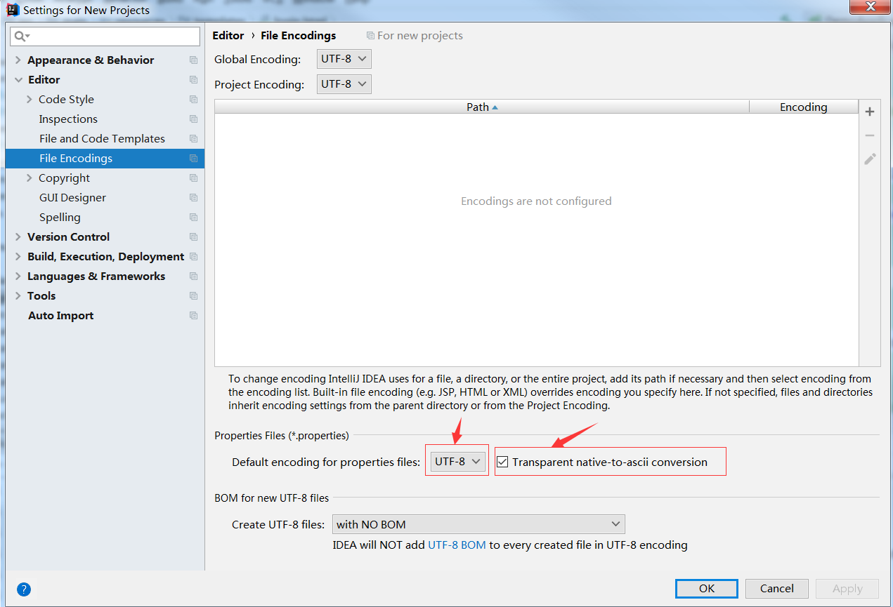
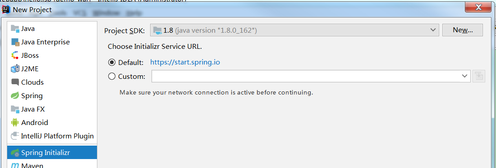

# 二、配置文件

## 1、配置文件

SpringBoot使用一个全局的配置文件，配置文件名是固定的；

+ application.properties

+ application.yml


配置文件的作用：修改SpringBoot自动配置的默认值，SpringBoot在底层都给我们自动配置，


YAML（YAML Ain't Markup Language）

​	YAML A Markup Language：是一种标记语言

​	YAML isn't Markup Language：不是一个标记语言

标记语言：

​	以前的配置文件，大多是使用的是XXX.xml文件

​	YAML以数据为中心，比JSON，XML等更适合做配置文件

​	YAML：配置例子

~~~yml
server：
	port： 8081
~~~

​	XML：

~~~xml
<server>
	<port>8081</port>
</server>
~~~

## 2、YAML语法

### 1、基本语法

k:(空格)v: 表示一对键值对（空格必须有）

已空格的缩进来控制层级关系，只要是左对齐的一列数据，都是同一个层级的

~~~ yml
server：
	port: 8081
	path: /hello
~~~

属性和值也是大小写敏感

### 2、值的写法

字面量：普通的值（数字、字符串、布尔）

####	k: v: 字面直接来写

​	字符串默认不用加上单引号或者双引号

​		“”：双引号：不会转义字符串里面的特殊字符，特殊字符会作为本身想表示的意思

​			name: "张三 \n 李四"	输出：张三 换行 李四

​		‘’：单引号：回转义特殊字符，特殊字符最终只是一个普通的字符串数据

​			name: '张三 \n 李四'	输出：张三 \n 李四

#### 对象、Map（属性和值）（键值对）

​	k: v：在下一行来写对象的属性和值的关系，注意缩进

​		对象还是k: v的方式


~~~ yml
friend:
	lastName: 张三
	age: 20
~~~

​	行内写法：

~~~ yml
friend: {lastName: 张三, age: 20}
~~~

#### 数组（List、Set）

用- 值表示数组中的一个元素

~~~ yml
pets:
	- cat
	- dog
	- pig
~~~

行内写法

~~~ yml
pets: [cat, dog, pig]
~~~

### 3、配置文件值注入

配置文件

~~~ yml
/**
 * 将配置文件中配置的每一个属性的值，映射到这个组件中
 * @ConfigurationProperties：告诉SpringBoot将本类中的所有属性和配置文件中相关的配置进行绑定
 *  prefix = "person"：配置文件中哪个下面的所有属性进行一一映射
 * @Component：让SpringBoot找到该类
 * 只有这个组件在容器中，才能使用容器的@ConfigurationProperties功能
 */
@Component
@ConfigurationProperties(prefix = "person")
public class Person {

    private String lastName;
    private Integer age;
    private Boolean boss;
    private Date birth;
    private Map<String, Object> map;
    private List<Object> list;
    private Dog dog;
~~~

我们可以导入配置文件处理器，以后编写配置就有提示了

~~~ xml
<!--导入配置文件处理器，配置文件进行绑定就会有提示-->
        <dependency>
            <groupId>org.springframework.boot</groupId>
            <artifactId>spring-boot-configuration-processor</artifactId>
            <optional>true</optional>
        </dependency>
~~~

properties属性提示


YML属性提示


#### 1、properties 配置文件在idea中默认UTF-8可能会乱码

打开idea设置界面搜索file encoding


将 properties 字符编码设置为utf-8,并勾选运行是使用 ascii 编码

#### 2、@Value获取值和@ConfigurationProperties获取值比较

|                | @ConfigurationProperties | @Value     |
| -------------- | ------------------------ | ---------- |
| 功能           | 批量注入配置文件中的属性 | 一个个指定 |
| 松散绑定       | 支持                     | 不支持     |
| SpEL           | 不支持                   | 支持       |
| JSR303数据校验 | 支持                     | 不支持     |
| 复杂类型封装   | 支持                     | 不支持     |

配置文件yml还是properties都能获取到值：

如果，只是在配置文件中获取某项值，就用@Value；

如果，专门编写了一个JavaBean来和配置文件进行映射，就用@ConfigurationProperties


松散绑定：

person.firstName：使用标准方式

person.first-name：大写用-

person.first_name：大写用_

PERSON_FIRST_NAME：推荐系统属性使用这种写法

#### 3、配置文件注入值数据校验

~~~ java
@Component
@ConfigurationProperties(prefix = "person")
@Validated
public class Person {
    /**
     * <bean>
     *     <property name="lastName" value="字面量/${key}从环境变量、配置文件中获取/#{SpEL}"></property>
     *
     * </bean>
     */
//    @Value("${person.lastName}")
//    @Email // email 校验
    private String lastName;
//    @Value("#{11*2}")
    private Integer age;
//    @Value("true")
    private Boolean boss;
~~~

#### 4、@PropertySource @ImportResource

**@PropertySource**：加载指定的配置文件

~~~ java
/**
 * 将配置文件中配置的每一个属性的值，映射到这个组件中
 * @ConfigurationProperties：告诉SpringBoot将本类中的所有属性和配置文件中相关的配置进行绑定
 *  prefix = "person"：配置文件中哪个下面的所有属性进行一一映射
 * @Component：让SpringBoot找到该类
 * 只有这个组件在容器中，才能使用容器的@ConfigurationProperties功能
 * @ConfigurationProperties(prefix = "person")默认从全局配置文件中获取值
 */
@PropertySource(value = "classpath:person.properties")// 加载指定配置文件
@Component
@ConfigurationProperties(prefix = "person")
@Validated
public class Person {
    /**
     * <bean>
     *     <property name="lastName" value="字面量/${key}从环境变量、配置文件中获取/#{SpEL}"></property>
     *
     * </bean>
     */
//    @Value("${person.lastName}")
//    @Email // email 校验
    private String lastName;
//    @Value("#{11*2}")
    private Integer age;
~~~

**@ImportResource**：导入Spring的配置文件，让配置文件里面的内容生效

Spring Boot里面没有Spring的配置文件，我们自己写的配置文件，也不能自动识别

想让Spring的配置文件生效，加载进来，**@ImportResource**标注在一个配置类上

~~~ java
@ImportResource(locations = {"classpath:beans.xml"})
导入Spring的配置文件让其生效
~~~


不用编写Spring的配置文件

~~~java
<?xml version="1.0" encoding="UTF-8"?>
<beans xmlns="http://www.springframework.org/schema/beans"
       xmlns:xsi="http://www.w3.org/2001/XMLSchema-instance"
       xsi:schemaLocation="http://www.springframework.org/schema/beans http://www.springframework.org/schema/beans/spring-beans.xsd">
    <bean id="helloService" class="com.fcc.springboot.service.HelloService"></bean>
</beans>
~~~


SpringBoot推荐给容器中添加组件的方式：

1、配置类=====Spring配置文件

2、使用**@Bean**给容器添加组件

~~~java
/**
 * @Configuration：当前类是一个配置类，来替代之前的Spring配置文件
 *
 * 在配置文件中<bean></bean>标签添加组件
 */
@Configuration
public class AppConfig {
    /**
     * 将方法的返回值添加到容器中，容器中这个组件默认的id就是方法名
     * @return
     */
    @Bean
    public HelloService helloService() {
        System.out.println("新增helloService");
        return new HelloService();
    }
}
~~~

### 4、配置文件占位符

#### 1、随机数

~~~java
${random.value}、${random.int}、${random.long}
${random.int(10)}、${random.int[1,10]}
~~~

#### 2、占位符获取之前配置的值，如果没有可以使用:指定默认值

~~~java
person:
    age: ${random.int}
    boss: false
    birth: 2018/11/11
    map: {k1: v1, k2: 12}
    list:
        - a1
        - a2
    dog:
        name: ${person.hello:hello}小狗
        age: 2
    lastName: 李四${random.uuid}
~~~

### 5、Profile（多环境支持）

#### 1、多Profile文件

我们在主配置文件编写的时候，文件名可以是application-{profile}.properties/yml

默认使用application.properties


#### 2、yml支持多文档块方式

~~~java
server:
  port: 8082
spring:
  profiles:
    active: prod #激活哪个文档块
---
server:
  port: 8083
spring:
  profiles: dev # 开放环境配置
---
server:
  port: 8084
spring:
  profiles: prod
~~~


#### 3、激活指定profile

​	1、在配置文件中指定spring.profiles.active=dev

​	2、命令行：

​		java -jar demo-0.0.1-SNAPSHOT.jar --spring.profiles.active=dev

​		可以直接在测试的时候，配置传入命令行参数：--spring.profiles.active=dev


​	3、虚拟机参数

​		-Dspring.profiles.active=dev


### 6、配置文件加载位置

springboot启动会扫描一下位置的application.properties或者application.yml文件作为Spring Boot的默认配置文件

-file:./config/

-file:./

-classpath:/config/

-classpath:/

优先级由高到低，高优先级的配置会覆盖低优先级的配置

SpringBoot会从这四个位置全部加载主配置文件，**互补配置**


可以通过spring.config.location来改变配置文件位置

**项目打包好以后，使用命令行参数的形式，启动项目的时候来指定配置文件的新位置，指定配置文件和默认加载的这些配置文件共同起作用形成互补配置**

**java -jar demo-0.0.1-SNAPSHOT.jar --spring.config.location=d:/application.properties**

### 7、外部配置加载顺序

**SpringBoot也可以从以下位置加载配置，优先级从高到底，高优先级的配置覆盖低优先级的配置，所有配置会形成互补配置**

**1、命令行参数**

java -jar demo-0.0.1-SNAPSHOT.jar --servlet.port=8088 --server.context-path=/web

多个配置用空格分开，--配置项=值

2、来自java:comp/env的JNDI属性

3、Java系统属性（System.getProperties()）

4、操作系统环境变量

5、RandomValuePropertiesSource配置的random.*属性值

**由jar包外箱jar包内进行寻找**

**优先加载带profile**

**6、jar包外部的application-{profile}.properties或application.yml(带spring.profile)配置文件**

**7、jar包内部的application-{profile}.properties或application.yml(带spring.profile)配置文件**

**再来加载不带profile**

**8、jar包外部的application-{profile}.properties或application.yml(不带spring.profile)配置文件**

**9、jar包内部的application-{profile}.properties或application.yml(不带spring.profile)配置文件**

10、@Configuration注解类上的@PropertySource

11、通过SpringApplication.setDefaultProperties指定的默认属性

所有支持的配置加载来源：参考官方文档

### 8、自动配置原理

#### 1、application.properties能配置哪些东西？配置文件到底能写什么？怎么写？自动配置原理

我们打开官方文档：https://docs.spring.io/spring-boot/docs/2.1.0.RELEASE/reference/htmlsingle/#common-application-properties


如图，官方给出了全部的配置项以及配置说明。 

#### 2、自动配置原理

1）、SpringBoot启动的时候加载主配置类，开启了自动配置功能 @EnableAutoConfiguration 

~~~java
@SpringBootApplication
public class SpringbootLoggingApplication {

    public static void main(String[] args) {
        SpringApplication.run(SpringbootLoggingApplication.class, args);
    }
}
~~~

~~~java
@Target({ElementType.TYPE})
@Retention(RetentionPolicy.RUNTIME)
@Documented
@Inherited
@SpringBootConfiguration
@EnableAutoConfiguration
@ComponentScan(
    excludeFilters = {@Filter(
    type = FilterType.CUSTOM,
    classes = {TypeExcludeFilter.class}
), @Filter(
    type = FilterType.CUSTOM,
    classes = {AutoConfigurationExcludeFilter.class}
)}
)
public @interface SpringBootApplication {
~~~

2）、@EnableAutoConfiguration 作用：

~~~java
@Target({ElementType.TYPE})
@Retention(RetentionPolicy.RUNTIME)
@Documented
@Inherited
@AutoConfigurationPackage
@Import({AutoConfigurationImportSelector.class})
public @interface EnableAutoConfiguration {
    String ENABLED_OVERRIDE_PROPERTY = "spring.boot.enableautoconfiguration";

    Class<?>[] exclude() default {};

    String[] excludeName() default {};
}
~~~

~~~java
public class AutoConfigurationImportSelector implements DeferredImportSelector, BeanClassLoaderAware, ResourceLoaderAware, BeanFactoryAware, EnvironmentAware, Ordered {
    private static final AutoConfigurationImportSelector.AutoConfigurationEntry EMPTY_ENTRY = new AutoConfigurationImportSelector.AutoConfigurationEntry();
    private static final String[] NO_IMPORTS = new String[0];
    private static final Log logger = LogFactory.getLog(AutoConfigurationImportSelector.class);
    private static final String PROPERTY_NAME_AUTOCONFIGURE_EXCLUDE = "spring.autoconfigure.exclude";
    private ConfigurableListableBeanFactory beanFactory;
    private Environment environment;
    private ClassLoader beanClassLoader;
    private ResourceLoader resourceLoader;

    public AutoConfigurationImportSelector() {
    }

    public String[] selectImports(AnnotationMetadata annotationMetadata) {
        if (!this.isEnabled(annotationMetadata)) {
            return NO_IMPORTS;
        } else {
            AutoConfigurationMetadata autoConfigurationMetadata = AutoConfigurationMetadataLoader.loadMetadata(this.beanClassLoader);
            AutoConfigurationImportSelector.AutoConfigurationEntry autoConfigurationEntry = this.getAutoConfigurationEntry(autoConfigurationMetadata, annotationMetadata);
            return StringUtils.toStringArray(autoConfigurationEntry.getConfigurations());
        }
    }
~~~

SpringFactoriesLoader.loadFactoryNames()扫描所有jar包类路径下 META‐INF/spring.factories把扫描到的这些文件的内容包装成properties对象从properties中获取EnableAutoConfiguration.class类（类名）对应的值，然后把他们添加在容器中。 

**将类路径下 META-INF/spring.factories 里面配置的所有EnableAutoConfiguration的值加入到了容器中**

~~~properties
# Auto Configure
org.springframework.boot.autoconfigure.EnableAutoConfiguration=\
org.springframework.boot.autoconfigure.admin.SpringApplicationAdminJmxAutoConfiguration,\
org.springframework.boot.autoconfigure.aop.AopAutoConfiguration,\
org.springframework.boot.autoconfigure.amqp.RabbitAutoConfiguration,\
org.springframework.boot.autoconfigure.batch.BatchAutoConfiguration,\
org.springframework.boot.autoconfigure.cache.CacheAutoConfiguration,\
org.springframework.boot.autoconfigure.cassandra.CassandraAutoConfiguration,\
org.springframework.boot.autoconfigure.cloud.CloudAutoConfiguration,\
org.springframework.boot.autoconfigure.context.ConfigurationPropertiesAutoConfiguration,\
org.springframework.boot.autoconfigure.context.MessageSourceAutoConfiguration,\
org.springframework.boot.autoconfigure.context.PropertyPlaceholderAutoConfiguration,\
org.springframework.boot.autoconfigure.couchbase.CouchbaseAutoConfiguration,\
org.springframework.boot.autoconfigure.dao.PersistenceExceptionTranslationAutoConfiguration,\
org.springframework.boot.autoconfigure.data.cassandra.CassandraDataAutoConfiguration,\
org.springframework.boot.autoconfigure.data.cassandra.CassandraRepositoriesAutoConfiguration,\
org.springframework.boot.autoconfigure.data.couchbase.CouchbaseDataAutoConfiguration,\
org.springframework.boot.autoconfigure.data.couchbase.CouchbaseRepositoriesAutoConfiguration,\
org.springframework.boot.autoconfigure.data.elasticsearch.ElasticsearchAutoConfiguration,\
org.springframework.boot.autoconfigure.data.elasticsearch.ElasticsearchDataAutoConfiguration,\
org.springframework.boot.autoconfigure.data.elasticsearch.ElasticsearchRepositoriesAutoConfiguration,\
org.springframework.boot.autoconfigure.data.jpa.JpaRepositoriesAutoConfiguration,\
org.springframework.boot.autoconfigure.data.ldap.LdapDataAutoConfiguration,\
org.springframework.boot.autoconfigure.data.ldap.LdapRepositoriesAutoConfiguration,\
org.springframework.boot.autoconfigure.data.mongo.MongoDataAutoConfiguration,\
org.springframework.boot.autoconfigure.data.mongo.MongoRepositoriesAutoConfiguration,\
org.springframework.boot.autoconfigure.data.neo4j.Neo4jDataAutoConfiguration,\
org.springframework.boot.autoconfigure.data.neo4j.Neo4jRepositoriesAutoConfiguration,\
org.springframework.boot.autoconfigure.data.solr.SolrRepositoriesAutoConfiguration,\
org.springframework.boot.autoconfigure.data.redis.RedisAutoConfiguration,\
org.springframework.boot.autoconfigure.data.redis.RedisRepositoriesAutoConfiguration,\
org.springframework.boot.autoconfigure.data.rest.RepositoryRestMvcAutoConfiguration,\
org.springframework.boot.autoconfigure.data.web.SpringDataWebAutoConfiguration,\
org.springframework.boot.autoconfigure.elasticsearch.jest.JestAutoConfiguration,\
org.springframework.boot.autoconfigure.freemarker.FreeMarkerAutoConfiguration,\
org.springframework.boot.autoconfigure.gson.GsonAutoConfiguration,\
org.springframework.boot.autoconfigure.h2.H2ConsoleAutoConfiguration,\
org.springframework.boot.autoconfigure.hateoas.HypermediaAutoConfiguration,\
org.springframework.boot.autoconfigure.hazelcast.HazelcastAutoConfiguration,\
org.springframework.boot.autoconfigure.hazelcast.HazelcastJpaDependencyAutoConfiguration,\
org.springframework.boot.autoconfigure.info.ProjectInfoAutoConfiguration,\
org.springframework.boot.autoconfigure.integration.IntegrationAutoConfiguration,\
org.springframework.boot.autoconfigure.jackson.JacksonAutoConfiguration,\
org.springframework.boot.autoconfigure.jdbc.DataSourceAutoConfiguration,\
org.springframework.boot.autoconfigure.jdbc.JdbcTemplateAutoConfiguration,\
org.springframework.boot.autoconfigure.jdbc.JndiDataSourceAutoConfiguration,\
org.springframework.boot.autoconfigure.jdbc.XADataSourceAutoConfiguration,\
org.springframework.boot.autoconfigure.jdbc.DataSourceTransactionManagerAutoConfiguration,\
org.springframework.boot.autoconfigure.jms.JmsAutoConfiguration,\
org.springframework.boot.autoconfigure.jmx.JmxAutoConfiguration,\
org.springframework.boot.autoconfigure.jms.JndiConnectionFactoryAutoConfiguration,\
org.springframework.boot.autoconfigure.jms.activemq.ActiveMQAutoConfiguration,\
org.springframework.boot.autoconfigure.jms.artemis.ArtemisAutoConfiguration,\
org.springframework.boot.autoconfigure.flyway.FlywayAutoConfiguration,\
org.springframework.boot.autoconfigure.groovy.template.GroovyTemplateAutoConfiguration,\
org.springframework.boot.autoconfigure.jersey.JerseyAutoConfiguration,\
org.springframework.boot.autoconfigure.jooq.JooqAutoConfiguration,\
org.springframework.boot.autoconfigure.kafka.KafkaAutoConfiguration,\
org.springframework.boot.autoconfigure.ldap.embedded.EmbeddedLdapAutoConfiguration,\
org.springframework.boot.autoconfigure.ldap.LdapAutoConfiguration,\
org.springframework.boot.autoconfigure.liquibase.LiquibaseAutoConfiguration,\
org.springframework.boot.autoconfigure.mail.MailSenderAutoConfiguration,\
org.springframework.boot.autoconfigure.mail.MailSenderValidatorAutoConfiguration,\
org.springframework.boot.autoconfigure.mobile.DeviceResolverAutoConfiguration,\
org.springframework.boot.autoconfigure.mobile.DeviceDelegatingViewResolverAutoConfiguration,\
org.springframework.boot.autoconfigure.mobile.SitePreferenceAutoConfiguration,\
org.springframework.boot.autoconfigure.mongo.embedded.EmbeddedMongoAutoConfiguration,\
org.springframework.boot.autoconfigure.mongo.MongoAutoConfiguration,\
org.springframework.boot.autoconfigure.mustache.MustacheAutoConfiguration,\
org.springframework.boot.autoconfigure.orm.jpa.HibernateJpaAutoConfiguration,\
org.springframework.boot.autoconfigure.reactor.ReactorAutoConfiguration,\
org.springframework.boot.autoconfigure.security.SecurityAutoConfiguration,\
org.springframework.boot.autoconfigure.security.SecurityFilterAutoConfiguration,\
org.springframework.boot.autoconfigure.security.FallbackWebSecurityAutoConfiguration,\
org.springframework.boot.autoconfigure.security.oauth2.OAuth2AutoConfiguration,\
org.springframework.boot.autoconfigure.sendgrid.SendGridAutoConfiguration,\
org.springframework.boot.autoconfigure.session.SessionAutoConfiguration,\
org.springframework.boot.autoconfigure.social.SocialWebAutoConfiguration,\
org.springframework.boot.autoconfigure.social.FacebookAutoConfiguration,\
org.springframework.boot.autoconfigure.social.LinkedInAutoConfiguration,\
org.springframework.boot.autoconfigure.social.TwitterAutoConfiguration,\
org.springframework.boot.autoconfigure.solr.SolrAutoConfiguration,\
org.springframework.boot.autoconfigure.thymeleaf.ThymeleafAutoConfiguration,\
org.springframework.boot.autoconfigure.transaction.TransactionAutoConfiguration,\
org.springframework.boot.autoconfigure.transaction.jta.JtaAutoConfiguration,\
org.springframework.boot.autoconfigure.validation.ValidationAutoConfiguration,\
org.springframework.boot.autoconfigure.web.DispatcherServletAutoConfiguration,\
org.springframework.boot.autoconfigure.web.EmbeddedServletContainerAutoConfiguration,\
org.springframework.boot.autoconfigure.web.ErrorMvcAutoConfiguration,\
org.springframework.boot.autoconfigure.web.HttpEncodingAutoConfiguration,\
org.springframework.boot.autoconfigure.web.HttpMessageConvertersAutoConfiguration,\
org.springframework.boot.autoconfigure.web.MultipartAutoConfiguration,\
org.springframework.boot.autoconfigure.web.ServerPropertiesAutoConfiguration,\
org.springframework.boot.autoconfigure.web.WebClientAutoConfiguration,\
org.springframework.boot.autoconfigure.web.WebMvcAutoConfiguration,\
org.springframework.boot.autoconfigure.websocket.WebSocketAutoConfiguration,\
org.springframework.boot.autoconfigure.websocket.WebSocketMessagingAutoConfiguration,\
org.springframework.boot.autoconfigure.webservices.WebServicesAutoConfiguration
~~~

每一个这样的 xxxAutoConfiguration类都是容器中的一个组件，都加入到容器中；用他们来做自动配置； 
3）、每一个自动配置类进行自动配置功能； 
4）、以HttpEncodingAutoConfiguration（Http编码自动配置）为例解释自动配置原理； 


~~~java
@Configuration //表示这是一个配置类，以前编写的配置文件一样，也可以给容器中添加组件
@EnableConfigurationProperties(HttpEncodingProperties.class) //启动指定类的
ConfigurationProperties功能；将配置文件中对应的值和HttpEncodingProperties绑定起来；并把
HttpEncodingProperties加入到ioc容器中
@ConditionalOnWebApplication //Spring底层@Conditional注解（Spring注解版），根据不同的条件，如果
满足指定的条件，整个配置类里面的配置就会生效； 判断当前应用是否是web应用，如果是，当前配置类生效
@ConditionalOnClass(CharacterEncodingFilter.class) //判断当前项目有没有这个类
CharacterEncodingFilter；SpringMVC中进行乱码解决的过滤器；
@ConditionalOnProperty(prefix = "spring.http.encoding", value = "enabled", matchIfMissing =
true) //判断配置文件中是否存在某个配置 spring.http.encoding.enabled；如果不存在，判断也是成立的
//即使我们配置文件中不配置pring.http.encoding.enabled=true，也是默认生效的；
public class HttpEncodingAutoConfiguration {
//他已经和SpringBoot的配置文件映射了
private final HttpEncodingProperties properties;
//只有一个有参构造器的情况下，参数的值就会从容器中拿
public HttpEncodingAutoConfiguration(HttpEncodingProperties properties) {
this.properties = properties;
} 
    @Bean //给容器中添加一个组件，这个组件的某些值需要从properties中获取
@ConditionalOnMissingBean(CharacterEncodingFilter.class) //判断容器没有这个组件？
public CharacterEncodingFilter characterEncodingFilter() {
CharacterEncodingFilter filter = new OrderedCharacterEncodingFilter();
filter.setEncoding(this.properties.getCharset().name());
filter.setForceRequestEncoding(this.properties.shouldForce(Type.REQUEST));
filter.setForceResponseEncoding(this.properties.shouldForce(Type.RESPONSE));
return filter;
}
~~~

根据当前不同的条件判断，决定这个配置类是否生效？ 
一但这个配置类生效；这个配置类就会给容器中添加各种组件；这些组件的属性是从对应的properties类中获取 
的，这些类里面的每一个属性又是和配置文件绑定的； 
5）、所有在配置文件中能配置的属性都是在xxxxProperties类中封装者‘；配置文件能配置什么就可以参照某个功 能对应的这个属性类

~~~java
@ConfigurationProperties(prefix = "spring.http.encoding") //从配置文件中获取指定的值和bean的属
性进行绑定
public class HttpEncodingProperties {
public static final Charset DEFAULT_CHARSET = Charset.forName("UTF‐8");
~~~

**精髓：** 
**1）、SpringBoot启动会加载大量的自动配置类** 
**2）、我们看我们需要的功能有没有SpringBoot默认写好的自动配置类；** 
**3）、我们再来看这个自动配置类中到底配置了哪些组件；（只要我们要用的组件有，我们就不需要再来配置了）** 
**4）、给容器中自动配置类添加组件的时候，会从properties类中获取某些属性。我们就可以在配置文件中指定这些属性的值；**

xxxxAutoConfigurartion：自动配置类； 
给容器中添加组件 

xxxxProperties:封装配置文件中相关属性；

#### 3、派生注解

作用：必须是@Conditional指定的条件成立，才给容器中添加组件，配置配里面的所有内容才生效； 

| @Conditional扩展注解            | 作用（判断是否满足当前指定条件）                 |
| ------------------------------- | ------------------------------------------------ |
| @ConditionalOnJava              | 系统的java版本是否符合要求                       |
| @ConditionalOnBean              | 容器中存在指定Bean；                             |
| @ConditionalOnMissingBean       | 容器中不存在指定Bean；                           |
| @ConditionalOnExpression        | 满足SpEL表达式指定                               |
| @ConditionalOnClass             | 系统中有指定的类                                 |
| @ConditionalOnMissingClass      | 系统中没有指定的类                               |
| @ConditionalOnSingleCandidate   | 容器中只有一个指定的Bean，或者这个Bean是首选Bean |
| @ConditionalOnProperty          | 系统中指定的属性是否有指定的值                   |
| @ConditionalOnResource          | 类路径下是否存在指定资源文件                     |
| @ConditionalOnWebApplication    | 当前是web环境                                    |
| @ConditionalOnNotWebApplication | 当前不是web环境                                  |
| @ConditionalOnJndi              | JNDI存在指定项                                   |

**自动配置类必须在一定的条件下才能生效；** 
我们怎么知道哪些自动配置类生效； 

**我们可以通过启用 debug=true属性；来让控制台打印自动配置报告**，这样我们就可以很方便的知道哪些自动配置 类生效

~~~prope
debug=true
~~~

~~~verilog
=========================
AUTO‐CONFIGURATION REPORT
=========================
Positive matches:（自动配置类启用的）
‐‐‐‐‐‐‐‐‐‐‐‐‐‐‐‐‐
DispatcherServletAutoConfiguration matched:
‐ @ConditionalOnClass found required class
'org.springframework.web.servlet.DispatcherServlet'; @ConditionalOnMissingClass did not find
unwanted class (OnClassCondition)
‐ @ConditionalOnWebApplication (required) found StandardServletEnvironment
(OnWebApplicationCondition)
Negative matches:（没有启动，没有匹配成功的自动配置类）
‐‐‐‐‐‐‐‐‐‐‐‐‐‐‐‐‐
ActiveMQAutoConfiguration:
Did not match:
‐ @ConditionalOnClass did not find required classes 'javax.jms.ConnectionFactory',
'org.apache.activemq.ActiveMQConnectionFactory' (OnClassCondition)
AopAutoConfiguration:
Did not match:
‐ @ConditionalOnClass did not find required classes
'org.aspectj.lang.annotation.Aspect', 'org.aspectj.lang.reflect.Advice' (OnClassCondition)
~~~


# 三、日志

## 1、日志框架

小张：开发一个大型系统

​	1、System.out.println("");将关键数据打印在控制台？去掉写在一个文件里

​	2、框架来记录系统的一些运行时信息，日志框架，zhanglogging.jar

​	3、高达上的几个功能？异步模式？自动归档？xxx?zhanglogging-good.jar

​	4、将以前框架卸下来？换上新的框架，重新修改之前相关的API，zhanglogging-prefect.jar

​	5、JDBC---数据库驱动

​		写了一个统一的接口层，日志门面（日志的一个抽象成），logging-abstract.jar

​		给项目中导入具体的日志实现就行了，我们之前的日志框架都是实现的抽象成


**市面上的日志框架：**

JUL、JCL、Jboss-logging、logback、log4j、log4j2、slf4j

| 日志门面（日志的抽象层）                                     | 日志实现                                      |
| ------------------------------------------------------------ | --------------------------------------------- |
| ~~JCL（Jakarta Commons Logging）~~ SLF4J（Simple Logging Facade For Java） **~~Jboss-logging~~** | Log4j JUL（java.util.logging） Log4j2 Logback |

SLF4J、Log4j、Logback 出自同一人

左边选一个门面（抽象层），右边选一个实现

日志门面：SLF4J

日志实现：Logback


SpringBoot：底层是Spring框架，Spring框架默认是JCL

​	**SpringBoot选用SLF4J和logback**

## 2、SLF4j使用

### 1、如何在系统中使用SLF4j https://www.slf4j.org

以后开发的时候，日志记录方法的调用，不直接调用日志的实现类，而是调用日志抽象层里面的方法，给系统导入slf4j的jar和logback的实现jar

~~~ java
import org.slf4j.Logger;
import org.slf4j.LoggerFactory;

public class HelloWorld {
  public static void main(String[] args) {
    Logger logger = LoggerFactory.getLogger(HelloWorld.class);
    logger.info("Hello World");
  }
}
~~~

图示：


每一个日志的实现框架都有自己的配置文件。使用slf4j以后，**配置文件还是做成日志实现框架的配置文件**

### 2、遗留问题

application（slf4j+logback）:Spring（commons-logging）、Hibernate（jboss-logging）、MyBatis（xxx）

统一日志记录，即使使用别的框架和我一起统一使用slf4j进行输出？


**如何让系统中所有的日志都统一用slf4j:**

1、将系统中其他日志框架先排除出去

2、用中间包来替换原有的日志框架

3、我们导入slf4j其他的实现

## 3、SpringBoot日志关系

~~~java
        <dependency>
            <groupId>org.springframework.boot</groupId>
            <artifactId>spring-boot-starter</artifactId>
        </dependency>
~~~

SpringBoot使用它来做日志

~~~java
        <dependency>
            <groupId>org.springframework.boot</groupId>
            <artifactId>spring-boot-starter-logging</artifactId>
        </dependency>
~~~

底层依赖关系


总结：

​	1）SpringBoot底层也是使用slf4j+logback的方式进行日志记录

​	2）SpringBoot也把其他的日志都替换成了slf4j

​	3）中间替换包


​	4）如果我们要引入其他框架？一定要把这个框架的默认日志依赖移除掉

​		Spring框架用的是commons-logging

~~~xml
    <dependency>
      <groupId>org.springframework</groupId>
      <artifactId>spring-core</artifactId>
      <exclusions>
		<exclusion>
       	  <groupId>commons-logging</groupId>
          <artifactId>commons-logging</artifactId>
        </exclusion>
      </exclusions>
    </dependency>
~~~

**SpringBoot能自动适配所有的日志，而且底层使用slf4j+logback的方式记录日志，引入其他框架的时候，只需要把这个框架依赖的日志框架排除**

## 4、日志使用

### 1、默认配置

SpringBoot默认配置好了日志

~~~java
Logger logger = LoggerFactory.getLogger(getClass());

    @Test
    public void contextLoads() {
        // 日志级别
        // 由低到高 trace<debug<info<warn<error
        // 可以调整需要输出的日志级别：日志就只会在这个级别及以后的高级别生效
        logger.trace("trace日志。。。");
        logger.debug("debug日志。。。");
        // SpringBoot 默认使用的info级别的，没有指定级别的就用SpringBoot默认规定的级别，root级别
        logger.info("info日志。。。");
        logger.warn("warn日志。。。");
        logger.error("error日志。。。");

        System.out.println(person);
    }
~~~

日志输出格式：

​	%d：表示日期时间

​	%thread：表示线程名

​	%-5level：表示级别从左显示5个字符宽度

​	%logger{50}：表示logger名字最长50个字符，否则按照句点分割

​	%msg：表示日志信息

​	%n：表示换行符

```verilog
%d{yyyy-MM-dd HH:mm:ss.SSS} [%thread] %-5level %logger{50} %msg%n
```

SpringBoot修改日志的默认配置

~~~properties
logging.level.com.fcc=trace
# 不指定路径，则在当前项目下生成springboot.log日志
# 可以指定完整的路径
#logging.file=d:/springboot.log
# 在当前磁盘的根路径下创建spring文件夹和里面的log文件夹，使用spring.log作为默认文件名
logging.path=/spring/log
# 在控制台输出的日志的格式
logging.pattern.console=%d{yyyy-MM-dd} [%thread] %-5level %logger{50} - %msg%n
# 指定文件中日志输出的格式
logging.pattern.file=%d{yyyy-MM-dd HH:mm:ss.SSS} === [%thread] === %-5level === %logger{50} === %msg%n
~~~

### 2、指定配置

给类路径下放上每个日志框架自己的配置文件，SpringBoot就不使用默认配置了

| Logging System          | Customization                                                |
| ----------------------- | ------------------------------------------------------------ |
| Logback                 | `logback-spring.xml`, `logback-spring.groovy`, `logback.xml`, or `logback.groovy` |
| Log4j2                  | `log4j2-spring.xml` or `log4j2.xml`                          |
| JDK (Java Util Logging) | `logging.properties`                                         |

logback.xml：直接被框架识别了。

**logback-spring.xml**：日志框架就不直接加载日志的配置项，由SpringBoot解析日志配置，可以使用SpringBoot的高级Profile功能

```xml
<springProfile name="staging">
	<!-- configuration to be enabled when the "staging" profile is active -->
    可以指定某段配置只在某个环境下生效
</springProfile>
```

如：

~~~ properties
<appender name="stdout" class="ch.qos.logback.core.ConsoleAppender">
        <!--
        日志输出格式：
            %d表示日期时间，
            %thread表示线程名，
            %-5level：级别从左显示5个字符宽度
            %logger{50} 表示logger名字最长50个字符，否则按照句点分割。 
            %msg：日志消息，
            %n是换行符
        -->
        <layout class="ch.qos.logback.classic.PatternLayout">
            <springProfile name="dev">
                <pattern>%d{yyyy-MM-dd HH:mm:ss.SSS} ----> [%thread] ---> %-5level %logger{50} - %msg%n</pattern>
            </springProfile>
            <springProfile name="!dev">
                <pattern>%d{yyyy-MM-dd HH:mm:ss.SSS} ==== [%thread] ==== %-5level %logger{50} - %msg%n</pattern>
            </springProfile>
        </layout>
    </appender>
~~~

如果使用logback.xml作为日志配置文件，还要使用profile功能，会有以下错误

~~~ error
no applicable action for [springProfile]
~~~

## 5、切换日志框架

可以按照slf4j的日志适配图，进行相关的切换

slf4j+log4j的方式

1、使用IDEA的pom.xml视图快速删除依赖，点击右键选择Diagrams->Show Dependencies...


2、出现依赖关系图，如下：


3、点击不同的组件右键选择Exclude，移除该组件（logback）


4、pom新增slf4j-log4j12依赖，新增log4j.properties

~~~xml
       <dependency>
            <groupId>org.springframework.boot</groupId>
            <artifactId>spring-boot-starter-web</artifactId>
            <exclusions>
                <exclusion>
                    <artifactId>logback-classic</artifactId>
                    <groupId>ch.qos.logback</groupId>
                </exclusion>
            </exclusions>
        </dependency>

        <dependency>
            <groupId>org.slf4j</groupId>
            <artifactId>slf4j-log4j12</artifactId>
        </dependency>
~~~

切换log4j2，新增log4j2配置文件

~~~xml
		<dependency>
            <groupId>org.springframework.boot</groupId>
            <artifactId>spring-boot-starter-web</artifactId>
            <exclusions>
                <exclusion>
                    <artifactId>spring-boot-starter-logging</artifactId>
                    <groupId>org.springframework.boot</groupId>
                </exclusion>
            </exclusions>
        </dependency>

        <dependency>
            <groupId>org.springframework.boot</groupId>
            <artifactId>spring-boot-starter-log4j2</artifactId>
        </dependency>
~~~

# 四、Web开发

### 1、简介

使用SpringBoot：

**1）创建SpringBoot应用，选中我们需要的模块**


**2）SpringBoot已经默认将这些场景配置好了，只需要在配置文件中指定少量配置就可以运行起来**

**3）编写业务代码**


**自动配置原理**

1）、SpringBoot启动会加载大量的自动配置类
2）、我们看我们需要的功能有没有SpringBoot默认写好的自动配置类；
3）、我们再来看这个自动配置类中到底配置了哪些组件；（只要我们要用的组件有，我们就不需要再来配置了）
4）、给容器中自动配置类添加组件的时候，会从properties类中获取某些属性。我们就可以在配置文件中指定这些属性的值；

这个场景SpringBoot帮我们配置了什么？能不能修改？能修改哪些配置？能不能扩展？

~~~java
xxxAutoConfiguration：帮我们给容器自动配置组件
xxxProperties：配置类来封装配置文件的内容
~~~

### 2、SpringBoot对静态资源的映射规则

我们以webMvc为例说明一下。

**1、WebMvcAutoConfiguration**

首先是ResourceProperties，他可以配置一些和静态资源有关的参数，比如缓存，资源目录等。

~~~java
@ConfigurationProperties(prefix = "spring.resources", ignoreUnknownFields = false)
public class ResourceProperties implements ResourceLoaderAware {
//可以设置和静态资源有关的参数，缓存时间等
~~~

addResourceHandlers方法主要是静态资源文件夹映射，

1）所有 /webjars/** ，都去 classpath:/META-INF/resources/webjars/ 找资源；

webjars：以jar包的方式引入静态资源；参考：http://www.webjars.org/， 比如我们引入jquery的包，在pom.xml配置：

~~~xml
<dependency>
    <groupId>org.webjars</groupId>
    <artifactId>jquery</artifactId>
    <version>3.3.1-1</version>
</dependency>
~~~


我们访问localhost:8080/webjars/jquery/3.3.1/jquery.js，就可以寻找到我们需要的静态文件。

2）“/**” 访问当前项目的任何资源，都去（静态资源的文件夹）找映射

~~~ properties
"classpath:/META‐INF/resources/",
"classpath:/resources/",
"classpath:/static/",
"classpath:/public/"
"/"：当前项目的根路径
~~~

访问：localhost:8080/abc === 去静态资源文件夹里面找abc

3）欢迎页； 静态资源文件夹下的所有index.html页面；被"/**"映射；localhost:8080/ 找index页面

~~~java
//配置欢迎页映射
		@Bean
        public WelcomePageHandlerMapping welcomePageHandlerMapping(ApplicationContext applicationContext) {
            return new WelcomePageHandlerMapping(new TemplateAvailabilityProviders(applicationContext), applicationContext, this.getWelcomePage(), this.mvcProperties.getStaticPathPattern());
        }

~~~

4）所有的 **/favicon.ico 都是在静态资源文件下找；

### 3、模板引擎-引入Thymeleaf

JSP、Velocity、Freemarker、Thymeleaf


SpringBoot推荐的Thymeleaf；
语法更简单，功能更强大；

#### 1、引入thymeleaf

~~~xml
<dependency>
    <groupId>org.springframework.boot</groupId>
    <artifactId>spring-boot-starter-thymeleaf</artifactId>
            2.1.6
</dependency>

切换thymeleaf版本
<properties>
        <thymeleaf.version>3.0.9.RELEASE</thymeleaf.version>
        <!-- 布局功能的支持程序  thymeleaf3主程序  layout2以上版本 -->
        <!-- thymeleaf2   layout1-->
        <thymeleaf-layout-dialect.version>2.2.2</thymeleaf-layout-dialect.version>
  </properties>
~~~

#### 2、Thymeleaf使用&语法

~~~java
@ConfigurationProperties(prefix = "spring.thymeleaf")
public class ThymeleafProperties {

    private static final Charset DEFAULT_ENCODING = Charset.forName("UTF-8");

    private static final MimeType DEFAULT_CONTENT_TYPE = MimeType.valueOf("text/html");

    public static final String DEFAULT_PREFIX = "classpath:/templates/";

    public static final String DEFAULT_SUFFIX = ".html";
    //
~~~

只要我们把HTML页面放在classpath:/templates/，thymeleaf就能自动渲染；

使用：

1、导入thymeleaf的名称空间

```html
<html lang="en" xmlns:th="http://www.thymeleaf.org">
```

2、使用thymeleaf语法

~~~html
<!DOCTYPE html>
<html lang="en" xmlns:th="http://www.thymeleaf.org">
<head>
    <meta charset="UTF-8">
    <title>Title</title>
</head>
<body>
    <h1>成功！</h1>
    <!--th:text 将div里面的文本内容设置为 -->
    <div th:text="${hello}">这是显示欢迎信息</div>
</body>
</html>
~~~

3、java代码

~~~java
	// 查出一些数据，在页面显示
    @RequestMapping("/success")
    public String success(Map<String, Object> map) {
        // 使用模板访问页面最终路径如下
        // classpath:/templates/success.html
        map.put("hello", "你好");
        return "success";
    }
~~~

#### 3、语法规则

1）th:text；改变当前元素里面的文本内容；
​	th：任意html属性；来替换原生属性的值


2）表达式

~~~properties
Simple expressions:（表达式语法）
Variable Expressions: ${...}：获取变量值；OGNL；
            1）、获取对象的属性、调用方法
            2）、使用内置的基本对象：
                #ctx : the context object.
                #vars: the context variables.
                #locale : the context locale.
                #request : (only in Web Contexts) the HttpServletRequest object.
                #response : (only in Web Contexts) the HttpServletResponse object.
                #session : (only in Web Contexts) the HttpSession object.
                #servletContext : (only in Web Contexts) the ServletContext object.
                
                ${session.foo}
            3）、内置的一些工具对象：
#execInfo : information about the template being processed.
#messages : methods for obtaining externalized messages inside variables expressions, in the same way as they would be obtained using #{…} syntax.
#uris : methods for escaping parts of URLs/URIs
#conversions : methods for executing the configured conversion service (if any).
#dates : methods for java.util.Date objects: formatting, component extraction, etc.
#calendars : analogous to #dates , but for java.util.Calendar objects.
#numbers : methods for formatting numeric objects.
#strings : methods for String objects: contains, startsWith, prepending/appending, etc.
#objects : methods for objects in general.
#bools : methods for boolean evaluation.
#arrays : methods for arrays.
#lists : methods for lists.
#sets : methods for sets.
#maps : methods for maps.
#aggregates : methods for creating aggregates on arrays or collections.
#ids : methods for dealing with id attributes that might be repeated (for example, as a result of an iteration).

    Selection Variable Expressions: *{...}：选择表达式：和${}在功能上是一样；
        补充：配合 th:object="${session.user}：
   <div th:object="${session.user}">
    <p>Name: <span th:text="*{firstName}">Sebastian</span>.</p>
    <p>Surname: <span th:text="*{lastName}">Pepper</span>.</p>
    <p>Nationality: <span th:text="*{nationality}">Saturn</span>.</p>
    </div>
    
    Message Expressions: #{...}：获取国际化内容
    Link URL Expressions: @{...}：定义URL；
    @{/order/process(execId=${execId},execType='FAST')}
    Fragment Expressions: ~{...}：片段引用表达式
            <div th:insert="~{commons :: main}">...</div>
            
Literals（字面量）
      Text literals: 'one text' , 'Another one!' ,…
      Number literals: 0 , 34 , 3.0 , 12.3 ,…
      Boolean literals: true , false
      Null literal: null
      Literal tokens: one , sometext , main ,…
Text operations:（文本操作）
    String concatenation: +
    Literal substitutions: |The name is ${name}|
Arithmetic operations:（数学运算）
    Binary operators: + , - , * , / , %
    Minus sign (unary operator): -
Boolean operations:（布尔运算）
    Binary operators: and , or
    Boolean negation (unary operator): ! , not
Comparisons and equality:（比较运算）
    Comparators: > , < , >= , <= ( gt , lt , ge , le )
    Equality operators: == , != ( eq , ne )
Conditional operators:条件运算（三元运算符）
    If-then: (if) ? (then)
    If-then-else: (if) ? (then) : (else)
    Default: (value) ?: (defaultvalue)
Special tokens:
    No-Operation: _
~~~

示例：

~~~java
	// 查出一些数据，在页面显示
    @RequestMapping("/success")
    public String success(Map<String, Object> map) {
        // 使用模板访问页面最终路径如下
        // classpath:/templates/success.html
        map.put("hello", "<h1>你好</h1>");
        map.put("users", Arrays.asList("zhangsan", "lisi", "wangwu"));
        return "success";
    }
~~~

~~~html
<hr/>
<div th:text="${hello}"></div>
<div th:utext="${hello}"></div>
<hr/>

<!-- th:each 每次便利都会生成当前这个标签：3个h4 -->
<h4 th:text="${user}"  th:each="user:${users}"></h4>
<hr/>
<h4>
    <span th:each="user:${users}">[[${user}]],</span>
</h4>
~~~

### 4、SpringMVC自动配置

https://docs.spring.io/spring-boot/docs/2.1.0.RELEASE/reference/htmlsingle/#boot-features-developing-web-applications

#### 1、Spring MVC auto-configuration

Spring Boot 自动配置好了SpringMVC

以下是SpringBoot对SpringMVC的默认配置:**（WebMvcAutoConfiguration）**

- Inclusion of `ContentNegotiatingViewResolver` and `BeanNameViewResolver` beans.
- 自动配置了ViewResolver（视图解析器：根据方法的返回值得到视图对象（View），视图对象决定如何渲染（转发？重定向？））
- ContentNegotiatingViewResolver：组合所有的视图解析器的；
- 如何定制：我们可以自己给容器中添加一个视图解析器；自动的将其组合进来；
- Support for serving static resources, including support for WebJars (see below).静态资源文件夹路径,webjars
- Static `index.html` support. 静态首页访问
- Custom `Favicon` support (see below).  favicon.ico
- 自动注册了 of `Converter`, `GenericConverter`, `Formatter` beans.
- Converter：转换器；  public String hello(User user)：类型转换使用Converter
-  `Formatter`  格式化器；  2017.12.17===Date；

~~~java
@Bean
        @ConditionalOnProperty(prefix = "spring.mvc", name = "date-format")//在文件中配置日期格式化的规则
        public Formatter<Date> dateFormatter() {
            return new DateFormatter(this.mvcProperties.getDateFormat());//日期格式化组件
        }
~~~

自己添加的格式化器转换器，我们只需要放在容器中即可

- Support for `HttpMessageConverters` (see below).
- HttpMessageConverter：SpringMVC用来转换Http请求和响应的；User---Json；
- `HttpMessageConverters` 是从容器中确定；获取所有的HttpMessageConverter；
   自己给容器中添加HttpMessageConverter，只需要将自己的组件注册容器中（@Bean,@Component）
- Automatic registration of `MessageCodesResolver` (see below).定义错误代码生成规则
- Automatic use of a `ConfigurableWebBindingInitializer` bean (see below).
   我们可以配置一个ConfigurableWebBindingInitializer来替换默认的；（添加到容器）

~~~properties
初始化WebDataBinder；
请求数据=====JavaBean；
~~~

**org.springframework.boot.autoconfigure.web：web的所有自动场景；**

If you want to keep Spring Boot MVC features, and you just want to add additional [MVC configuration](https://docs.spring.io/spring/docs/4.3.14.RELEASE/spring-framework-reference/htmlsingle#mvc) (interceptors, formatters, view controllers etc.) you can add your own `@Configuration` class of type `WebMvcConfigurerAdapter`, but **without** `@EnableWebMvc`. If you wish to provide custom instances of `RequestMappingHandlerMapping`, `RequestMappingHandlerAdapter` or `ExceptionHandlerExceptionResolver` you can declare a `WebMvcRegistrationsAdapter` instance providing such components.

If you want to take complete control of Spring MVC, you can add your own `@Configuration` annotated with `@EnableWebMvc`.

#### 2、扩展SpringMVC

~~~xml
	<mvc:view-controller path="/hello" view-name="success"/>
    <mvc:interceptors>
        <mvc:interceptor>
            <mvc:mapping path="/hello"/>
            <bean></bean>
        </mvc:interceptor>
    </mvc:interceptors>
~~~

**编写一个配置类（@Configuration），是WebMvcConfigurerAdapter类型；不能标注@EnableWebMvc**;

既保留了所有的自动配置，也能用我们扩展的配置；

~~~java
//使用WebMvcConfigurerAdapter可以来扩展SpringMVC的功能
@Configuration
public class MyMvcConfig extends WebMvcConfigurerAdapter {
    @Override
    public void addViewControllers(ViewControllerRegistry registry) {
       // super.addViewControllers(registry);
        //浏览器发送 /atguigu 请求来到 success
        registry.addViewController("/atguigu").setViewName("success");
    }
}
~~~

原理：
 1）、WebMvcAutoConfiguration是SpringMVC的自动配置类
 2）、在做其他自动配置时会导入；@Import(**EnableWebMvcConfiguration**.class)

~~~java
	@Configuration
    public static class EnableWebMvcConfiguration extends DelegatingWebMvcConfiguration {
      private final WebMvcConfigurerComposite configurers = new WebMvcConfigurerComposite();

     //从容器中获取所有的WebMvcConfigurer
      @Autowired(required = false)
      public void setConfigurers(List<WebMvcConfigurer> configurers) {
          if (!CollectionUtils.isEmpty(configurers)) {
              this.configurers.addWebMvcConfigurers(configurers);
                //一个参考实现；将所有的WebMvcConfigurer相关配置都来一起调用；  
                @Override
             // public void addViewControllers(ViewControllerRegistry registry) {
              //    for (WebMvcConfigurer delegate : this.delegates) {
               //       delegate.addViewControllers(registry);
               //   }
              }
          }
    }
~~~

 3）、容器中所有的WebMvcConfigurer都会一起起作用；
​ 4）、我们的配置类也会被调用；

 效果：SpringMVC的自动配置和我们的扩展配置都会起作用；

#### 3、全面接管SpringMVC

SpringBoot对SpringMVC的自动配置不需要了，所有都是我们自己配置；所有的SpringMVC的自动配置都失效了

**我们需要在配置类中添加@EnableWebMvc即可；**

~~~java
//使用WebMvcConfigurerAdapter可以来扩展SpringMVC的功能
@EnableWebMvc
@Configuration
public class MyMvcConfig extends WebMvcConfigurerAdapter {
    @Override
    public void addViewControllers(ViewControllerRegistry registry) {
       // super.addViewControllers(registry);
        //浏览器发送 /atguigu 请求来到 success
        registry.addViewController("/atguigu").setViewName("success");
    }
}
~~~

原理：

为什么@EnableWebMvc自动配置就失效了；

1）@EnableWebMvc的核心

~~~java
@Import(DelegatingWebMvcConfiguration.class)
public @interface EnableWebMvc {
~~~

2）、

```java
@Configuration
public class DelegatingWebMvcConfiguration extends WebMvcConfigurationSupport {
```

3）、

```java
@Configuration
@ConditionalOnWebApplication
@ConditionalOnClass({ Servlet.class, DispatcherServlet.class,
        WebMvcConfigurerAdapter.class })
//容器中没有这个组件的时候，这个自动配置类才生效，如果用了@EnableWebMvc将WebMvcConfigurationSupport组件导入进来，所以这里不生效
@ConditionalOnMissingBean(WebMvcConfigurationSupport.class)
@AutoConfigureOrder(Ordered.HIGHEST_PRECEDENCE + 10)
@AutoConfigureAfter({ DispatcherServletAutoConfiguration.class,
        ValidationAutoConfiguration.class })
public class WebMvcAutoConfiguration {
```

4）、@EnableWebMvc将WebMvcConfigurationSupport组件导入进来；

5）、导入的WebMvcConfigurationSupport只是SpringMVC最基本的功能；

### 5、如何修改SpringBoot的默认配置

模式：

   1）、SpringBoot在自动配置很多组件的时候，先看容器中有没有用户自己配置的（@Bean、@Component）如果有就用用户配置的，如果没有，才自动配置；如果有些组件可以有多个（ViewResolver）将用户配置的和自己默认的组合起来；

   2）、在SpringBoot中会有非常多的xxxConfigurer帮助我们进行扩展配置

   3）、在SpringBoot中会有很多的xxxCustomizer帮助我们进行定制配置

### 6、RestfulCRUD

#### 1、默认访问首页

~~~java
//使用WebMvcConfigurerAdapter可以来扩展SpringMVC的功能
//@EnableWebMvc   不要接管SpringMVC
@Configuration
public class MyMvcConfig extends WebMvcConfigurerAdapter {
    @Override
    public void addViewControllers(ViewControllerRegistry registry) {
       // super.addViewControllers(registry);
        //浏览器发送 /atguigu 请求来到 success
        registry.addViewController("/abc").setViewName("success");
    }

    //所有的WebMvcConfigurerAdapter组件都会一起起作用
    @Bean //将组件注册在容器
    public WebMvcConfigurerAdapter webMvcConfigurerAdapter(){
        WebMvcConfigurerAdapter adapter = new WebMvcConfigurerAdapter() {
            @Override
            public void addViewControllers(ViewControllerRegistry registry) {
                registry.addViewController("/").setViewName("login");
                registry.addViewController("/index.html").setViewName("login");
            }
        };
        return adapter;
    }
}
~~~

html引入bootstrap.css

~~~html
<head>
    <meta charset="UTF-8">
    <title>Title</title>
    <link th:href="@{/webjars/bootstrap/4.1.3/css/bootstrap.css}" />
</head>
~~~

#### 2、国际化

1）、编写国际化配置文件；
2）、使用ResourceBundleMessageSource管理国际化资源文件
3）、在页面使用fmt:message取出国际化内容


步骤：
1）、编写国际化配置文件，抽取页面需要显示的国际化消息


2）、SpringBoot自动配置好了管理国际化资源文件的组件；默认message.properties文件

~~~java
@ConfigurationProperties(prefix = "spring.messages")
public class MessageSourceAutoConfiguration {
    
    /**
     * Comma-separated list of basenames (essentially a fully-qualified classpath
     * location), each following the ResourceBundle convention with relaxed support for
     * slash based locations. If it doesn't contain a package qualifier (such as
     * "org.mypackage"), it will be resolved from the classpath root.
     */
    private String basename = "messages";  
    //我们的配置文件可以直接放在类路径下叫messages.properties；
    
    @Bean
    public MessageSource messageSource() {
        ResourceBundleMessageSource messageSource = new ResourceBundleMessageSource();
        if (StringUtils.hasText(this.basename)) {
            //设置国际化资源文件的基础名（去掉语言国家代码的）
            messageSource.setBasenames(StringUtils.commaDelimitedListToStringArray(
                    StringUtils.trimAllWhitespace(this.basename)));
        }
        if (this.encoding != null) {
            messageSource.setDefaultEncoding(this.encoding.name());
        }
        messageSource.setFallbackToSystemLocale(this.fallbackToSystemLocale);
        messageSource.setCacheSeconds(this.cacheSeconds);
        messageSource.setAlwaysUseMessageFormat(this.alwaysUseMessageFormat);
        return messageSource;
    }
~~~

新增配置路径

~~~properties
# 国际化路径指定
spring.messages.basename=i18n.login
~~~

3）、去页面获取国际化的值；用#{}获取国际化内容

~~~html
<h1 class="h3 mb-3 font-weight-normal" th:text="#{login.tip}">Please sign in</h1>
~~~

**IDEA 设置全局properties编码，File->Other Settings->Settings for New Projects...**

**File Encodings->propertis 选择UTF-8编码，勾选Transparent native-to-ascii conversion**





~~~html
<!DOCTYPE html>
<html lang="en"  xmlns:th="http://www.thymeleaf.org">
<head>
    <meta http-equiv="Content-Type" content="text/html; charset=UTF-8">
    <meta name="viewport" content="width=device-width, initial-scale=1, shrink-to-fit=no">
    <meta name="description" content="">
    <meta name="author" content="">
    <title>Signin Template for Bootstrap</title>
    <!-- Bootstrap core CSS -->
    <link href="asserts/css/bootstrap.min.css" th:href="@{/webjars/bootstrap/4.1.3/css/bootstrap.css}" rel="stylesheet">
    <!-- Custom styles for this template -->
    <link href="asserts/css/signin.css" th:href="@{/asserts/css/signin.css}" rel="stylesheet">
</head>

<body class="text-center">
<form class="form-signin" action="dashboard.html">
    
    <h1 class="h3 mb-3 font-weight-normal" th:text="#{login.tip}">Please sign in</h1>
    <label class="sr-only" th:text="#{login.username}">Username</label>
    <input type="text" class="form-control" placeholder="Username" th:placeholder="#{login.username}" required="" autofocus="">
    <label class="sr-only" th:text="#{login.password}">Password</label>
    <input type="password" class="form-control" placeholder="Password" th:placeholder="#{login.password}" required="">
    <div class="checkbox mb-3">
        <label>
            <input type="checkbox" value="remember-me"/> [[#{login.remember}]]
        </label>
    </div>
    <button class="btn btn-lg btn-primary btn-block" type="submit" th:text="#{login.btn}">Sign in</button>
    <p class="mt-5 mb-3 text-muted">© 2017-2018</p>
    <a class="btn btn-sm">中文</a>
    <a class="btn btn-sm">English</a>
</form>

</body>

</html>
~~~

效果：根据浏览器语言设置的信息切换了国际化；
原理：

国际化Locale（区域信息对象）；LocaleResolver（获取区域信息对象）；

~~~java
@Bean
        @ConditionalOnMissingBean
        @ConditionalOnProperty(prefix = "spring.mvc", name = "locale")
        public LocaleResolver localeResolver() {
            if (this.mvcProperties
                    .getLocaleResolver() == WebMvcProperties.LocaleResolver.FIXED) {
                return new FixedLocaleResolver(this.mvcProperties.getLocale());
            }
            AcceptHeaderLocaleResolver localeResolver = new AcceptHeaderLocaleResolver();
            localeResolver.setDefaultLocale(this.mvcProperties.getLocale());
            return localeResolver;
        }
默认的就是根据请求头带来的区域信息获取Locale进行国际化
~~~

4）、点击链接切换国际化

~~~java
/**
 * 可以在连接上携带区域信息
 */
public class MyLocaleResolver implements LocaleResolver {
 
    @Override
    public Locale resolveLocale(HttpServletRequest request) {
        // 获取参数
        String l = request.getParameter("l");
        Locale locale = Locale.getDefault();
        if(!StringUtils.isEmpty(l)){
            String[] split = l.split("_");
            locale = new Locale(split[0],split[1]);
        }
        return locale;
    }

    @Override
    public void setLocale(HttpServletRequest request, HttpServletResponse response, Locale locale) {

    }
}
~~~

在配置类上填写新的MyLocaleResolver

~~~java
	@Bean
    public LocaleResolver localeResolver(){
        return new MyLocaleResolver();
    }
~~~

页面添加切换

~~~html
<a class="btn btn-sm" th:href="@{/index.html(l='zh_CN')}">中文</a>
<a class="btn btn-sm" th:href="@{/index.html(l='en_US')}">English</a>
~~~

#### 3、登录

开发期间模板引擎页面修改以后，要实时生效

1）、禁用模板引擎的缓存

```properties
# 禁用缓存
spring.thymeleaf.cache=false 
```

2）、页面修改完成以后CTRL+F9：重新编译；

登陆错误消息的显示

```html
<p style="color: red" th:text="${msg}" th:if="${not #strings.isEmpty(msg)}"></p>
```

3）Controller

~~~java
	@RequestMapping("/login")
    public String login(LoginParam loginParam, Map<String, Object> map) {
        System.out.println(loginParam);
        if ("admin".equals(loginParam.getUsername()) && "123456".equals(loginParam.getPassword())) {
            return "redirect:list";
        }
        // 失败，错误信息
        map.put("msg", "username or password is error!");
        return "login";
    }
~~~


#### 4、拦截器进行登录检查

拦截器

~~~java
/**
 * 回话拦截
 */
public class SessionInterceptor implements HandlerInterceptor {

    /** 方法前来接 */
    @Override
    public boolean preHandle(HttpServletRequest request, HttpServletResponse response, Object handler) throws Exception {
        Object user = request.getSession().getAttribute("loginUser");
        if (user == null) {
            request.setAttribute("msg", "请登录！");
            request.getRequestDispatcher("/index.html").forward(request, response);
            return false;
        }
        return true;
    }

    @Override
    public void postHandle(HttpServletRequest request, HttpServletResponse response, Object handler, ModelAndView modelAndView) throws Exception {

    }

    @Override
    public void afterCompletion(HttpServletRequest request, HttpServletResponse response, Object handler, Exception ex) throws Exception {

    }
}
~~~

注册拦截器

~~~java
/所有的WebMvcConfigurerAdapter组件都会一起起作用
    @Bean //将组件注册在容器
    public WebMvcConfigurerAdapter webMvcConfigurerAdapter(){
        WebMvcConfigurerAdapter adapter = new WebMvcConfigurerAdapter() {
            @Override
            public void addViewControllers(ViewControllerRegistry registry) {
                registry.addViewController("/").setViewName("login");
                registry.addViewController("/index.html").setViewName("login");
            }

            // 注册拦截器
            @Override
            public void addInterceptors(InterceptorRegistry registry) {
                //静态资源；  *.css , *.js
                //SpringBoot已经做好了静态资源映射
                registry.addInterceptor(new SessionInterceptor())
                .addPathPatterns("/**").excludePathPatterns("/index.html", "/", "/login");
            }
        };
        return adapter;
    }
~~~

#### 5、CRUD-员工

实验要求：

1）、RestfulCRUD：CRUD满足Rest风格；

URI：  /资源名称/资源标识       HTTP请求方式区分对资源CRUD操作

|      | 普通CRUD（uri来区分操作） | RestfulCRUD       |
| ---- | ------------------------- | ----------------- |
| 查询 | getEmp                    | emp---GET         |
| 添加 | addEmp?xxx                | emp---POST        |
| 修改 | updateEmp?id=xxx&xxx=xx   | emp/{id}---PUT    |
| 删除 | deleteEmp?id=1            | emp/{id}---DELETE |

2）、实验的请求架构;

| 实验功能                             | 请求URI | 请求方式 |
| ------------------------------------ | ------- | -------- |
| 查询所有员工                         | emps    | GET      |
| 查询某个员工(来到修改页面)           | emp/1   | GET      |
| 来到添加页面                         | emp     | GET      |
| 添加员工                             | emp     | POST     |
| 来到修改页面（查出员工进行信息回显） | emp/1   | GET      |
| 修改员工                             | emp     | PUT      |
| 删除员工                             | emp/1   | DELETE   |

3）、员工列表：

**thymeleaf公共页面元素抽取**

~~~html
1、抽取公共片段
<div th:fragment="copy">
&copy; 2011 The Good Thymes Virtual Grocery
</div>

2、引入公共片段
<div th:insert="~{footer :: copy}"></div>
~{templatename::selector}：模板名::选择器
~{templatename::fragmentname}:模板名::片段名

3、默认效果：
insert的公共片段在div标签中
如果使用th:insert等属性进行引入，可以不用写~{}：
行内写法可以加上：[[~{}]];[(~{})]；
~~~

三种引入公共片段的th属性：

**th:insert**：将公共片段整个插入到声明引入的元素中

**th:replace**：将声明引入的元素替换为公共片段

**th:include**：将被引入的片段的内容包含进这个标签中

~~~html
<footer th:fragment="copy">
&copy; 2011 The Good Thymes Virtual Grocery
</footer>

引入方式
<div th:insert="footer :: copy"></div>
<div th:replace="footer :: copy"></div>
<div th:include="footer :: copy"></div>

th:insert效果
<div>
    <footer>
    &copy; 2011 The Good Thymes Virtual Grocery
    </footer>
</div>

th:replace效果
<footer>
&copy; 2011 The Good Thymes Virtual Grocery
</footer>

th:include效果
<div>
&copy; 2011 The Good Thymes Virtual Grocery
</div>
~~~

引入片段的时候传入参数：

~~~htlm
<nav class="col-md-2 d-none d-md-block bg-light sidebar" id="sidebar">
    <div class="sidebar-sticky">
        <ul class="nav flex-column">
            <li class="nav-item">
                <a class="nav-link active"
                   th:class="${activeUri=='main.html'?'nav-link active':'nav-link'}"
                   href="#" th:href="@{/main.html}">
                    <svg xmlns="http://www.w3.org/2000/svg" width="24" height="24" viewBox="0 0 24 24" 
fill="none" stroke="currentColor" stroke-width="2" stroke-linecap="round" 
stroke-linejoin="round" class="feather feather-home">
                        <path d="M3 9l9-7 9 7v11a2 2 0 0 1-2 2H5a2 2 0 0 1-2-2z"></path>
                        <polyline points="9 22 9 12 15 12 15 22"></polyline>
                    </svg>
                    Dashboard <span class="sr-only">(current)</span>
                </a>
            </li>

<!--引入侧边栏;传入参数-->
<div th:replace="commons/bar::#sidebar(activeUri='emps')"></div>
~~~

#### 6、CRUD-员工新增

新增页面

~~~html
<form action="/manage/emp" method="post" th:action="@{/manage/emp}">
        <div class="form-group">
            <label>LastName</label>
            <input type="text" class="form-control" placeholder="zhangsan" name="lastName" value="张三">
        </div>
        <div class="form-group">
            <label>Email</label>
            <input type="email" class="form-control" placeholder="zhangsan@qq.com" name="email" value="zhangsan@qq.com">
        </div>
        <div class="form-group">
            <label>Gender</label><br/>
            <div class="form-check form-check-inline">
                <input class="form-check-input" type="radio" name="gender"  value="1" checked="checked">
                <label class="form-check-label">男</label>
            </div>
            <div class="form-check form-check-inline">
                <input class="form-check-input" type="radio" name="gender"  value="0">
                <label class="form-check-label">女</label>
            </div>
        </div>
        <div class="form-group">
            <label>department</label>
            <select class="form-control" name="department.id">
                <option th:value="${dept.id}" th:each="dept:${depts}" th:text="${dept.departmentName}" selected></option>
            </select>
        </div>
        <div class="form-group">
            <label>Birth</label>
            <!-- 日期格式 springMVC默认格式yyyy/MM/dd -->
            <input type="text" class="form-control" placeholder="zhangsan" name="birth" value="2018-10-10">
        </div>
        <button type="submit" class="btn btn-primary">添加</button>
    </form>
~~~

提交的数据格式不对：生日：日期；

2017-12-12；2017/12/12；2017.12.12；

日期的格式化；SpringMVC将页面提交的值需要转换为指定的类型;

2017-12-12---Date； 类型转换，格式化;

**参考WebMvcAutoConfiguration，新增日期格式配置**

~~~properties
# 设置springMVC自动请求参数绑定的日期格式，默认是yyyy/MM/dd
spring.mvc.date-format=yyyy-MM-dd
~~~

**默认日期是按照/的方式**；

~~~java
@GetMapping("/emp")
    public String toAdd(Model model) {
        // 添加页面，查询所有部门
        model.addAttribute("depts", departmentDao.getDepartment());
        return "emp/add";
    }
// SpringMVC 自动将请求参数和入参对象的属性进行一一绑定，要求请求参数的名字和javaBean入参的对象里面的属性名一样
    @PostMapping("/emp")
    public String addEmp(Employee employee) {
        employeeDao.save(employee);
        // redirect 重定向
        // forward 转发
        return "redirect:/manage/emps";
    }
~~~

#### 7、员工修改

修改添加二合一表单

~~~html
<!--需要区分是员工修改还是添加；-->
    <form th:action="@{/manage/emp}" method="post">
        <!--发送put请求修改员工数据-->
        <!--
    1、SpringMVC中配置HiddenHttpMethodFilter;（SpringBoot自动配置好的）
    2、页面创建一个post表单
    3、创建一个input项，name="_method";值就是我们指定的请求方式
    -->
        <input type="hidden" name="_method" value="put" th:if="${emp!=null}"/>
        <input type="hidden" name="id" th:if="${emp!=null}" th:value="${emp.id}">
        <div class="form-group">
            <label>LastName</label>
            <input name="lastName" type="text" class="form-control" placeholder="zhangsan" th:value="${emp!=null}?${emp.lastName}">
        </div>
        <div class="form-group">
            <label>Email</label>
            <input name="email" type="email" class="form-control" placeholder="zhangsan@163.com" th:value="${emp!=null}?${emp.email}">
        </div>
        <div class="form-group">
            <label>Gender</label><br/>
            <div class="form-check form-check-inline">
                <input class="form-check-input" type="radio" name="gender" value="1" th:checked="${emp!=null}?${emp.gender==1}">
                <label class="form-check-label">男</label>
            </div>
            <div class="form-check form-check-inline">
                <input class="form-check-input" type="radio" name="gender" value="0" th:checked="${emp!=null}?${emp.gender==0}">
                <label class="form-check-label">女</label>
            </div>
        </div>
        <div class="form-group">
            <label>department</label>
            <!--提交的是部门的id-->
            <select class="form-control" name="department.id">
                <option th:selected="${emp!=null}?${dept.id == emp.department.id}" th:value="${dept.id}" th:each="dept:${depts}" th:text="${dept.departmentName}">1</option>
            </select>
        </div>
        <div class="form-group">
            <label>Birth</label>
            <input name="birth" type="text" class="form-control" placeholder="zhangsan" th:value="${emp!=null}?${#dates.format(emp.birth, 'yyyy-MM-dd HH:mm')}">
        </div>
        <button type="submit" class="btn btn-primary" th:text="${emp!=null}?'修改':'添加'">添加</button>
    </form>
~~~

#### 8、员工删除

替换删除按钮

~~~html
<td>
                <a class="btn btn-sm btn-primary" href="/manage/emp/" th:href="@{/manage/emp/}+${emp.id}">修改</a>
                <!--<a class="btn btn-sm btn-danger" href="/manage/emp/" th:href="@{/manage/emp/}+${emp.id}">删除</a>-->
                <a class="btn btn-sm btn-danger deleteBtn" th:attr="del_uri=@{/manage/emp/}+${emp.id}">删除</a>
            </td>
~~~

添加删除的form表单

~~~html
 <form method="post" th:id="deleteEmpForm">
        <input type="hidden" name="_method" value="delete"/>
    </form>
~~~

添加删除的绑定事件

~~~javascript
$(".deleteBtn").click(function(){
        //删除当前员工的
        console.log($(this).attr("del_uri"));
        $("#deleteEmpForm").attr("action",$(this).attr("del_uri")).submit();
        return false;
    });
~~~

### 7、错误处理机制

#### 1、springBoot默认的错误处理机制

默认效果：

1）浏览器，返回一个默认的错误页面


~~~txt
发送请求头里包含accept:text/html,表示接收text/html内容格式的数据
accept: text/html,application/xhtml+xml,application/xml;q=0.9,image/webp,image/apng,*/*;q=0.8
accept-encoding: gzip, deflate, br
accept-language: zh-CN,zh;q=0.9,en;q=0.8
cache-control: max-age=0
~~~

2）如果是其他客户端，默认返回一个json数据

~~~json
{
    "timestamp": "2018-11-27T09:25:50.993+0000",
    "status": 404,
    "error": "Not Found",
    "message": "No message available",
    "path": "/crud/1"
}
~~~

~~~txt
发送请求头里accept为接收所有格式的数据
Content-Type:"application/x-www-form-urlencoded"
cache-control:"no-cache"
Postman-Token:"f8f970ca-44f5-42c6-8443-d29a33fb144c"
User-Agent:"PostmanRuntime/7.4.0"
Accept:"*/*"
Host:"127.0.0.1:8080"
accept-encoding:"gzip, deflate"
content-length:""
~~~


原理：

​	参考ErrorMvcAutoConfiguration；错误处理的自动配置

​	给容器中添加一下组件：

​	1、DefaultErrorAttributes

~~~java
// 设置页面错误信息
public Map<String, Object> getErrorAttributes(WebRequest webRequest, boolean includeStackTrace) {
        Map<String, Object> errorAttributes = new LinkedHashMap();
        errorAttributes.put("timestamp", new Date());
        this.addStatus(errorAttributes, webRequest);
        this.addErrorDetails(errorAttributes, webRequest, includeStackTrace);
        this.addPath(errorAttributes, webRequest);
        return errorAttributes;
    }
~~~


​	2、BasicErrorController：处理默认/error请求

~~~java
@Controller
@RequestMapping("${server.error.path:${error.path:/error}}")
public class BasicErrorController extends AbstractErrorController {
    
    @RequestMapping(produces = MediaType.TEXT_HTML_VALUE)// 产生html类型的数据，浏览器发送的请求这个方法处理
	public ModelAndView errorHtml(HttpServletRequest request,
			HttpServletResponse response) {
		HttpStatus status = getStatus(request);
		Map<String, Object> model = Collections.unmodifiableMap(getErrorAttributes(
				request, isIncludeStackTrace(request, MediaType.TEXT_HTML)));
		response.setStatus(status.value());
        // 设置哪个页面作为错误页面，包含页面地址和页面内容
		ModelAndView modelAndView = resolveErrorView(request, response, status, model);
		return (modelAndView != null) ? modelAndView : new ModelAndView("error", model);
	}

	@RequestMapping // 产生json数据，其他客户端这个方法处理
	public ResponseEntity<Map<String, Object>> error(HttpServletRequest request) {
		Map<String, Object> body = getErrorAttributes(request,
				isIncludeStackTrace(request, MediaType.ALL));
		HttpStatus status = getStatus(request);
		return new ResponseEntity<>(body, status);
	}
~~~


​	3、ErrorPageCustomizer

~~~java
	@Value("${error.path:/error}")
	private String path = "/error";// 系统出现错误以后来到error请求进行请求；（web.xml注册的错误页面）

~~~


​	4、DefaultErrorViewResolver

~~~java
	@Override
	public ModelAndView resolveErrorView(HttpServletRequest request, HttpStatus status,
			Map<String, Object> model) {
		ModelAndView modelAndView = resolve(String.valueOf(status.value()), model);
		if (modelAndView == null && SERIES_VIEWS.containsKey(status.series())) {
			modelAndView = resolve(SERIES_VIEWS.get(status.series()), model);
		}
		return modelAndView;
	}

	private ModelAndView resolve(String viewName, Map<String, Object> model) {
		// 默认SpringBoot可以去找到一个页面，error/404
        String errorViewName = "error/" + viewName;
        // 模板引擎可以解析这个页面地址就用模板引擎解析
		TemplateAvailabilityProvider provider = this.templateAvailabilityProviders
				.getProvider(errorViewName, this.applicationContext);
		if (provider != null) {
            // 模板引擎可用的情况下返回到errorViewName指定的视图地址
			return new ModelAndView(errorViewName, model);
		}
        // 模板引擎不可用，就在静态资源文件夹下找errorViewName对应的页面 error/404.html
		return resolveResource(errorViewName, model);
	}
	private ModelAndView resolveResource(String viewName, Map<String, Object> model) {
		for (String location : this.resourceProperties.getStaticLocations()) {
			try {
				Resource resource = this.applicationContext.getResource(location);
				resource = resource.createRelative(viewName + ".html");
				if (resource.exists()) {
					return new ModelAndView(new HtmlResourceView(resource), model);
				}
			}
			catch (Exception ex) {
			}
		}
		return null;
	}
~~~


​	步骤：

​		一旦系统出现4xx或者5xx之类的错误；ErrorPageCustomizer就会生效（定制错误的响应规则），就会来到/error请求；就会被BasicErrorController处理；

​	1）响应页面，**DefaultErrorViewResolver**确定去哪个页面

~~~java
protected ModelAndView resolveErrorView(HttpServletRequest request,
			HttpServletResponse response, HttpStatus status, Map<String, Object> model) {
    // 所有的ErrorViewResolver得到modelAndView
		for (ErrorViewResolver resolver : this.errorViewResolvers) {
			ModelAndView modelAndView = resolver.resolveErrorView(request, status, model);
			if (modelAndView != null) {
				return modelAndView;
			}
		}
		return null;
	}
~~~


#### 2、如何定制错误响应

	##### 1、如何定制错误的页面

​	1）**有模板引擎的情况下，error/状态码**；【将错误页面命名为 错误状态码.html 放在模板引擎文件夹里面的error文件夹下】，发送此状态码的错误就会来到 对应的页面

​	可以使用4xx和5xx作为错误页面的文件名来匹配这种类型的所有错误，精确优先（优先寻找精确的状态码.html）

​		页面能获取的信息

​		timestamp：时间戳

​		status：状态码

​		error：错误提示

​		exception：异常对象

​		message： 异常消息

​		errors：JSR303数据校验的错误

​	2）没有模板引擎（模板引擎找不到错误页面），静态资源文件夹下找 static

​	3）以上都没有错误页面，就是默认到SpringBoot默认的错误提示页面。


#####	2、如何定制错误的json数据

​	1）自定义异常处理&返回定制json数据

~~~java
// 新增自定义异常
public class UserNotExistException extends RuntimeException {
    public UserNotExistException() {
        super("用户不存在");
    }
}
~~~

~~~java
// 新增访问出现异常/hello?user=hello
@RequestMapping("/hello")
    public String hello(@RequestParam("user") String user) {
        if (user.equals("hello")) {
            throw new UserNotExistException();
        }
        return "success";
    }
~~~

~~~java
// 拦截异常
@ControllerAdvice
public class MyExceptionHandler {
    // 浏览器、客户端返回的都是json
    @ResponseBody
    @ExceptionHandler(UserNotExistException.class)
    public Map<String, Object> handleException(Exception e) {
        Map<String, Object> map = new HashMap<String, Object>();
        map.put("code", "user.notexist");
        map.put("message", e.getMessage());
        return map;
    }
}
// 没有自适应：根据浏览器、客户端返回不同数据
~~~

​	2）转发到/error进行自适应效果处理

~~~java
// 重写拦截异常
@ExceptionHandler(UserNotExistException.class)
    public String handleException(Exception e, HttpServletRequest request) {
        Map<String, Object> map = new HashMap<String, Object>();
        // 设置错误状态码 4xx 5xx，否则
        /**
         * 参见BasicErrorController HttpStatus status = getStatus(request);
         * Integer statusCode = (Integer) request.getAttribute("javax.servlet.error.status_code");
         */
        request.setAttribute("javax.servlet.error.status_code", 400);
        map.put("code", "user.notexist");
        map.put("message", e.getMessage());
        // 转发到/error
        return "forward:/error";
    }
~~~

	##### 3、将自定义数据携带出去

出现错误以后，回来到/error请求，会被BasicErrorController处理，响应的数据是由getErrorAttributes设置的（是AbstractErrorController（ErrorController）规定的方法）

​	1、编写一个ErrorController的实现类（或者实现AbstractErrorController的子类），放在容器中

​	2、页面上能用的数据，或者json返回能用的数据都是通过this.errorAttributes.getErrorAttributes得到

​	容器中DefaultErrorAttributes.getErrorAttributes默认进行数据处理的

自定义ErrorAttributes

~~~java
/**
 * 加入自定义的ErrorAttributes
 */
@Component
public class MyErrorAttributes extends DefaultErrorAttributes {
	// 将原来错误字段和自定义字段合并后返回
    @Override
    public Map<String, Object> getErrorAttributes(WebRequest webRequest, boolean includeStackTrace) {
        Map<String, Object> map = super.getErrorAttributes(webRequest, includeStackTrace);
        // 新增自定义错误字段信息
        map.put("company", "fcc");
        return map;
    }
}
~~~

**最终效果：响应是自适应的：自定义ErrorAttributes及自定义字段信息**

~~~java
// 重写拦截异常
@ExceptionHandler(UserNotExistException.class)
    public String handleException(Exception e, HttpServletRequest request) {
        Map<String, Object> map = new HashMap<String, Object>();
        // 设置错误状态码 4xx 5xx
        /**
         * 参见BasicErrorController HttpStatus status = getStatus(request);
         * Integer statusCode = (Integer) request.getAttribute("javax.servlet.error.status_code");
         */
        request.setAttribute("javax.servlet.error.status_code", 400);
        map.put("code", "user.notexist");
        map.put("message", e.getMessage());

        // 放在请求域中，在MyErrorAttributes获取出来
        request.setAttribute("errorMap", map);

        // 转发到/error
        return "forward:/error";
    }
~~~


~~~java
/**
 * 加入自定义的ErrorAttributes
 */
@Component
public class MyErrorAttributes extends DefaultErrorAttributes {
    // 返回的map就是页面和json能获取的所有字段
    @Override
    public Map<String, Object> getErrorAttributes(WebRequest webRequest, boolean includeStackTrace) {
        Map<String, Object> map = super.getErrorAttributes(webRequest, includeStackTrace);
        // 新增自定义错误字段信息
        map.put("company", "fcc");

        // 异常处理携带的数据 参考 MyExceptionHandler
        Map<String, Object> errorMap = (Map<String, Object>)webRequest.getAttribute("errorMap", RequestAttributes.SCOPE_REQUEST);// request里获取变量
        map.put("errorMap", errorMap);
        return map;
    }
}
~~~


效果如下

~~~json
{
    "timestamp": "2018-11-28T09:21:54.190+0000",
    "status": 400,
    "error": "Bad Request",
    "message": "用户不存在",
    "path": "/crud/hello",
    "company": "fcc",
    "errorMap": {
        "code": "user.notexist",
        "message": "用户不存在"
    }
}
~~~

### 8、配置嵌入式Servlet容器

SpringBoot默认是用Tomcat作为嵌入式的Servlet容器


问题？

#### 1）如何定制和修改Servlet容器的相关配置 ServerProperties

1、修改和server有关配置

~~~properties
server.port=8081
server.servlet.context-path=/crud
server.tomcat.uri-encoding=utf-8
// 通用的servlet容器设置
server.xxx
// Tomcat设置
server.tomcat.xxx
~~~

2、编写一个EmbeddedServletContainerCustomizer：嵌入式的Servlet容器的定制器，来修改Servlet容器的配置

~~~java
@Bean
public EmbeddedServletContainerCustomizer embeddedServletContainerCustomizer() {
    return new EmbeddedServletContainerCustomizer() {
      	// 定制嵌入式的Servlet容器相关的规则
        @Override
        public void customize(ConfigurableEmbeddedServletContainer container) {
            container.setPort(8083);
        }
    };
}
~~~


#### 2）注册Servlet三大组件【Servlet、Filter、Listener】

由于SpringBoot默认是以jar包方式启动嵌入式的Servlet容器来启动SpringBoot的web应用，没有web.xml文件

注册三大组件用一下方式

ServletRegistrationBean

~~~java
@Configuration
public class MyServletConfig {

    @Bean
    public ServletRegistrationBean servletRegistrationBean() {
        ServletRegistrationBean servletRegistrationBean = new ServletRegistrationBean(new MyServlet(), "/myServlet");
        return servletRegistrationBean;
    }

    class MyServlet extends HttpServlet {
        @Override
        protected void doGet(HttpServletRequest req, HttpServletResponse resp) throws ServletException, IOException {
            doPost(req, resp);
        }
        @Override
        protected void doPost(HttpServletRequest req, HttpServletResponse resp) throws ServletException, IOException {
            resp.getWriter().write("hello Servlet");
        }
    }

}
~~~

FilterRegistrationBean

```java
@Bean
public FilterRegistrationBean filterRegistrationBean() {
    FilterRegistrationBean filterRegistrationBean = new FilterRegistrationBean();
    filterRegistrationBean.setFilter(new MyFilter());
    filterRegistrationBean.setUrlPatterns(Arrays.asList("/myServlet"));
    return filterRegistrationBean;
}

class MyFilter implements Filter {
    @Override
    public void doFilter(ServletRequest servletRequest, ServletResponse servletResponse, FilterChain filterChain) {
        try {
            servletResponse.getWriter().write("myFilter...\r\n");
            filterChain.doFilter(servletRequest, servletResponse);
        } catch (Exception e) {
            e.printStackTrace();
        }
    }
}
```

ServletListenerRegistrationBean

```java
@Bean
public ServletListenerRegistrationBean servletListenerRegistrationBean() {
    ServletListenerRegistrationBean servletListenerRegistrationBean = new ServletListenerRegistrationBean();
    servletListenerRegistrationBean.setListener(new MyServletListener());
    return servletListenerRegistrationBean;
}

class MyServletListener implements ServletContextListener {
    @Override
    public void contextInitialized(ServletContextEvent sce) {
        System.out.println("MyServletListener ...启动。。。");
    }

    @Override
    public void contextDestroyed(ServletContextEvent sce) {
        System.out.println("MyServletListener ...销毁。。。");
    }
}
```

SpringBoot帮我们自动SpringMVC的时候，自动的注册SpringMVC的前端控制器，DispatcherServletAutoConfiguration

~~~java

~~~

#### 3）替换为其他嵌入式Servlet容器

默认支持：

Tomcat（默认使用）

```xml
<!--引入web模板-->
<dependency>
    <groupId>org.springframework.boot</groupId>
    <artifactId>spring-boot-starter-web</artifactId>
    <!--  引入web模块时就是使用tomcat作为Servlet容器 -->
</dependency>
```

Jetty适合长连接应用

~~~xml
<!--引入web模板-->
<dependency>
    <groupId>org.springframework.boot</groupId>
    <artifactId>spring-boot-starter-web</artifactId>
    <exclusions>
        <exclusion>
            <artifactId>spring-boot-starter-tomcat</artifactId>
            <groupId>org.springframework.boot</groupId>
        </exclusion>
    </exclusions>
</dependency>
<!-- 引入其他的Servlet容器 -->
<dependency>
    <artifactId>spring-boot-starter-jetty</artifactId>
    <groupId>org.springframework.boot</groupId>
</dependency>
~~~

Undertow

```xml
<!--引入web模板-->
<dependency>
    <groupId>org.springframework.boot</groupId>
    <artifactId>spring-boot-starter-web</artifactId>
    <exclusions>
        <exclusion>
            <artifactId>spring-boot-starter-tomcat</artifactId>
            <groupId>org.springframework.boot</groupId>
        </exclusion>
    </exclusions>
</dependency>
<!-- 引入其他的Servlet容器 -->
<dependency>
    <artifactId>spring-boot-starter-undertow</artifactId>
    <groupId>org.springframework.boot</groupId>
</dependency>
```


### 9、使用外置的Servlet容器&JSP支持

嵌入式Servlet容器：

优点：简单、便捷

缺点：默认不支持JSP、优化定制比较复杂（使用定制器【ServletProperties、自定义EmbeddedServletContainerCustomizer、自己编写嵌入式Servlet容器的创建工程EmbeddedServletContainerFactory】）

外置的Servlet容器：外面安装Tomcat--应用war包的方式打包：

步骤：

1）必须创建一个war项目（利用idea创建好目录结构）




生成web.xml文件：选择项目的旁边的按钮Project Structure。


添加外部Tomcat：

1、选择工程点击Edit Configurations...


2、添加tomcat


3、部署应用


2）将嵌入式的Tomcat指定为provided

```xml
<dependency>
    <groupId>org.springframework.boot</groupId>
    <artifactId>spring-boot-starter-tomcat</artifactId>
    <scope>provided</scope>
</dependency>
```

3）必须编写一个SpringBootServletInitializer的子类，并调用configure方法

```java
public class ServletInitializer extends SpringBootServletInitializer {

    @Override
    protected SpringApplicationBuilder configure(SpringApplicationBuilder application) {
        // 传入SpringBoot应用的主程序
        return application.sources(DemoWarApplication.class);
    }

}
```

4）添加jsp视图配置

~~~properties
spring.mvc.view.prefix=/WEB-INF/
spring.mvc.view.suffix=.jsp
~~~

5）启动服务器就可以使用了

## 五、Docker

### 1、简介

**Docker**是一个开源的应用容器引擎，Go语言

Docker支持将软件编译成一个镜像，然后在镜像中各种软件做好配置，将镜像发布出去，其他使用者开源直接使用这个镜像

运行中的这个镜像称为容器，容器启动是非常快速的。类似windows里的ghost操作系统。

### 2、核心概念

docker主机（Host）：安装了Docker程序的机器（Docker直接安装在操作系统上）

docker客户端（Client）：连接Docker主机进行操作

docker仓库（Registry）：用来保存跟踪打包好的软件镜像

docker镜像（Images）：软件打包好的镜像，放在docker仓库中

docker容器（Container）：镜像启动后的实例称为一个容器，容器是独立运行的一个或一组应用

使用Docker的步骤：

1）安装Docker

2）去Docker仓库找到这个软件对应的镜像

3）使用Docker运行这个镜像，这个镜像就会生成一个Docker容器

4）对容器的启动停止就是对软件的启动停止


### 3、安装Docker

#### 1、安装Linux虚拟机

1）VMWare、VirtualBox（Oracle的）；

2）导入虚拟机文件

3）双击启动Linux

4）使用客户端连接Linux（SmarTTY）

5）设置虚拟机网络

​	桥接网络=选好网卡=接入网线

​	i：选择2个电脑的图标-选择网络


​	ii：修改网卡文件ifcfg-enp0s3

~~~shell
cd /etc/sysconfig/network-scripts/
vi ifcfg-enp0s3
# 修改2项
BOOTPROTO=dhcp 	#动态获取ip
ONBOOT=yes		#为开机启动
# 保存退出，重启网卡
service network restart
~~~

6）设置好网络以后使用命令重启虚拟机的网络

~~~shell
service network restart
~~~

7）查看Linux的ip地址

~~~shell
ip addr
~~~

8）使用客户端连接

#### 2、在Linux虚拟机上安装Docker

查看centos版本，Docker要求CentOS系统的内核版本高于3.10

~~~shell
[root@localhost ~]# uname -r
3.10.0-229.el7.x86_64
~~~

升级软件包及内核（选做）

~~~shell
[root@localhost ~]# yum update
~~~

安装Docker

~~~shell
[root@localhost ~]# yum install docker
~~~

启动Docker

~~~shell
# 查看Docker版本号
[root@localhost ~]# docker -v
# 启动 docker
[root@localhost ~]# systemctl start docker
# 停止Docker
[root@localhost ~]# systemctl stop docker
~~~

出现如下错误

~~~shell
Job for docker.service failed because the control process exited with error code. See "systemctl status docker.service" and "journalctl -xe" for details
# 是由于docker不支持图像内核驱动，SELinux不支持这个内核上的OrthALA2图形驱动程序。解决办法：修改docker配置文件：vi /etc/sysconfig/docker
把OPTIONS一行改为：OPTIONS='--selinux-enabled=false --log-driver=journald --signature-verification=false'
~~~


将Docker服务设置为开机启动

~~~shell
[root@localhost ~]# systemctl enable docker
~~~

### 3、Docker常用命令&操作

#### 1、镜像操作

| 操作 | 命令                                        | 说明                                                      |
| ---- | ------------------------------------------- | --------------------------------------------------------- |
| 检索 | docker search 关键字eg：docker search redis | 我们经常去docker hub上检索镜像的详细信息，如镜像得体TAG   |
| 拉取 | docker pull 镜像名:tag                      | :tag是可选的，tag表示标签，多为软件的办版本，默认是latest |
| 列表 | docker images                               | 查看所有本地镜像                                          |
| 删除 | docker rmi image-id                         | 删除指定的本地镜像                                        |

https://hub.docker.com

#### 2、容器操作

软件镜像...运行镜像...产生一个容器（正在运行的软件）

步骤：

~~~shell
1、搜索镜像
docker search tomcat
2、拉取镜像(最新的)
docker pull tomcat
3、根据镜像启动容器
docker run --name mytomcat -d tomcat:latest
运行出现如下错误：
/usr/bin/docker-current:Error response from daemon: error creating overlay mount to /var/lib/docker/overlay2/1b1d4a0234ee4ca31eaf3c0b9f25a7c854116daba0da1fa08730639ae7080431/merged: invalid argument.

See '/usr/bin/docker-current run --help'
这个是因为用的overlay2文件系统，而系统默认只能识别overlay文件系统，所以我们就要更新文件系统了
解决：
1)systemctl stop docker 	# 停docker服务
2)rm -rf /var/lib/docker 	# 注意会清掉docker images的镜像
3)vi /etc/sysconfig/docker-storage	#将文件里的overlay2改成overlay即可
将DOCKER_STORAGE_OPTIONS="--storage-driver overlay "
4)vi /etc/sysconfig/docker	#去掉option后面的--selinux-enabled
OPTIONS='--log-driver=journald --signature-verification=false'

4、docker ps 查看运行中的容器
5、停止运行中的容器
docker stop mytomcat
6、查看所有容器
docker ps -a
7、启动容器
docker start mytomcat
8、删除容器
docker rm mytomcat
9、启动一个做了端口映射的tomcat，
docker run --name mytomcat -p 8000:8080 -d tomcat:latest
-p：（主机端口：容器端口）
-d：后台运行
可以访问虚拟机的IP:8000，访问tomcat
10、查看容器的日志
docker logs mytomcat

可以用一个镜像启动多个容器
如：docker run --name mytomcat1 -p 8001:8080 -d tomcat:latest
如：docker run --name mytomcat2 -p 8002:8080 -d tomcat:latest
更多命令查看
可以参考么一个镜像的文档
~~~

#### 3、安装MySQL示例

参考https://hub.docker.com/_/mysql/

~~~shell
docker pull mysql:5.7.24
高版本的8.0 ，在客户端连接会出现问题，需要更新MySQL客户端
~~~

错误的启动

~~~shell
[root@localhost ~]# docker run --name mysql01 -d mysql:latest
782d1636f004731faf6525fdeb8e686d24a0e86aae90892d7ed7bf0daba33178

# mysql 退出了
[root@localhost ~]# docker ps -a
CONTAINER ID        IMAGE               COMMAND                  CREATED             STATUS                     PORTS               NAMES
782d1636f004        mysql:latest        "docker-entrypoint..."   5 seconds ago       Exited (1) 3 seconds ago                       mysql01

# 错误日志
[root@localhost ~]# docker logs mysql01
error: database is uninitialized and password option is not specified 
  You need to specify one of MYSQL_ROOT_PASSWORD, MYSQL_ALLOW_EMPTY_PASSWORD and MYSQL_RANDOM_ROOT_PASSWORD； 这三个参数必须指定一个
~~~

正确的启动：端口映射

~~~shell
[root@localhost ~]# docker run --name mysql01 -p 3306:3306 -e MYSQL_ROOT_PASSWORD=123456 -d mysql:5.7.24
2df6df69604bf853c62a9feb3a440a33e14903bb3323ca1d8d00460451545207
[root@localhost ~]# docker ps -a
CONTAINER ID        IMAGE               COMMAND                  CREATED             STATUS              PORTS                               NAMES
2df6df69604b        mysql:5.7.24        "docker-entrypoint..."   5 seconds ago       Up 3 seconds        0.0.0.0:3306->3306/tcp, 33060/tcp   mysql01
f03cc76ac37a        tomcat              "catalina.sh run"        8 minutes ago       Up 8 minutes        0.0.0.0:8080->8080/tcp              tomcat
~~~

几个其他高级操作

~~~shell
docker run --name some-mysql -v /my/custom:/etc/mysql/conf.d -e MYSQL_ROOT_PASSWORD=my-secret-pw -d mysql:tag

把主机的/my/custom文件夹挂载到mysql的docker容器的/etc/mysql/conf.d文件夹里面改mysql的配置文件就只需要把mysql配置文件放在/my/custom 里

docker run --name some-mysql -e MYSQL_ROOT_PASSWORD=my-secret-pw -d mysql:tag --character-set-server=utf8mb4 --collation-server=utf8mb4_unicode_ci
指定mysql的一些参数
~~~

## 六、SpringBoot与数据访问

### 1、JDBC

~~~xml
<dependency>
    <groupId>org.springframework.boot</groupId>
    <artifactId>spring-boot-starter-jdbc</artifactId>
</dependency>
<dependency>
    <groupId>mysql</groupId>
    <artifactId>mysql-connector-java</artifactId>
    <version>5.1.46</version>
</dependency>
~~~

~~~properties
spring.datasource.url=jdbc:mysql://127.0.0.1:3307/baseweb?useUnicode\=true&characterEncoding\=utf-8&rewriteBatchedStatements=true  
spring.datasource.username=root
spring.datasource.password=fqm
spring.datasource.driver-class-name=com.mysql.jdbc.Driver
~~~

~~~java
@Repository
public class SysUserDao {
    @Resource
    private JdbcTemplate jdbcTemplate;

    public String getSysUserEmail(String userName) {
        List<Map<String, Object>> list = jdbcTemplate.queryForList("select t.user_mail from sys_rbac_user t where t.user_name=?", userName);
        if (list != null && list.size() > 0) {
            Map<String, Object> map = list.get(0);
            Object email = map.get("user_mail");
            return email == null ? userName + ":没有设置" : email.toString();
        }
        return "db找不到";
    }

}
~~~

效果：

```properties
默认是用org.apache.tomcat.jdbc.pool.DataSource作为数据源；

数据源的相关配置都在DataSourceProperties里面；
```

自动配置原理：

1、参考DataSourceConfiguration，根据配置创建数据源，默认使用Tomcat连接池；可以使用spring.datasource.type指定自定义的数据源类型；

2、SpringBoot默认可以支持；

```
org.apache.tomcat.jdbc.pool.DataSource、HikariDataSource、BasicDataSource、
```

3、自定义数据源类型

```java
/**
 * Generic DataSource configuration.
 */
@ConditionalOnMissingBean(DataSource.class)
@ConditionalOnProperty(name = "spring.datasource.type")
static class Generic {

   @Bean
   public DataSource dataSource(DataSourceProperties properties) {
       //使用DataSourceBuilder创建数据源，利用反射创建响应type的数据源，并且绑定相关属性
      return properties.initializeDataSourceBuilder().build();
   }

}
```

4、**DataSourceInitializer：ApplicationListener**；

```properties
作用：

    1）、runSchemaScripts();运行建表语句；

    2）、runDataScripts();运行插入数据的sql语句；
```

默认只需要将文件命名为：

```properties
schema-*.sql、data-*.sql
默认规则：schema.sql，schema-all.sql；
可以使用   
    schema:
      - classpath:department.sql
      指定位置
```

5、操作数据库：自动配置了JdbcTemplate操作数据库

### 2、整合Druid数据源

~~~yml
spring:
  thymeleaf:
    cache: false # 禁用缓存
  messages:
    basename: i18n.login # 国际化路径指定
  mvc:
    date-format: yyyy-MM-dd # 设置springMVC自动请求参数绑定的日期格式，默认是yyyy/MM/dd
  datasource:
    url: jdbc:mysql://127.0.0.1:3307/baseweb?useUnicode=true&characterEncoding=UTF-8&zeroDateTimeBehavior=convertToNull&allowMultiQueries=true&serverTimezone=GMT%2B8
    username: root
    password: fqm
    driver-class-name: com.mysql.jdbc.Driver
    type: com.alibaba.druid.pool.DruidDataSource #使用Druid
    filters: wall,stat # 这些参数需要配置指定的DataSource才能加载
    maxActive: 20
    initialSize: 1
    maxWait: 60000
    minIdle: 1
    timeBetweenEvictionRunsMillis: 60000
    minEvictableIdleTimeMillis: 300000
    validationQuery: select 'x'
    testWhileIdle: true
    testOnBorrow: false
    testOnReturn: false
    poolPreparedStatements: true
    maxOpenPreparedStatements: 20
    maxPoolPreparedStatementPerConnectionSize: 20
    connectionProperties: druid.stat.mergeSql=true;druid.stat.slowSqlMillis=500
~~~

~~~java
/** 导入druid数据源 */
@Configuration
public class DruidConfig {

    @ConfigurationProperties(prefix = "spring.datasource")
    @Bean
    public DataSource druid() {
        return new DruidDataSource();
    }

    // 配置Druid的监控
    // 1、配置一个管理后台的Servlet
    @Bean
    public ServletRegistrationBean statViewServlet() {
        ServletRegistrationBean bean = new ServletRegistrationBean(new StatViewServlet(), "/druid/*");
        Map<String, String> initParams = new HashMap<String, String>();
        initParams.put("loginUsername","admin");
        initParams.put("loginPassword","123456");
        initParams.put("allow","");//默认就是允许所有访问
        initParams.put("deny","192.168.1.21");// 不允许访问
        bean.setInitParameters(initParams);
        return bean;
    }

    //2、配置一个web监控的filter
    @Bean
    public FilterRegistrationBean webStatFilter() {
        FilterRegistrationBean bean = new FilterRegistrationBean();
        bean.setFilter(new WebStatFilter());
        Map<String, String> initParams = new HashMap<String, String>();
        initParams.put("exclusions","*.js,*.css,/druid/*");
        bean.setInitParameters(initParams);
        bean.setUrlPatterns(Arrays.asList("/*"));
        return bean;
    }
}
~~~

### 3、整合MyBatis

```xml
<!-- MyBatis -->
<dependency>
    <groupId>org.mybatis.spring.boot</groupId>
    <artifactId>mybatis-spring-boot-starter</artifactId>
    <version>LATEST</version>
</dependency>
```


步骤：

1）配置数据源相关属性（见上一节Druid）

2）给数据库建表

3）创建JavaBean

~~~java
public class Department {
    private Integer id;
    private String departmentName;
}
public class Employee {
    private Integer id;
    private String lastName;
    private String email;
    // 1:male,0:femal
    private Integer gender;
    private Integer dId;
}
~~~

4）注解版

~~~java
// 指定这是一个操作数据库的mapper
// @Mapper或@MapperScan将揭开扫描到容器中
@Mapper
public interface DepartmentMapper {

    @Select("select * from department where id=#{id}")
    public Department getDepartmentById(Integer id);

    @Delete("delete from department where id=#{id}")
    public int deleteDepartmentById(Integer id);

    @Options(useGeneratedKeys = true, keyProperty = "id")
    @Insert("insert into department(departmentName) values(#{departmentName})")
    public int inssertDepartment(Department department);

    @Update("update department set departmentName=#{departmentName} where id=#{id}")
    public int updateDepartment(Department department);

}
~~~

~~~java
@Controller
@RequestMapping("/dept")
public class DepartmentController {

    @Resource
    private DepartmentMapper departmentMapper;

    @RequestMapping("/add")
    @ResponseBody
    public String addDepartment(Department department) {
        return departmentMapper.inssertDepartment(department) + "";
    }

    @RequestMapping("/edit")
    @ResponseBody
    public String editDepartment(Department department) {
        return departmentMapper.updateDepartment(department) + "";
    }

    @RequestMapping("/del/{id}")
    @ResponseBody
    public String deleteDepartment(@PathVariable("id") Integer id) {
        return departmentMapper.deleteDepartmentById(id) + "";
    }

    @RequestMapping("/get/{id}")
    @ResponseBody
    public Department getDepartment(@PathVariable("id") Integer id) {
        return departmentMapper.getDepartmentById(id);
    }
}
~~~

**自定义MyBatis的配置规则；给容器中添加一个ConfigurationCustomizer；**

~~~java
@Configuration
public class MyBatisConfig {

    @Bean
    public ConfigurationCustomizer configurationCustomizer() {
        return new ConfigurationCustomizer() {
            @Override
            public void customize(org.apache.ibatis.session.Configuration configuration) {
                configuration.setMapUnderscoreToCamelCase(true);
            }
        };
    }

}
~~~

~~~java
// 使用MapperScan批量扫描所有的Mapper接口；
@MapperScan(value = "com.fcc.springboot.mybatis.mapper")
@SpringBootApplication
public class DemoApplication {
    public static void main(String[] args) {
        SpringApplication.run(DemoApplication.class, args);
    }
}
~~~

5）配置版

http://www.mybatis.org/mybatis-3/getting-started.html

全局备注文件：resources/mybatis/mybatis-config.xml

~~~xml
<!-- mybatis-config.xml -->
<?xml version="1.0" encoding="UTF-8" ?>
<!DOCTYPE configuration
  PUBLIC "-//mybatis.org//DTD Config 3.0//EN"
  "http://mybatis.org/dtd/mybatis-3-config.dtd">
<configuration>
    <!-- 驼峰命名法 -->
    <settings>
        <setting name="mapUnderscoreToCamelCase" value="true"/>
    </settings>
</configuration>
~~~

映射文件：resource/mybatis/mapper/EmployeeMapper.xml

~~~xml
<!-- EmployeeMapper.xml -->
<?xml version="1.0" encoding="UTF-8" ?>
<!DOCTYPE mapper
        PUBLIC "-//mybatis.org//DTD Mapper 3.0//EN"
        "http://mybatis.org/dtd/mybatis-3-mapper.dtd">
<mapper namespace="com.fcc.springboot.mybatis.mapper.EmployeeMapper">
    <select id="getEmployeeById" resultType="com.fcc.springboot.mybatis.bean.Employee">
      select * from employee where id = #{id}
    </select>

    <insert id="insertEmployee" >
      insert into employee(lastName, email, gender, d_id) values (#{lastName}, #{email}, #{gender}, #{dId})
    </insert>
</mapper>
~~~

~~~java
// 员工接口
public interface EmployeeMapper {

     public Employee getEmployeeById(Integer id);

     public void insertEmployee(Employee employee);

}
~~~


~~~yml
# 新增配置文件路径
mybatis:
  config-location: classpath:mybatis/mybatis-config.xml # 指定全局配置文件的位置
  mapper-locations: classpath:mybatis/mapper/*.xml  # 指定sql映射文件的位置
~~~

### 4、整合SpringData JPA

#### 1、SpringData简介


#### 2、整合SpringData JPA

~~~xml
<!-- JPA-->
<dependency>
    <groupId>org.springframework.boot</groupId>
    <artifactId>spring-boot-starter-data-jpa</artifactId>
</dependency>
~~~

JPA：ORM（Object Relational Mapping）

1）编写一个实体类（bean）和数据表进行映射，并且配置好映射关系

~~~java
//使用JPA注解配置映射关系
@Entity //告诉JPA这是一个实体类（和数据表映射的类）
@Table(name = "tbl_user") //@Table来指定和哪个数据表对应;如果省略默认表名就是user；
public class User {

    @Id //这是一个主键
    @GeneratedValue(strategy = GenerationType.IDENTITY)//自增主键
    private Integer id;

    @Column(name = "last_name",length = 50) //这是和数据表对应的一个列
    private String lastName;
    @Column //省略默认列名就是属性名
    private String email;
~~~

2）编写一个Dao接口来操作实体类对应的数据表（Repository）

```java
//继承JpaRepository来完成对数据库的操作
public interface UserRepository extends JpaRepository<User,Integer> {
}
```

~~~java
@Controller
@RequestMapping("/user")
public class UserController {

    @Resource
    UserRepository userRepository;

    @RequestMapping("/add")
    @ResponseBody
    public User addUser(User user) {
        return userRepository.save(user);
    }

    @RequestMapping("/get/{id}")
    @ResponseBody
    public Object getUser(@PathVariable("id") Integer id) {
        return userRepository.findById(id);
    }

}
~~~

3）基本的配置JpaProperties

```yaml
spring:  
 jpa:
    hibernate:
#     更新或者创建数据表结构
      ddl-auto: update
#    控制台显示SQL
    show-sql: true
```

## 七、启动配置原理

几个重要的事件回调机制

配置在META-INF/spring.factories

**ApplicationContextInitializer**

**SpringApplicationRunListener**

只需要放在ioc容器中

**ApplicationRunner**

**CommandLineRunner**

启动流程：

### 1、创建SpringApplication对象

~~~java
initialize(sources);
private void initialize(Object[] sources) {
    //保存主配置类
    if (sources != null && sources.length > 0) {
        this.sources.addAll(Arrays.asList(sources));
    }
    //判断当前是否一个web应用
    this.webEnvironment = deduceWebEnvironment();
    //从类路径下找到META-INF/spring.factories配置的所有ApplicationContextInitializer；然后保存起来
    setInitializers((Collection) getSpringFactoriesInstances(
        ApplicationContextInitializer.class));
    //从类路径下找到ETA-INF/spring.factories配置的所有ApplicationListener
    setListeners((Collection) getSpringFactoriesInstances(ApplicationListener.class));
    //从多个配置类中找到有main方法的主配置类
    this.mainApplicationClass = deduceMainApplicationClass();
}
~~~


### 2、运行run方法

~~~java
public ConfigurableApplicationContext run(String... args) {
   StopWatch stopWatch = new StopWatch();
   stopWatch.start();
   ConfigurableApplicationContext context = null;
   FailureAnalyzers analyzers = null;
   configureHeadlessProperty();
    
   //获取SpringApplicationRunListeners；从类路径下META-INF/spring.factories
   SpringApplicationRunListeners listeners = getRunListeners(args);
    //回调所有的获取SpringApplicationRunListener.starting()方法
   listeners.starting();
   try {
       //封装命令行参数
      ApplicationArguments applicationArguments = new DefaultApplicationArguments(
            args);
      //准备环境
      ConfigurableEnvironment environment = prepareEnvironment(listeners,
            applicationArguments);
            //创建环境完成后回调SpringApplicationRunListener.environmentPrepared()；表示环境准备完成
       
      Banner printedBanner = printBanner(environment);
       
       //创建ApplicationContext；决定创建web的ioc还是普通的ioc
      context = createApplicationContext();
       
      analyzers = new FailureAnalyzers(context);
       //准备上下文环境;将environment保存到ioc中；而且applyInitializers()；
       //applyInitializers()：回调之前保存的所有的ApplicationContextInitializer的initialize方法
       //回调所有的SpringApplicationRunListener的contextPrepared()；
       //
      prepareContext(context, environment, listeners, applicationArguments,
            printedBanner);
       //prepareContext运行完成以后回调所有的SpringApplicationRunListener的contextLoaded（）；
       
       //s刷新容器；ioc容器初始化（如果是web应用还会创建嵌入式的Tomcat）；Spring注解版
       //扫描，创建，加载所有组件的地方；（配置类，组件，自动配置）
      refreshContext(context);
       //从ioc容器中获取所有的ApplicationRunner和CommandLineRunner进行回调
       //ApplicationRunner先回调，CommandLineRunner再回调
      afterRefresh(context, applicationArguments);
       //所有的SpringApplicationRunListener回调finished方法
      listeners.finished(context, null);
      stopWatch.stop();
      if (this.logStartupInfo) {
         new StartupInfoLogger(this.mainApplicationClass)
               .logStarted(getApplicationLog(), stopWatch);
      }
       //整个SpringBoot应用启动完成以后返回启动的ioc容器；
      return context;
   }
   catch (Throwable ex) {
      handleRunFailure(context, listeners, analyzers, ex);
      throw new IllegalStateException(ex);
   }
}
~~~

### 3、事件监听机制

配置在META-INF/spring.factories

**ApplicationContextInitializer**

```java
public class HelloApplicationContextInitializer implements ApplicationContextInitializer<ConfigurableApplicationContext> {
    @Override
    public void initialize(ConfigurableApplicationContext applicationContext) {
        System.out.println("ApplicationContextInitializer...initialize..."+applicationContext);
    }
}
```

**SpringApplicationRunListener**

```java
public class HelloSpringApplicationRunListener implements SpringApplicationRunListener {

    //必须有的构造器
    public HelloSpringApplicationRunListener(SpringApplication application, String[] args){

    }

    @Override
    public void starting() {
        System.out.println("SpringApplicationRunListener...starting...");
    }

    @Override
    public void environmentPrepared(ConfigurableEnvironment environment) {
        Object o = environment.getSystemProperties().get("os.name");
        System.out.println("SpringApplicationRunListener...environmentPrepared.."+o);
    }

    @Override
    public void contextPrepared(ConfigurableApplicationContext context) {
        System.out.println("SpringApplicationRunListener...contextPrepared...");
    }

    @Override
    public void contextLoaded(ConfigurableApplicationContext context) {
        System.out.println("SpringApplicationRunListener...contextLoaded...");
    }

    @Override
    public void finished(ConfigurableApplicationContext context, Throwable exception) {
        System.out.println("SpringApplicationRunListener...finished...");
    }
}
```

配置（META-INF/spring.factories）

```properties
org.springframework.context.ApplicationContextInitializer=com.atguigu.springboot.listener.HelloApplicationContextInitializer

org.springframework.boot.SpringApplicationRunListener=com.atguigu.springboot.listener.HelloSpringApplicationRunListener
```

只需要放在ioc容器中

**ApplicationRunner**

```java
@Component
public class HelloApplicationRunner implements ApplicationRunner {
    @Override
    public void run(ApplicationArguments args) throws Exception {
        System.out.println("ApplicationRunner...run....");
    }
}
```

**CommandLineRunner**

```java
@Component
public class HelloCommandLineRunner implements CommandLineRunner {
    @Override
    public void run(String... args) throws Exception {
        System.out.println("CommandLineRunner...run..."+ Arrays.asList(args));
    }
}
```

## 八、自定义starter

starter：

1、这个场景需要使用到的依赖是什么？

2、如何编写自动配置

~~~java
@Configuration  //指定这个类是一个配置类
@ConditionalOnXXX  //在指定条件成立的情况下自动配置类生效
@AutoConfigureAfter  //指定自动配置类的顺序
@Bean  //给容器中添加组件

@ConfigurationPropertie结合相关xxxProperties类来绑定相关的配置
@EnableConfigurationProperties //让xxxProperties生效加入到容器中

自动配置类要能加载
将需要启动就加载的自动配置类，配置在META-INF/spring.factories
org.springframework.boot.autoconfigure.EnableAutoConfiguration=org.springframework.boot.autoconfigure.admin.SpringApplicationAdminJmxAutoConfiguration,org.springframework.boot.autoconfigure.aop.AopAutoConfiguration,\
~~~

3、模式

启动器只用来做依赖导入；

专门来写一个自动配置模块；

启动器依赖自动配置；别人只需要引入启动器（starter）

mybatis-spring-boot-starter；自定义启动器名-spring-boot-starter

步骤：

1）启动器模块

```xml
<?xml version="1.0" encoding="UTF-8"?>
<project xmlns="http://maven.apache.org/POM/4.0.0"
         xmlns:xsi="http://www.w3.org/2001/XMLSchema-instance"
         xsi:schemaLocation="http://maven.apache.org/POM/4.0.0 http://maven.apache.org/xsd/maven-4.0.0.xsd">
    <modelVersion>4.0.0</modelVersion>

    <groupId>com.atguigu.starter</groupId>
    <artifactId>atguigu-spring-boot-starter</artifactId>
    <version>1.0-SNAPSHOT</version>

    <!--启动器-->
    <dependencies>

        <!--引入自动配置模块-->
        <dependency>
            <groupId>com.atguigu.starter</groupId>
            <artifactId>atguigu-spring-boot-starter-autoconfigurer</artifactId>
            <version>0.0.1-SNAPSHOT</version>
        </dependency>
    </dependencies>

</project>
```

2）、自动配置模块

```xml
<?xml version="1.0" encoding="UTF-8"?>
<project xmlns="http://maven.apache.org/POM/4.0.0" xmlns:xsi="http://www.w3.org/2001/XMLSchema-instance"
   xsi:schemaLocation="http://maven.apache.org/POM/4.0.0 http://maven.apache.org/xsd/maven-4.0.0.xsd">
   <modelVersion>4.0.0</modelVersion>

   <groupId>com.atguigu.starter</groupId>
   <artifactId>atguigu-spring-boot-starter-autoconfigurer</artifactId>
   <version>0.0.1-SNAPSHOT</version>
   <packaging>jar</packaging>

   <name>atguigu-spring-boot-starter-autoconfigurer</name>
   <description>Demo project for Spring Boot</description>

   <parent>
      <groupId>org.springframework.boot</groupId>
      <artifactId>spring-boot-starter-parent</artifactId>
      <version>1.5.10.RELEASE</version>
      <relativePath/> <!-- lookup parent from repository -->
   </parent>

   <properties>
      <project.build.sourceEncoding>UTF-8</project.build.sourceEncoding>
      <project.reporting.outputEncoding>UTF-8</project.reporting.outputEncoding>
      <java.version>1.8</java.version>
   </properties>

   <dependencies>

      <!--引入spring-boot-starter；所有starter的基本配置-->
      <dependency>
         <groupId>org.springframework.boot</groupId>
         <artifactId>spring-boot-starter</artifactId>
      </dependency>

   </dependencies>

</project>

```

~~~java
package com.atguigu.starter;

import org.springframework.boot.context.properties.ConfigurationProperties;

@ConfigurationProperties(prefix = "atguigu.hello")
public class HelloProperties {

    private String prefix;
    private String suffix;

    public String getPrefix() {
        return prefix;
    }

    public void setPrefix(String prefix) {
        this.prefix = prefix;
    }

    public String getSuffix() {
        return suffix;
    }

    public void setSuffix(String suffix) {
        this.suffix = suffix;
    }
}
package com.atguigu.starter;

public class HelloService {

    HelloProperties helloProperties;

    public HelloProperties getHelloProperties() {
        return helloProperties;
    }

    public void setHelloProperties(HelloProperties helloProperties) {
        this.helloProperties = helloProperties;
    }

    public String sayHellAtguigu(String name){
        return helloProperties.getPrefix()+"-" +name + helloProperties.getSuffix();
    }
}
package com.atguigu.starter;

import org.springframework.beans.factory.annotation.Autowired;
import org.springframework.boot.autoconfigure.condition.ConditionalOnWebApplication;
import org.springframework.boot.context.properties.EnableConfigurationProperties;
import org.springframework.context.annotation.Bean;
import org.springframework.context.annotation.Configuration;

@Configuration
@ConditionalOnWebApplication //web应用才生效
@EnableConfigurationProperties(HelloProperties.class)
public class HelloServiceAutoConfiguration {

    @Autowired
    HelloProperties helloProperties;
    @Bean
    public HelloService helloService(){
        HelloService service = new HelloService();
        service.setHelloProperties(helloProperties);
        return service;
    }
}
~~~


## 九、缓存

步骤：

#### 1、开启基于注解的缓存 @EnableCaching

~~~java
@MapperScan(value = "com.fcc.springboot.mybatis.mapper")
@SpringBootApplication
@EnableCaching // 开启基于注解的缓存
public class DemoApplication {
    public static void main(String[] args) {
        SpringApplication.run(DemoApplication.class, args);
    }
}
~~~

#### 2、标注缓存注解即可

​	@Cacheable、@CachePut、@CacheEvict

~~~java
@Service
@CacheConfig(cacheNames = "fcc:department") // 提取缓存的公共配置
public class DepartmentService {

    @Resource
    DepartmentMapper departmentMapper;

    /**
     * 将方法的运行结果进行缓存
     * CacheManager管理多个Cache组件，对缓存的真正CRUD操作在Cache组件中，每一个缓存组件有自己唯一一个名字
     * 几个属性
     *      cacheNames/value：指定缓存的名字，将方法的返回结果放在哪个缓存中，是数组的方式，可以指定多个缓存
     *      key：缓存数据使用的key，可以用它来指定，，默认是使用方法参数的值，1-方法的返回值
     *          编写SpEL：#id;参数id的值 #a0  #p0 #root.args[0]
     			getEmp[2]："#root.methodName+'['+#id+']'"
     *      keyGenerator：key的生成器，可以自己指定key的生成器的组件id
     *          key/keyGenerator：二选一使用
     *      cacheManager：指定缓存管理器，或者cacheResolver指定获取解析器
     *      condition：指定符合条件的情况下才缓存。
     *      unless：否定缓存，当unless指定的点击为true，方法的返回值就不会被缓存，可以获取到结果进行缓存
     *          unless = "#result == null"
     *      sync：是否使用异步
     *
     * @param id
     * @return
     */
    @Cacheable(value = {"fcc:department"}, key = "#id",condition = "#id>2", unless = "#result == null")
    public Department getDepartmentById(Integer id) {
        System.out.println("get id=" + id);
        return departmentMapper.getDepartmentById(id);
    }
    
    /**
     * @CachePut：既调用方法，又更新缓存数据
     * 运行时机：
     *  1、先调用目标方法
     *  2、将目标方法的结果缓存起来
     *       @Cacheable的 key是不能用#result取得返回结果
     * @param department
     * @return
     */
	@CachePut(value = {"fcc:department"}, key = "#result.id", unless = "#result == null")
    public Department updateDepartment(Department department) {
        System.out.println("update id=" + department.getId());
        departmentMapper.updateDepartment(department);
        return department;
    }
    /**
     * @Caching 定义复杂的缓存规则
     * @param lastName
     * @return
     */
    @Caching(
            cacheable = {
                    @Cacheable(/*value = {"fcc:department"}, */key = "#departmentName", unless = "#result == null")
            },
            put = {
                    @CachePut(value = {"fcc:department"}, key = "#result.id", unless = "#result == null"),
                    @CachePut(value = {"fcc:department"}, key = "#result.departmentName", unless = "#result == null")
            }
    )
    public Department getDepartmentByName(String departmentName) {
        return departmentMapper.getDepartmentByName(departmentName);
    }
}
~~~

Cache SpEL 表达式

| 名字          | 位置               | 描述                                                         | 示例                 |
| ------------- | ------------------ | ------------------------------------------------------------ | -------------------- |
| methodName    | root object        | 当前被调用的方法名                                           | #root.methodName     |
| method        | root object        | 当前被调用的方法                                             | #root.method.name    |
| target        | root object        | 当前被调用的目标对象                                         | #root.target         |
| targetClass   | root object        | 当前被调用的目标对象类                                       | #root.targetClass    |
| args          | root object        | 当前被调用的方法的参数列表                                   | #root.args[0]        |
| caches        | root object        | 当前方法调用使用的缓存列表（如@Cacheable(value="cache1","cache2")），则有两个cache | #root.caches[0].name |
| argument name | evaluation context | 方法参数的名字，可以直接#参数名，也可以使用#p0或#a0的形式，0代表参数的索引 | #iban、#a0、#p0      |
| result        | evaluation context | 方法执行后的返回值（仅当方法执行之后的判断有效，如‘unless’，‘cache put’的表达式'cache evict'的表达式beforeInvocation=false） | #result              |

#### 3、原理

1）自动配置类：CacheAutoConfiguration

2）缓存配置类

```properties
org.springframework.boot.autoconfigure.cache.GenericCacheConfiguration
org.springframework.boot.autoconfigure.cache.JCacheCacheConfiguration
org.springframework.boot.autoconfigure.cache.EhCacheCacheConfiguration
org.springframework.boot.autoconfigure.cache.HazelcastCacheConfiguration
org.springframework.boot.autoconfigure.cache.InfinispanCacheConfiguration
org.springframework.boot.autoconfigure.cache.CouchbaseCacheConfiguration
org.springframework.boot.autoconfigure.cache.RedisCacheConfiguration
org.springframework.boot.autoconfigure.cache.CaffeineCacheConfiguration
org.springframework.boot.autoconfigure.cache.SimpleCacheConfiguration
org.springframework.boot.autoconfigure.cache.NoOpCacheConfiguration
```

3）哪个配置类生效 SimpleCacheConfiguration

4）给容器中注册了一个CacheManager：ConcurrentMapCacheManager

5）可以获取和创建ConcurrentMapCacheManager类型的缓存组件，它的作用将数据保存在ConcurrentMap中

**运行流程：**

@Cacheable：

i、方法运行之前，先去查询Cache（缓存组件），按照cacheName指定的名字获取，（CacheManager先获取相应的缓存），第一次获取缓存如果没有Cache组件会自动创建

ii、去Cache中查找缓存的内容，使用一个key，默认就是方法的参数。key是按照某种策略生成的，默认是使用keyGenerator生成的，默认使用SimpleKeyGenerator生成key。SimpleKeyGenerator生成key的默认策略。

​	如果没有参数：key=new SimpleKey()

​	如果有一个参数：key=参数的值；

​	如果有多个参数key=new SimpleKey(params)

iii、没有查到就调用目标方法

iv、将目标方法返回的结果，放进缓存中

@Cacheable标准的方法执行之前先来检查缓存中有没有这个数据，默认按照参数的值作为key去查询缓存，如果没有就运行方法并将结果放入缓存，以后再调用就可以直接使用缓存中的数据

**核心：**

​	1）使用CacheManager【ConcurrentMapCacheManager】按照名字得到Cache【ConcurrentMapCache】组件

​	2）key使用keyGenerator生成，默认是SimpleKeyGenerator

4、开发中使用缓存中间件，redis、memcached、ehcache

#### 4、整合redis

1、安装redis：使用docker

~~~shell
docker pull redis # 获取redis镜像
docker run -d -p 6379:6379 --name myredis redis # 后台启动redis端口6379
~~~

Redis Desktop Manager客户端

2、引入redis

~~~xml
<dependency>
    <groupId>org.springframework.boot</groupId>
    <artifactId>spring-boot-starter-data-redis</artifactId>
</dependency>
~~~

~~~yml
spring:
    redis:
        host: localhost
        database: 0
        port: 6379
~~~

Redis常见五大数据类型：

​	String（字符串）、List（列表）、Set（集合）、Hash（散列）、ZSet（有序集合）

~~~java
@Test
public void testRedis() {
    // 保存数据
    stringRedisTemplate.opsForValue().append("msg", "hello");
    System.out.println("msg=" + stringRedisTemplate.opsForValue().get("msg"));
}
~~~

**序列化对象，用json保存数据到redis中**

```java
@Test
public void testRedisObject() {
    Employee emp = new Employee();
    emp.setId(2);
    // 默认如果保存对象，使用jdk序列化机制，序列化后的数据保存到redis
    redisTemplate.opsForValue().set("emp", emp);
    // 使用json格式保存到redis中：自己将对象转为json或者用redisTemplate默认的序列化规则-json
    System.out.println(redisTemplate.opsForValue().get("emp"));
}
```

~~~java
@Configuration
public class MyRedisConfig {
	// 自定义RedisTemplate，并设置默认序列化使用Jackson2
    @Bean
    public RedisTemplate redisTemplate(RedisConnectionFactory redisConnectionFactory) {
        RedisTemplate redisTemplate = new RedisTemplate();
        redisTemplate.setConnectionFactory(redisConnectionFactory);
        redisTemplate.setDefaultSerializer(new Jackson2JsonRedisSerializer<Object>(Object.class));
        return redisTemplate;
    }

}
~~~

RedisAutoConfiguration 设置的默认RedisTemplate，如下

```java
@Configuration
@ConditionalOnClass(RedisOperations.class)
@EnableConfigurationProperties(RedisProperties.class)
@Import({ LettuceConnectionConfiguration.class, JedisConnectionConfiguration.class })
public class RedisAutoConfiguration {

   @Bean
   @ConditionalOnMissingBean(name = "redisTemplate")
   public RedisTemplate<Object, Object> redisTemplate(
         RedisConnectionFactory redisConnectionFactory) throws UnknownHostException {
      RedisTemplate<Object, Object> template = new RedisTemplate<>();
      template.setConnectionFactory(redisConnectionFactory);
      return template;
   }

   @Bean
   @ConditionalOnMissingBean
   public StringRedisTemplate stringRedisTemplate(
         RedisConnectionFactory redisConnectionFactory) throws UnknownHostException {
      StringRedisTemplate template = new StringRedisTemplate();
      template.setConnectionFactory(redisConnectionFactory);
      return template;
   }

}
```

3、测试缓存

​	原理：CacheManager=Cache缓存组件来实际给缓存中取缓存

​	1）引入redis的starter，容器中保存的是RedisCacheManager

​	2）RedisCacheManager帮我们创建RedisCache来作为缓存组件，RedisCache通过操作redis缓存数据

​	3）默认保存数据k-v都是Object的时候，利用序列化保存。如何保存为json

​		引入了redis的starter，CacheManager变为RedisCacheManager

​		默认创建的RedisCacheManager操作redis的时候使用的是RedisTemplate

​		RedisTemplate是默认使用jdk的序列化机制

​	4）**自定义CacheManager使用JSON序列化对象**

~~~java
@Bean
public RedisCacheManager cacheManager(RedisConnectionFactory connectionFactory) {

    Jackson2JsonRedisSerializer<Object> redisSerializer = new Jackson2JsonRedisSerializer<>(Object.class);

    ObjectMapper objectMapper = new ObjectMapper();
    objectMapper.setVisibility(PropertyAccessor.ALL, JsonAutoDetect.Visibility.ANY);
    objectMapper.enableDefaultTyping(ObjectMapper.DefaultTyping.NON_FINAL);

    redisSerializer.setObjectMapper(objectMapper);

    RedisCacheConfiguration cacheConfiguration = RedisCacheConfiguration.defaultCacheConfig()
        .serializeValuesWith(RedisSerializationContext.SerializationPair.fromSerializer(redisSerializer));

    RedisCacheManager redisCacheManager = RedisCacheManager.builder(connectionFactory).cacheDefaults(cacheConfiguration).build();

    return redisCacheManager;
}
~~~

## 十、消息

### 1、概述

1）大多应用中个，可通过消息服务中间件来提升系统异步通信、扩展解耦能力

2）消息服务中两个重要概念

​	消息代理（message broker）和目的地（destination）

​	当消息发送者发送消息后，将有消息代理接管，消息代理保证消息传递到指定目的地

3）消息队列重要有两种形式的目的地

​	1.队列（queue）：点对点消息通信（point-to-point）

​	2.主题（topic）：发布（publish）/订阅（subscribe）消息通信

4）点对点：

​	1.消息发送者发送消息，消息代理将其放入一个队列中，消息接受者从队列中获取消息内容，消息读取后被移出队列

​	2.消息只有唯一的发送者和接受者，但并不是说只能有一个接受者

5）发布订阅：

​	发送者（发布者）发送消息到主题，多个接受者（订阅者）监听（订阅）这个主题，name就会在消息到达的同时收到消息

6）JMS（Java Message Service）JAVA消息服务

​	基于JVM消息代理的规范。ActiveMQ、HornetMQ是JMS实现

7）AMQP（Advanced Message Queuing Protocol）

​	1.高级消息队列协议，也是一个消息代理的规范，兼容JMS

​	2.RabbitMQ是AMQP的实现

|              | JMS                                                          | AMQP                                                         |
| ------------ | ------------------------------------------------------------ | ------------------------------------------------------------ |
| 定义         | Java API                                                     | 网络线级协议                                                 |
| 跨平台       | 否                                                           | 是                                                           |
| 跨语言       | 否                                                           | 是                                                           |
| Model        | (1)、Peer-2-Peer (2)、Pub/Sub                                | (1)、direct exchange (2)、fanout exchange (3)、topic change (4)、headers exchange (5)、system exchange 后四种都是pub/sub ,差别路由机制做了更详细的划分 |
| 支持消息类型 | TextMessage MapMessage ByteMessage StreamMessage ObjectMessage Message | byte[]通常需要序列化                                         |

8）Spring支持

- spring-jms提供了对JMS的支持
- spring-rabbit提供了对AMQP的支持
- 需要创建ConnectionFactory的实现来连接消息代理
- 提供JmsTemplate,RabbitTemplate来发送消息
- @JmsListener(JMS).@RabbitListener(AMQP)注解在方法上的监听消息代理发布的消息
- @EnableJms,@EnableRabbit开启支持

9）SpringBoot自动配置

- JmsAutoConfiguration
- RabbitAutoConfiguration

### 2、RabbitMQ简介

​	RabbitMQ是一个有erlang开发的AMQP（Advanced Message Queuing Protocol）	的开源实现，支持对消息的可靠的传递，支持事务，不支持批量的操作；基于存储的可靠性的要求存储可以采用内存或者硬盘。

​	kafka具有高的吞吐量，内部采用消息的批量处理，zero-copy机制，数据的存储和获取是本地磁盘顺序批量操作，具有O(1)的复杂度，消息处理的效率很高。

​	**RabbitMQ,遵循AMQP协议，由内在高并发的erlanng语言开发，用在实时的对可靠性要求比较高的消息传递上。**

​	**kafka是Linkedin于2010年12月份开源的消息发布订阅系统,它主要用于处理活跃的流式数据,大数据量的数据处理上。**

#### 1、核心概念

**Message**:消息头和消息体组成，消息体是不透明的，而消息头上则是由一系列的可选属性组成，属性：路由键【routing-key】,优先级【priority】,指出消息可能需要持久性存储【delivery-mode】

**Publisher**:消息的生产者，也是一个向交换器发布消息的客户端应用程序

**Exchange**:交换器，用来接收生产者发送的消息并将这些消息路由给服务器中的队列

Exchange的4中类型：direct【默认】点对点，fanout,topic和headers, 发布订阅，不同类型的Exchange转发消息的策略有所区别

**Queue**:消息队列，用来保存消息直到发送给消费者，它是消息的容器，也是消息的终点，一个消息可投入一个或多个队列，消息一直在队列里面，等待消费者连接到这个队列将数据取走。

**Binding**:绑定，队列和交换机之间的关联，多对多关系

**Connection**:网络连接，例如TCP连接

Channel:信道，多路复用连接中的一条独立的双向数据流通道，信道是建立在真是的TCP链接之内的虚拟连接AMQP命令都是通过信道发送出去的。不管是发布消息，订阅队列还是接受消息，都是信道，减少TCP的开销，复用一条TCP连接。

**Consumer**:消息的消费者，表示一个从消息队列中取得消息的客户端的 应用程序

**VirtualHost**:小型的rabbitMQ,相互隔离

**Broker**:表示消息队列 服务实体


#### 2、RabbitMQ的运行机制

**AMQP中的消息路由**

AMQP中消息的路由过程和Java开发者熟悉的JMS存在一些差别，AMQP中增加了Exchange和Binding的角色。生产者吧消息发布到Exchange上，消息最终到达队列并被消费者接受，而Binding决定交换器的消息应该发送到哪个队列。


**Exchange类型**

Exchangen分发消息时候根据类型的而不同分发策略有区别，目前共四种类型：direct、fanout、topic、headers。headers匹配AMQP消息的header而不是路由键，headers交换器和direct交换器完全一致，但性能差很多，而且几乎用不到了，所以直接看另外三总类型：

**direct：根据路由键直接匹配，一对一**

消息中的路由键（routing key）如果和Binding中的bingding key一致，交换器就将消息发到对应的队列中。路由键与队列名完全匹配，如果一个队列绑定到交换器要求路由键为“dog”，则只转发routing key标记为“dog”的消息，不会转发“dog.puppy”，也不会转发“dog.guard”等等。它是完全匹配、单传播的模式。


**fanout:不经过路由键，直接发送到每一个队列**

每个发到fanout类型交换器的消息都会分到所有绑定的队列上去。fanout交换器不处理路由键，只是简单的将队列绑定到交换器上，每个发送到交换器的消息都会被转发到与该交换器绑定的所有队列上。很像子网广播。每台子网内的主机都获得了一份复制的消息。**fanout类型转发消息是最快的。**


**topic:类似模糊匹配的根据路由键，来分配绑定的队列**

topic交换器通过模式匹配分配消息路由键属性，将路由键和某个模式进行匹配，此时队列需要绑定到一个模式上。它将路由键和绑定键的字符串切分成单词，**这些单词中间用点隔开**。它同样也会识别两个通配符：符号“#”和符号“*”。#匹配0个或多个单词，*匹配一个单词。


#### 3、RabbitMQ安装&测试

1）打开虚拟机，在docker中安装RabbitMQ

~~~shell
#1.安装rabbitmq，使用镜像加速
docker pull registry.docker-cn.com/library/rabbitmq:3-management
[root@node1 ~]# docker images
REPOSITORY                                     TAG                 IMAGE ID            CREATED             SIZE
registry.docker-cn.com/library/rabbitmq        3-management        c51d1c73d028        11 days ago         149 MB
#2.运行rabbitmq
##### 端口：5672 客户端和rabbitmq通信 15672：管理界面的web页面

docker run -d -p 5672:5672 -p 15672:15672 --name myrabbitmq c51d1c73d028

#3.查看运行
docker ps
~~~

2）打开网页客户端并登陆，账号【guest】,密码【guest】，登陆

3）添加【direct】【faout】【topic】的绑定关系

- 添加Exchange,分别添加**exchange.direct**、**exchange.fanout**、**exchange.topic**


- 添加 Queues,分别添加**fcc、fcc.news、fcc.emps、mq.news**

  

- 点击【exchange.direct】添加绑定规则


- 点击【exchange.fanout】添加绑定规则

  

- 点击【exchange.topic】添加绑定规则

  

**/*: 代表匹配1个单词**

**/#：代表匹配0个或者多个单词**

4）发布信息测试

【direct】发布命令，点击 Publish message


查看队列的数量


点击查看发送的信息，点击队列名称。


【fanout】的发布消息


查看队列的数量


【topic】发布信息测试


查看队列的数量


#### 4、创建工程整合

~~~xml
<dependency>
    <groupId>org.springframework.boot</groupId>
    <artifactId>spring-boot-starter-amqp</artifactId>
</dependency>
~~~

自动配置：

1）RabbitAutoConfiguration

2）有自动配置了连接工厂ConnectionFactroy

3）RabbitProperties封装了RabbitMQ的配置

~~~properties
spring.rabbitmq.host=172.18.0.159
spring.rabbitmq.username=guest
spring.rabbitmq.password=guest
spring.rabbitmq.port=5672
spring.rabbitmq.virtual-host=/
~~~

4）RabbitTemplate：给RabbitMQ发送和接受消息

5）AmqpAdmin：RabbitMQ系统管理功能组件，创建和删除 Queue，Exchange，Bind

6）@EnableRabbit + @RabbitListener 监听消息队列内容

##### 1、编写测试类

~~~java
@Resource
RabbitTemplate rabbitTemplate;

@Test
public void contextLoads() {
    // 1、单播（点对点）
    // Message 需要自己构造一个，定义消息体内容和消息头
    //        rabbitTemplate.send(exchange, routingKey, message);
    // object 默认当成消息体，只需要传入需要发送的对象，自动序列化交给RabbitMQ
    //        rabbitTemplate.convertAndSend(exchange, routeKey, object);
    Map<String, Object> map = new HashMap<String, Object>();
    map.put("msg", "No1消息");
    map.put("data", Arrays.asList("helloword", 123, true));
    // 对象默认序列化后发送出去
    rabbitTemplate.convertAndSend("exchange.direct", "fcc", map);

}
~~~

查看网页数据


##### 2、接受消息

~~~java
// 接受数据
@Test
public void testReceive() {
    Object fcc = rabbitTemplate.receiveAndConvert("fcc");
    System.out.println(fcc.getClass());
    System.out.println(fcc);
}
~~~

~~~properties
class java.util.HashMap
{msg=No1消息, data=[helloword, 123, true]}
~~~

~~~java
@Configuration
public class MyAMQPConfig {
	// 设置RabbitTemplate的MessageConverter
    @Bean
    public MessageConverter messageConverter() {
        return new Jackson2JsonMessageConverter();
    }

}
~~~

~~~java
// 广播
@Test
public void sendMsg() {
    Map<String, Object> map = new HashMap<String, Object>();
    map.put("msg", "No1消息");
    map.put("data", Arrays.asList("helloword", 123, true));
    rabbitTemplate.convertAndSend("exchange.fanout", "fcc", map);
}
~~~

##### 3、开启基于注解的方式

~~~java
@Service
public class BookService {

    @RabbitListener(queues = "fcc")
    public void receive(Book book) {
        System.out.println("receive=" + book);
    }
    
    @RabbitListener(queues = "fcc")
    public void receive02(Message message){
        System.out.println(message.getBody());
        System.out.println(message.getMessageProperties());
    }

}
~~~

~~~java
@EnableRabbit // 开启基于注解的RabbitMQ模式
@SpringBootApplication
public class SpringbootAmqpApplication {

    public static void main(String[] args) {
        SpringApplication.run(SpringbootAmqpApplication.class, args);
    }
}
~~~

##### 4、AmqpAdmin

~~~java
@Resource
AmqpAdmin amqpAdmin;
@Test // 创建Exchange
public void createExchange() {
    amqpAdmin.declareExchange(new DirectExchange("amqpAdmin.direct"));
    System.out.println("创建完成");
}
@Test // 创建队列
public void createQueue() {
    amqpAdmin.declareQueue(new Queue("amqpAdmin.queue", true));
}
@Test // 创建Bind
public void createBind() {
    amqpAdmin.declareBinding(new Binding("amqpAdmin.queue",
                                         Binding.DestinationType.QUEUE,
                                         "amqpAdmin.direct", "amqpAdmin.direct", null));
}
~~~

## 十一、检索

### 1、ElasticSearch简介

ElasticSearch是一个基于Lucene的搜索服务器。它提供了一个分布式多用户能力的全文搜索引擎，基于RESTful web接口。Elasticsearch是用Java开发的，并作为Apache许可条款下的开放源码发布，是当前流行的企业级搜索引擎。设计用于[云计算](https://baike.baidu.com/item/%E4%BA%91%E8%AE%A1%E7%AE%97)中，能够达到实时搜索，稳定，可靠，快速，安装使用方便。

### 2、ElasticSearch的安装

~~~shell
docker pull registry.docker-cn.com/library/elasticsearch
docker images
[root@localhost ~]# docker images
REPOSITORY                                     TAG                 IMAGE ID         
registry.docker-cn.com/library/elasticsearch   latest              5acf0e8da90b        2 months ago        486 MB
# 设置启动内存
docker run -e ES_JAVA_OPTS="-Xms256m -Xmx256m" -d -p 9200:9200 -p 9300:9300 --name es01 5acf0e8da90b
~~~

测试是否启动成功

访问9200端口：<http://172.18.0.159:9200/> 查看是否返回json数据

~~~json
{
  "name" : "FKwLRll",
  "cluster_name" : "elasticsearch",
  "cluster_uuid" : "e20Y5Gw5QGujduzSDn8s4Q",
  "version" : {
    "number" : "5.6.12",
    "build_hash" : "cfe3d9f",
    "build_date" : "2018-09-10T20:12:43.732Z",
    "build_snapshot" : false,
    "lucene_version" : "6.6.1"
  },
  "tagline" : "You Know, for Search"
}
~~~

### 3、ElasticSearch快速入门

最好的工具就是[官方文档](https://www.elastic.co/guide/cn/elasticsearch/guide/current/getting-started.html)，以下操作都在文档中进行操作。

#### 1、基础概念

面向文档，JSON作为序列化格式，ElasticSearch的基本概念

**索引（名词）：**

如前所述，一个 *索引* 类似于传统关系数据库中的一个 *数据库* ，是一个存储关系型文档的地方。 *索引* (*index*) 的复数词为 *indices* 或 *indexes* 。

**索引（动词）：**

*索引一个文档* 就是存储一个文档到一个 *索引* （名词）中以便它可以被检索和查询到。这非常类似于 SQL 语句中的 `INSERT` 关键词，除了文档已存在时新文档会替换旧文档情况之外。

**类型**：相当于数据库中的表

**文档**：相当于数据库中的行，即每条数据都叫一个文档

**属性**：相当于数据库中的列，即文档的属性


#### 2、测试

下载[POSTMAN](https://www.getpostman.com/apps)，并使用POSTMAN测试

##### 1、插入数据&删除数据

具体信息查看[官方示例](https://www.elastic.co/guide/cn/elasticsearch/guide/current/_indexing_employee_documents.html)

- 每个雇员索引一个稳定，包含该雇员的所有信息
- 每个文档都将是employee类型
- 该类型位于索引megacorp内
- 该索引保存在我们的Elasticsearch集群中

重点：PUT请求+请求体

```json
PUT /megacorp/employee/1
{
    "first_name" : "John",
    "last_name" :  "Smith",
    "age" :        25,
    "about" :      "I love to go rock climbing",
    "interests": [ "sports", "music" ]
}
```

~~~json
// 返回数据：_version记录每次更新的数据
{
    "_index": "megacorp",
    "_type": "employee",
    "_id": "1",
    "_version": 1,
    "result": "created",
    "_shards": {
        "total": 2,
        "successful": 1,
        "failed": 0
    },
    "created": true
}
~~~

**删除数据**

重点：DELETE请求+请求体

~~~cmd
DELETE /megacorp/employee/4
~~~

~~~json
// 返回数据
{
    "found": true,
    "_index": "megacorp",
    "_type": "employee",
    "_id": "4",
    "_version": 2,
    "result": "deleted",
    "_shards": {
        "total": 2,
        "successful": 1,
        "failed": 0
    }
}
~~~


##### 2、检索文档

[官方示例](https://www.elastic.co/guide/cn/elasticsearch/guide/current/_retrieving_a_document.html)

重点：GET请求+URI+index+type+ID

```cmd
GET /megacorp/employee/1
```

~~~json
// 返回数据
{
    "_index": "megacorp",
    "_type": "employee",
    "_id": "3",
    "_version": 1,
    "found": true,
    "_source": {
        "first_name": "Douglas",
        "last_name": "Fir",
        "age": 35,
        "about": "I like to build cabinets",
        "interests": [
            "forestry"
        ]
    }
}
~~~

##### 3、轻量检索

[官方文档](https://www.elastic.co/guide/cn/elasticsearch/guide/current/_search_lite.html)

重点：GET请求+index+type+_search+条件（非必须）

搜索所有雇员： `_search`

```
GET /megacorp/employee/_search
```

高亮搜索：URL参数

```cmd
GET /megacorp/employee/_search?q=last_name:Smith
```

##### 4、使用查询表达式

[官方文档](https://www.elastic.co/guide/cn/elasticsearch/guide/current/_search_with_query_dsl.html)

重点：GET+URI+index+type+_search+请求体【match】

Query-string 搜索通过命令非常方便地进行临时性的即席搜索 ，但它有自身的局限性（参见 [*轻量* 搜索](https://www.elastic.co/guide/cn/elasticsearch/guide/current/search-lite.html) ）。Elasticsearch 提供一个丰富灵活的查询语言叫做 *查询表达式* ，它支持构建更加复杂和健壮的查询。

*领域特定语言* （DSL）， 指定了使用一个 JSON 请求。我们可以像这样重写之前的查询所有 Smith 的搜索 ：

```json
GET /megacorp/employee/_search
{
    "query" : {
        "match" : {
            "last_name" : "Smith"
        }
    }
}
```

返回结果与之前的查询一样，但还是可以看到有一些变化。其中之一是，不再使用 *query-string* 参数，而是一个请求体替代。这个请求使用 JSON 构造，并使用了一个 `match` 查询（属于查询类型之一，后续将会了解）。

##### 5、更加复杂的查询

[官方文档](https://www.elastic.co/guide/cn/elasticsearch/guide/current/_more_complicated_searches.html)

重点：GET+URI+index+type+_search + 请求体【match+filter】

现在尝试下更复杂的搜索。 同样搜索姓氏为 Smith 的雇员，但这次我们只需要年龄大于 30 的。查询需要稍作调整，使用过滤器 *filter* ，它支持高效地执行一个结构化查询。

```json
GET /megacorp/employee/_search
{
    "query" : {
        "bool": {
            "must": {
                "match" : {
                    "last_name" : "smith" 
                }
            },
            "filter": {
                "range" : {
                    "age" : { "gt" : 30 } 
                }
            }
        }
    }
}
```

|      | 这部分与我们之前使用的 `match` *查询* 一样。                 |
| ---- | ------------------------------------------------------------ |
|      | 这部分是一个 `range` *过滤器* ， 它能找到年龄大于 30 的文档，其中 `gt` 表示_大于(_great than)。 |

目前无需太多担心语法问题，后续会更详细地介绍。只需明确我们添加了一个 *过滤器* 用于执行一个范围查询，并复用之前的 `match` 查询。现在结果只返回了一个雇员，叫 Jane Smith，32 岁。

##### 6、全文搜索

[官方文档](https://www.elastic.co/guide/cn/elasticsearch/guide/current/_full_text_search.html)

重点：GET+index+type+_search+请求体【match】 ==》看相关性得分

截止目前的搜索相对都很简单：单个姓名，通过年龄过滤。现在尝试下稍微高级点儿的全文搜索——一项传统数据库确实很难搞定的任务。

搜索下所有喜欢攀岩（rock climbing）的雇员：

```json
GET /megacorp/employee/_search
{
    "query" : {
        "match" : {
            "about" : "rock climbing"
        }
    }
}
```

显然我们依旧使用之前的 `match` 查询在`about` 属性上搜索 “rock climbing” 。得到两个匹配的文档：

```json
{
   ...
   "hits": {
      "total":      2,
      "max_score":  0.16273327,
      "hits": [
         {
            ...
            "_score":         0.16273327, 
            "_source": {
               "first_name":  "John",
               "last_name":   "Smith",
               "age":         25,
               "about":       "I love to go rock climbing",
               "interests": [ "sports", "music" ]
            }
         },
         {
            ...
            "_score":         0.016878016, 
            "_source": {
               "first_name":  "Jane",
               "last_name":   "Smith",
               "age":         32,
               "about":       "I like to collect rock albums",
               "interests": [ "music" ]
            }
         }
      ]
   }
}
```

> “_score”:相关性得分

Elasticsearch 默认按照相关性得分排序，即每个文档跟查询的匹配程度。第一个最高得分的结果很明显：John Smith 的 `about` 属性清楚地写着 “rock climbing” 。

但为什么 Jane Smith 也作为结果返回了呢？原因是她的 `about` 属性里提到了 “rock” 。因为只有 “rock” 而没有 “climbing” ，所以她的相关性得分低于 John 的。

这是一个很好的案例，阐明了 Elasticsearch 如何 *在* 全文属性上搜索并返回相关性最强的结果。Elasticsearch中的 *相关性* 概念非常重要，也是完全区别于传统关系型数据库的一个概念，数据库中的一条记录要么匹配要么不匹配。

##### 7、短语搜索

[官方文档](https://www.elastic.co/guide/cn/elasticsearch/guide/current/_phrase_search.html)

重点：GET+index+type+_search+请求体【match_phrase 】

找出一个属性中的独立单词是没有问题的，但有时候想要精确匹配一系列单词或者*短语* 。 比如， 我们想执行这样一个查询，仅匹配同时包含 “rock” *和* “climbing” ，*并且* 二者以短语 “rock climbing” 的形式紧挨着的雇员记录。

为此对 `match` 查询稍作调整，使用一个叫做 `match_phrase` 的查询：

```json
GET /megacorp/employee/_search
{
    "query" : {
        "match_phrase" : {
            "about" : "rock climbing"
        }
    }
}
```

返回的信息

```json
{
   ...
   "hits": {
      "total":      1,
      "max_score":  0.23013961,
      "hits": [
         {
            ...
            "_score":         0.23013961,
            "_source": {
               "first_name":  "John",
               "last_name":   "Smith",
               "age":         25,
               "about":       "I love to go rock climbing",
               "interests": [ "sports", "music" ]
            }
         }
      ]
   }
}
```

##### 8、高亮搜索

[官方地址](https://www.elastic.co/guide/cn/elasticsearch/guide/current/highlighting-intro.html)

重点：GET+index+type+_search+请求体【match_phrase+highlight】==>返回关键字加了em标签

许多应用都倾向于在每个搜索结果中 *高亮* 部分文本片段，以便让用户知道为何该文档符合查询条件。在 Elasticsearch 中检索出高亮片段也很容易。

再次执行前面的查询，并增加一个新的 `highlight` 参数：

```json
GET /megacorp/employee/_search
{
    "query" : {
        "match_phrase" : {
            "about" : "rock climbing"
        }
    },
    "highlight": {
        "fields" : {
            "about" : {}
        }
    }
}
```

当执行该查询时，返回结果与之前一样，与此同时结果中还多了一个叫做 `highlight` 的部分。这个部分包含了 `about` 属性匹配的文本片段，并以 HTML 标签 `<em></em>` 封装：

```json
{
   ...
   "hits": {
      "total":      1,
      "max_score":  0.23013961,
      "hits": [
         {
            ...
            "_score":         0.23013961,
            "_source": {
               "first_name":  "John",
               "last_name":   "Smith",
               "age":         25,
               "about":       "I love to go rock climbing",
               "interests": [ "sports", "music" ]
            },
            "highlight": {
               "about": [
                  "I love to go <em>rock</em> <em>climbing</em>" 
               ]
            }
         }
      ]
   }
}
```

##### 9、分析

[官方文档](https://www.elastic.co/guide/cn/elasticsearch/guide/current/_analytics.html#_analytics)

重点：GET+index+type+_search+请求体【aggs-field】

> aggs：聚合

终于到了最后一个业务需求：支持管理者对雇员目录做分析。 Elasticsearch 有一个功能叫聚合（aggregations），允许我们基于数据生成一些精细的分析结果。聚合与 SQL 中的 `GROUP BY` 类似但更强大。

举个例子，挖掘出雇员中最受欢迎的兴趣爱好：

```json
GET /megacorp/employee/_search
{
  "aggs": {
    "all_interests": {
      "terms": { "field": "interests" }
    }
  }
}
```

会报错

Fielddata is disabled on text fields by default. Set fielddata=true on [inte

默认情况下，字段数据在文本字段上禁用。设置字段数据= TRUE

首先开启数据结构

```json
PUT megacorp/_mapping/employee/
{
  "properties": {
    "interests": { 
      "type":     "text",
      "fielddata": true
    }
  }
}
```

然后在进行请求

```json
{
   ...
   "hits": { ... },
   "aggregations": {
      "all_interests": {
         "buckets": [
            {
               "key":       "music",
               "doc_count": 2
            },
            {
               "key":       "forestry",
               "doc_count": 1
            },
            {
               "key":       "sports",
               "doc_count": 1
            }
         ]
      }
   }
}
```

可以看到，两位员工对音乐感兴趣，一位对林地感兴趣，一位对运动感兴趣。这些聚合并非预先统计，而是从匹配当前查询的文档中即时生成。

如果想知道叫 Smith 的雇员中最受欢迎的兴趣爱好，可以直接添加适当的查询来组合查询：

```
GET /megacorp/employee/_search
{
  "query": {
    "match": {
      "last_name": "smith"
    }
  },
  "aggs": {
    "all_interests": {
      "terms": {
        "field": "interests"
      }
    }
  }
}
```

`all_interests` 聚合已经变为只包含匹配查询的文档：

```json
 ...
  "all_interests": {
     "buckets": [
        {
           "key": "music",
           "doc_count": 2
        },
        {
           "key": "sports",
           "doc_count": 1
        }
     ]
  }
```

聚合还支持分级汇总 。比如，查询特定兴趣爱好员工的平均年龄：

```json
GET /megacorp/employee/_search
{
    "aggs" : {
        "all_interests" : {
            "terms" : { "field" : "interests" },
            "aggs" : {
                "avg_age" : {
                    "avg" : { "field" : "age" }
                }
            }
        }
    }
}
```

输出基本是第一次聚合的加强版。依然有一个兴趣及数量的列表，只不过每个兴趣都有了一个附加的 `avg_age` 属性，代表有这个兴趣爱好的所有员工的平均年龄。

即使现在不太理解这些语法也没有关系，依然很容易了解到复杂聚合及分组通过 Elasticsearch 特性实现得很完美。可提取的数据类型毫无限制。

### 4、SpringBoot+ElasticSearch

1、新建项目SpringBoot1.5+Web+Nosql–>ElasticSearch

2、springBoot默认支持两种技术和ES进行交互

​	1、Jest【需要导入使用】

​	利用JestClient和服务器的9200端口进行http通信

​	2、SpringData ElasticSearch【默认】

​	1）、客户端:Client节点信息: clusterNodes: clusterName

​	2）、ElasticsearchTemplate操作es

​	3）、编写ElasticsearchRepository子接口

#### 1、Jest

1、注释SpringDataElasticSearch的依赖，并导入Jest【5.xx】的相关依赖

```xml
        <!--   SpringData管理ElasticSearch   -->
<!--        <dependency>
            <groupId>org.springframework.boot</groupId>
            <artifactId>spring-boot-starter-data-elasticsearch</artifactId>
        </dependency>-->

        <!-- https://mvnrepository.com/artifact/io.searchbox/jest -->
        <dependency>
            <groupId>io.searchbox</groupId>
            <artifactId>jest</artifactId>
            <version>5.3.4</version>
        </dependency>
```

2、修改配置文件application.yml

```yaml
spring:
  elasticsearch:
    jest:
      uris: http://172.18.0.159:9200
```

3、创建 bean.Article

```java
package com.fcc.springboot.bean;

import io.searchbox.annotations.JestId;

public class Article {

    @JestId
    private Integer id;
    private String autor;
    private String title;
    private String content;

    public Integer getId() {
        return id;
    }

    public void setId(Integer id) {
        this.id = id;
    }

    public String getAutor() {
        return autor;
    }

    public void setAutor(String autor) {
        this.autor = autor;
    }

    public String getTitle() {
        return title;
    }

    public void setTitle(String title) {
        this.title = title;
    }

    public String getContent() {
        return content;
    }

    public void setContent(String content) {
        this.content = content;
    }
}
```

4、运行程序

5、编写Jest Cilent的测试类

> 向fcc-article中插入数据

```java
@Autowired
JestClient jestClient;

@Test
public void contextLoads() {
    //1、给Es中索引（保存）一个文档
    Article article = new Article();
    article.setId(2);
    article.setTitle("好消息");
    article.setAutor("zhangsan");
    article.setContent("Hello World");
    //构建一个索引功能
    Index index = new Index.Builder(article).index("fcc").type("article").build();

    try {
        //执行
        jestClient.execute(index);
    } catch (IOException e) {
        e.printStackTrace();
    }

}
```

> 查询数据

```java
@Test
public void search(){
    //查询表达式
    String json = "{\n" +
            "    \"query\" : {\n" +
            "        \"match\" : {\n" +
            "            \"content\" : \"Hello\"\n" +
            "        }\n" +
            "    }\n" +
            "}";
    //构建搜索操作
    Search search = new Search.Builder(json).addIndex("fcc").addType("article").build();

    //执行
    try {
        SearchResult result = jestClient.execute(search);
        System.out.println(result.getJsonString());
    } catch (IOException e) {
        e.printStackTrace();
    }

}
```

#### 2、SpringData-Elastic

1、下载对应版本的ElasticSearch

如果版本不适配，会报错，解决方案：升级SpringBoot版本，或者安装合适的ES

版本适配说明：https://github.com/spring-projects/spring-data-elasticsearch

docker镜像地址ES官网：docker.elastic.co/elasticsearch/elasticsearch:6.2.2

| spring data elasticsearch | elasticsearch |
| ------------------------- | ------------- |
| 3.2.x                     | 6.5.0         |
| 3.1.x                     | 6.2.2         |
| 3.0.x                     | 5.5.0         |
| 2.1.x                     | 2.4.0         |
| 2.0.x                     | 2.2.0         |
| 1.3.x                     | 1.5.2         |

2、在Docker中安装适合版本的ES【2.4.6】

```shell
docker pull elasticsearch:2.4.6
docker run -e ES_JAVA_OPTS="-Xms256m -Xmx256m" -d -p 9201:9200 -p 9301:9300 --name ES02 elasticsearch:2.4.6
```

3、编写配置文件

```yaml
spring:
  data:
    elasticsearch:
      cluster-name: elasticsearch # 访问http://172.18.0.159:9200 可以查看到该值
      cluster-nodes: 172.18.0.159:9301
```

4、运行主程序

5、操作ElasticSearch有两种方式

​	1）编写一个ElasticsearchRepositry

​	2）编写一个ElasticsearchTemplate

6、ElasticsearchRepositry的操作

1）新建一个bean/Book类

```java
@Document(indexName = "fcc",type="book")
public class Book {

    private Integer id;
    private String bookName;
    private String auto;


    public Book() {
        super();
    }

    public Book(Integer id, String bookName, String auto) {
        super();
        this.id = id;
        this.bookName = bookName;
        this.auto = auto;
    }

    public Integer getId() {
        return id;
    }

    public void setId(Integer id) {
        this.id = id;
    }

    public String getBookName() {
        return bookName;
    }

    public void setBookName(String bookName) {
        this.bookName = bookName;
    }

    public String getAuto() {
        return auto;
    }

    public void setAuto(String auto) {
        this.auto = auto;
    }

    @Override
    public String toString() {
        return "Book{" +
                "id=" + id +
                ", bookName='" + bookName + '\'' +
                ", auto='" + auto + '\'' +
                '}';
    }
}
```

2）新建一个repositry/BookRepositry

```java
public interface BookRepositry extends ElasticsearchRepository<Book,Integer> {
	//自定义查询方法
    public List<Book> findByBookNameLike(String bookName);
}
```

3）编写测试类

```java
@Autowired
BookRepositry bookRepositry;
@Test
public void testSearch(){
    for (Book book : bookRepositry.findByBookNameLike("明")) {
        System.out.println(book);
    }

}
```

## 十二、任务

### 1、异步任务

在Java应用中，绝大多数情况下都是通过同步的方式来实现交互处理的；但是在处理与第三方系统交互的时候，容易造成响应迟缓的情况，之前大部分都是使用多线程来完成此类任务，其实，在Spring 3.x之后，就已经内置了@Async来完美解决这个问题。

**两个注解：@EnableAysnc、@Aysnc**

~~~java
@Service
public class AsyncService {

    @Async // 标记开启异步调用该方法
    public void hello() {
        SimpleDateFormat format = new SimpleDateFormat("yyyy-MM-dd HH:mm:ss");
        System.out.println("hello begin..." + format.format(new Date()));
        try {
            Thread.sleep(3000);
        } catch (InterruptedException e) {
            e.printStackTrace();
        }
        System.out.println("hello end..." + format.format(new Date()));
    }

}
~~~

~~~java
@EnableAsync // 开启异步注解
@SpringBootApplication
public class SpringbootTaskerApplication {

    public static void main(String[] args) {
        SpringApplication.run(SpringbootTaskerApplication.class, args);
    }

}
~~~

### 2、定时任务

项目开发中经常需要执行一些定时任务，比如需要在每天凌晨时候，分析一次前一天的日志信息。Spring为我们提供了异步执行任务调度的方式，提供TaskExecutor 、TaskScheduler 接口。
**两个注解：@EnableScheduling、@Scheduled**

cron表达式：

| 字段 | 允许值                | 允许的特殊字符  |
| ---- | --------------------- | --------------- |
| 秒   | 0-59                  | , - * /         |
| 分   | 0-59                  | , - * /         |
| 小时 | 0-23                  | , - * /         |
| 日期 | 1-31                  | , - * ? / L W C |
| 月份 | 1-12                  | , - * /         |
| 星期 | 0-7或SUN-SAT 0,7是SUN | , - * ? / L C # |

| 特殊字符 | 代表含义                   |
| -------- | -------------------------- |
| ,        | 枚举                       |
| -        | 区间                       |
| *        | 任意                       |
| /        | 步长                       |
| ?        | 日/星期冲突匹配            |
| L        | 最后                       |
| W        | 工作日                     |
| C        | 和calendar联系后计算过的值 |
| #        | 星期，4#2，第2个星期四     |

~~~java
@Service
public class ScheduledService {
    /**
     * second（秒），minute（分）, hour（时）, day of month（日）, day of week（周几）
     * 【0 0/5 14,18 * * ?】 每天14点整，和18点整，每隔5分钟执行一次
     * 【0 15 10 ? * 1-6】 每个月的周一至周六10:15分执行一次
     * 【0 0 2 ? * 6L】 每个月的最后一个周六凌晨2点执行一次
     * 【0 0 2 LW * ?】 每个月的最后一个工作日凌晨2点执行一次
     * 【0 0 2-4 ? * 1#1】 每个月的第一个周一凌晨2点到4点期间，每隔整点都执行一次
     */
    @Scheduled(cron = "0/1 * * * * *")// 开启定时任务 每1秒执行一次
    public void hello() {
        System.out.println("hello2...");
    }

}
~~~

~~~java
@EnableScheduling// 开启定时注解
@SpringBootApplication
public class SpringbootTaskerApplication {

    public static void main(String[] args) {
        SpringApplication.run(SpringbootTaskerApplication.class, args);
    }

}
~~~

### 3、邮件任务

邮件发送需要引入spring-boot-starter-mail

~~~xml
<dependency>
    <groupId>org.springframework.boot</groupId>
    <artifactId>spring-boot-starter-mail</artifactId>
</dependency>
~~~

Spring Boot 自动配置MailSenderAutoConfiguration
定义MailProperties内容，配置在application.yml中

~~~properties
spring.mail.username=xxxxx@qq.com
spring.mail.password=xxxx
spring.mail.host=smtp.qq.com
spring.mail.properties.mail.smtp.ssl.enable=true # 开启ssl连接
~~~

自动装配JavaMailSender
测试邮件发送

~~~java
@Resource
JavaMailSenderImpl sender;

@Test
public void contextLoads() throws MessagingException {
    //        SimpleMailMessage message = new SimpleMailMessage();
    MimeMessage mimeMessage = sender.createMimeMessage();
    MimeMessageHelper message = new MimeMessageHelper(mimeMessage, true);
    message.setSubject("今晚开会");
    message.setText("今晚8点开会");
    message.setTo("xxx0@163.com");
    message.setFrom("xxx@qq.com");
    message.addAttachment("1.jpg", new File("1.png"));
    sender.send(mimeMessage);
    System.out.println("send end...");
}
~~~

## 十三、 安全

Spring Security是针对Spring项目的安全框架，也是Spring Boot底层安全模块默认的技术选型。他可以实现强大的web安全控制。对于安全控制，我们仅需引入spring-boot-starter-security模块，进行少量的配置，即可实现强大的安全管理。

几个类：
WebSecurityConfigurerAdapter：自定义Security策略
AuthenticationManagerBuilder：自定义认证策略
@EnableWebSecurity：开启WebSecurity模式

到官网查询https://docs.spring.io/spring-security/site/docs/5.1.2.RELEASE/reference/htmlsingle/

应用程序的两个主要区域是“认证”和“授权”（或者访问控制）。这两个主要区域是Spring Security 的两个目标。

**“认证”（Authentication），是建立一个他声明的主体的过程（一个“主体”一般是指用户，设备或一些可以在你的应用程序中执行动作的其他系统）。**

**“授权”（Authorization）指确定一个主体是否允许在你的应用程序执行一个动作的过程。为了抵达需要授权的店，主体的身份已经有认证过程建立。**

这个概念是通用的而不只在Spring Security中。

### 1、配置

~~~xml
<!-- 引入依赖 -->
<dependency>
    <groupId>org.springframework.boot</groupId>
    <artifactId>spring-boot-starter-security</artifactId>
</dependency>
<dependency>
    <groupId>org.springframework.boot</groupId>
    <artifactId>spring-boot-starter-thymeleaf</artifactId>
</dependency>
~~~

### 2、登录&认证&授权&注销&记住我

~~~java
@EnableWebSecurity
public class MySecurityConfig extends WebSecurityConfigurerAdapter {

    @Override
    protected void configure(HttpSecurity http) throws Exception {
//        super.configure(http);
        // 定制请求的授权规则
        http.authorizeRequests().antMatchers("/").permitAll()
                .antMatchers("/level1/**").hasRole("VIP1")
                .antMatchers("/level2/**").hasRole("VIP2")
                .antMatchers("/level3/**").hasRole("VIP3");
        // 开启自动配置的登录功能，效果：如果没有登录，没有权限就会到登录页面
        // 1、/login来到登录页面
        // 2、重定向到/login?error表示登录失败
        // 3、更多详细规定
        http.formLogin();
        // 开启自动配置的注销功能
        //1、访问/logout 表示用户注销，清空session
        //2、注销成功会返回/login?logout页面
        http.logout().logoutSuccessUrl("/");// 注销成功跳转的页面
        // 开启记住我功能
        //1、登录成功以后，将cookie发给浏览器保存，以后访问页面带上这个cookie，只要通过检查就可以免登陆
        //2、点击注销会删除cookie
        http.rememberMe();
        
    }

    // 定义认证规则
    @Override
    protected void configure(AuthenticationManagerBuilder auth) throws Exception {
        //super.configure(auth);
        auth.inMemoryAuthentication().passwordEncoder(new BCryptPasswordEncoder())
                .withUser("zhangsan").password(new BCryptPasswordEncoder().encode("123")).roles("VIP1","VIP2").and()
                .withUser("lisi").password(new BCryptPasswordEncoder().encode("123")).roles("VIP3","VIP2").and()
                .withUser("wangwu").password(new BCryptPasswordEncoder().encode("123")).roles("VIP1","VIP3")
                ;
    }
}
~~~

### 3、权限控制

~~~xml
<!- 使用Thymeleaf提供的SpringSecurity标签支持 -->
<dependency>
    <groupId>org.thymeleaf.extras</groupId>
    <artifactId>thymeleaf-extras-springsecurity5</artifactId>
    <version>3.0.4.RELEASE</version>
</dependency>
~~~

页面集成Thymeleaf提供的SpringSecurity标签，html中添加

**xmlns:sec="http://www.thymeleaf.org/extras/spring-security**

1）未登陆显示：请登录

2）已登录显示：注销

3）登录后显示：可以查看到的权限内容

~~~html
<!DOCTYPE html>
<html xmlns:th="http://www.thymeleaf.org"
	  xmlns:sec="http://www.thymeleaf.org/extras/spring-security">
<head>
<meta http-equiv="Content-Type" content="text/html; charset=UTF-8">
<title>Insert title here</title>
</head>
<body>
<h1 align="center">欢迎光临武林秘籍管理系统</h1>
<div sec:authorize="!isAuthenticated()"><!-- 未登陆 -->
	<h2 align="center">游客您好，如果想查看武林秘籍 <a th:href="@{/login}">请登录</a></h2>
</div>
<div sec:authorize="isAuthenticated()">
	<h2 align="center">
		<span sec:authentication="name"></span>您好，您的角色有：
		<span sec:authentication="principal.authorities"></span>
		<form th:action="@{/logout}" method="post">
			<button type="submit" >注销</button>
		</form>
	</h2>
</div>
<hr>
<div sec:authorize="hasRole('VIP1')">
<h3>普通武功秘籍</h3>
<ul>
	<li><a th:href="@{/level1/1}">罗汉拳</a></li>
	<li><a th:href="@{/level1/2}">武当长拳</a></li>
	<li><a th:href="@{/level1/3}">全真剑法</a></li>
</ul>
</div>
<div sec:authorize="hasRole('VIP2')">
<h3>高级武功秘籍</h3>
<ul>
	<li><a th:href="@{/level2/1}">太极拳</a></li>
	<li><a th:href="@{/level2/2}">七伤拳</a></li>
	<li><a th:href="@{/level2/3}">梯云纵</a></li>
</ul>
</div>
<div sec:authorize="hasRole('VIP3')">
<h3>绝世武功秘籍</h3>
<ul>
	<li><a th:href="@{/level3/1}">葵花宝典</a></li>
	<li><a th:href="@{/level3/2}">龟派气功</a></li>
	<li><a th:href="@{/level3/3}">独孤九剑</a></li>
</ul>
</div>
</body>
</html>
~~~

### 4、定制登录页&记住我

~~~java
// 4、默认post形式的/login代表处理登录
// 5、一但定制loginPage，那么loginPage的post请求就是登录
http.formLogin()
// 开启指定登录页面配置，配置username,password的表单名称
              .loginPage("/userlogin").usernameParameter("user").passwordParameter("pwd")
                .loginProcessingUrl("/login")// 设置登录的请求地址，如果不设置登录的请求的地址为/userlogin 的post方式
    
http.rememberMe()
                .rememberMeParameter("rememberMe")// 设置自定义页面时，指定rememberMe的表单名称
                ;    
~~~

~~~html
<form th:action="@{/login}" method="post">
    用户名:<input name="user"/><br>
    密码:<input name="pwd"><br/>
    记住我:<input type="checkbox" name="rememberMe">
    <input type="submit" value="登陆">
</form>
~~~

## 十四、分布式

在分布式系统中，国内常用zookeeper+dubbo组合，而Spring Boot推荐使用全栈的Spring，Spring Boot+Spring Cloud。

分布式系统：


### 1、Zookeeper和Dubbo

**ZooKeeper**
ZooKeeper 是一个分布式的，开放源码的分布式应用程序协调服务。它是一个为分布式应用提供一致性服务的软件，提供的功能包括：配置维护、域名服务、分布式同步、组服务等。
**Dubbo**
Dubbo是Alibaba开源的分布式服务框架，它最大的特点是按照分层的方式来架构，使用这种方式可以使各个层之间解耦合（或者最大限度地松耦合）。从服务模型的角度来看，Dubbo采用的是一种非常简单的模型，要么是提供方提供服务，要么是消费方消费服务，所以基于这一点可以抽象出服务提供方（Provider）和服务消费方（Consumer）两个角色。


#### 1、安装zookeeper作为注册中心

~~~shell
docker pull zookeeper:3.4.13
docker run --name zk3-4-13 -p 2181:2181 --restart always -d f336949ce7a1
~~~

#### 2、编写服务提供者

到dubbo官网查找springboot的支持https://github.com/apache/incubator-dubbo-spring-boot-project

1）引入dubbo和zkclient依赖

~~~xml
<!-- SpringBoot 1.5X版本 -->
<dependency>
    <groupId>com.alibaba.boot</groupId>
    <artifactId>dubbo-spring-boot-starter</artifactId>
    <version>0.1.1</version>
</dependency>
<!-- zookeeper 客户端工具 -->
<!-- https://mvnrepository.com/artifact/com.github.sgroschupf/zkclient -->
<dependency>
    <groupId>com.github.sgroschupf</groupId>
    <artifactId>zkclient</artifactId>
    <version>0.1</version>
</dependency>
<!-- SpringBoot 2.X版本 -->
<dependency>
    <groupId>com.alibaba.boot</groupId>
    <artifactId>dubbo-spring-boot-starter</artifactId>
    <version>0.2.0</version>
</dependency>

~~~

2）配置dubbo的扫描包和注册中心地址

~~~properties
dubbo.application.name=provider-ticket
dubbo.registry.address=zookeeper://172.18.0.159:2181
# 扫描包，并注册服务
dubbo.scan.base-packages=com.fcc.springboot.ticket.service
dubbo.application.id = dubbo-provider
dubbo.application.name = dubbo-provider
~~~

3）使用@Service发布服务

~~~java
// 一个接口类
public interface TickerService {
    public String getTicket();
}
~~~

~~~java
// 一个实现类
import com.alibaba.dubbo.config.annotation.Service;
import org.springframework.stereotype.Component;

@Component
@Service(application = "dubbo-provider") // 将服务发布到
public class TickerServiceImpl implements TickerService {

    @Override
    public String getTicket() {
        return "《碟中谍6》";
    }
}
~~~

#### 3、编写服务消费者

1）引入dubbo和zkclient依赖

```xml
<!-- SpringBoot 1.5X版本 -->
<dependency>
    <groupId>com.alibaba.boot</groupId>
    <artifactId>dubbo-spring-boot-starter</artifactId>
    <version>0.1.1</version>
</dependency>
<!-- zookeeper 客户端工具 -->
<!-- https://mvnrepository.com/artifact/com.github.sgroschupf/zkclient -->
<dependency>
    <groupId>com.github.sgroschupf</groupId>
    <artifactId>zkclient</artifactId>
    <version>0.1</version>
</dependency>
<!-- SpringBoot 2.X版本 -->
<dependency>
    <groupId>com.alibaba.boot</groupId>
    <artifactId>dubbo-spring-boot-starter</artifactId>
    <version>0.2.0</version>
</dependency>
```

2）配置dubbo的扫描包和注册中心地址

```properties
dubbo.application.name=provider-ticket
dubbo.registry.address=zookeeper://172.18.0.159:2181
# 扫描包，并注册服务
dubbo.scan.base-packages=com.fcc.springboot
dubbo.application.id = dubbo-consumer
dubbo.application.name = dubbo-consumer
```

3）引用服务

```java
// 一个接口类（同服务是同一个接口类）
public interface TickerService {
    public String getTicket();
}
```

```java
import com.alibaba.dubbo.config.annotation.Reference;
import com.fcc.springboot.ticket.service.TickerService;
import org.springframework.stereotype.Service;

@Service
public class UserService {
    @Reference(application = "dubbo-consumer")
    TickerService tickerService;
    public String getTicket() {
        String ticket = tickerService.getTicket();
        System.out.println("买到票：" + ticket);
        return ticket;
    }
}
```

~~~java
@SpringBootApplication(scanBasePackages = "com.fcc.springboot") // 添加扫描的包
public class ConsumerUserApplication {

    public static void main(String[] args) {
        SpringApplication.run(ConsumerUserApplication.class, args);
    }

}
~~~

4）测试类

~~~java
@RunWith(SpringRunner.class)
@SpringBootTest
public class ConsumerUserApplicationTests {
    @Resource
    UserService userService;
    @Test
    public void contextLoads() {
        userService.getTicket();
    }
}
~~~

### 2、SpringCloud

Spring Cloud是一个分布式的整体解决方案。Spring Cloud 为开发者提供了**在分布式系统（配置管理，服务发现，熔断，路由，微代理，控制总线，一次性token，全局琐，leader选举，分布式session，集群状态）中快速构建的工具**，使用Spring Cloud的开发者可以快速的启动服务或构建应用、同时能够快速和云平台资源进行对接。

**SpringCloud分布式开发五大常用组件**
服务发现——Netflix Eureka
客服端负载均衡——Netflix Ribbon
断路器——Netflix Hystrix
服务网关——Netflix Zuul
分布式配置——Spring Cloud Config

#### 1、Eureka注册中心

~~~xml
<dependency>
    <groupId>org.springframework.cloud</groupId>
    <artifactId>spring-cloud-starter-netflix-eureka-server</artifactId>
</dependency>
~~~

~~~properties
server.port=8761
# eureka实例的主机名
eureka.instance.hostname=eureka-server
# 不把自己注册到eureka上
eureka.client.register-with-eureka=false
# 不从eureka上获取服务的注册信息
eureka.client.fetch-registry=false
eureka.client.service-url.deaultZone=http://localhost:8761/eureka/
~~~

~~~java
@EnableEurekaServer // 开启Eureka服务
@SpringBootApplication
public class EurekaServerApplication {
    public static void main(String[] args) {
        SpringApplication.run(EurekaServerApplication.class, args);
    }
}
~~~

#### 2、编写服务提供者

~~~xml
<dependency>
    <groupId>org.springframework.boot</groupId>
    <artifactId>spring-boot-starter-web</artifactId>
</dependency>
<dependency>
    <groupId>org.springframework.cloud</groupId>
    <artifactId>spring-cloud-starter-netflix-eureka-client</artifactId>
</dependency>
~~~

~~~properties
server.port=9000
spring.application.name=provider-ticket
# 注册服务的时候使用服务的ip地址
eureka.instance.prefer-ip-address=true
eureka.client.service-url.defaultZone: http://localhost:8761/eureka/
~~~

```java
@Service
public class TicketService {
    public String getTicket() {
        return "《碟中谍6》";
    }
}
```

```java
@RestController
public class TicketController {
    @Resource
    TicketService ticketService;
    @GetMapping("/ticket")
    @ResponseBody
    public String getTicket() {
        return ticketService.getTicket();
    }
}
```

服务地址：http://127.0.0.1:9000/ticket

#### 3、编写服务消费者

~~~xml
<dependency>
    <groupId>org.springframework.boot</groupId>
    <artifactId>spring-boot-starter-web</artifactId>
</dependency>
<dependency>
    <groupId>org.springframework.cloud</groupId>
    <artifactId>spring-cloud-starter-netflix-eureka-client</artifactId>
</dependency>
~~~

~~~properties
server.port=9001
spring.application.name=consumer-user
# 注册服务的时候使用服务的ip地址
eureka.instance.prefer-ip-address=true
eureka.client.service-url.defaultZone: http://localhost:8761/eureka/
~~~

~~~java
@EnableDiscoveryClient // 开启发现服务功能
@SpringBootApplication
public class ConsumerUserApplication {

    public static void main(String[] args) {
        SpringApplication.run(ConsumerUserApplication.class, args);
    }

    @LoadBalanced // 使用客户端负载均衡
    @Bean
    public RestTemplate restTemplate() {
        return new RestTemplate();
    }

}
~~~

~~~java
@Controller
public class UserController {
    @Resource
    RestTemplate restTemplate;
    @RequestMapping("/buyTicket")
    @ResponseBody
    public String buyTicket(String name) {
        String ticket = restTemplate.getForObject("http://PROVIDER-TICKET/ticket", String.class);
        return name + "，卖到票：" + ticket;
    }
}
~~~

访问客户端地址：http://127.0.0.1:9001/butTicket?name=张三，将调研服务端的ticket服务

## 十五、开放热部署

在开发中我们修改一个Java文件后想看到效果不得不重启应用，这导致大量时间花费，我们希望不重启应用的情况下，程序可以自动部署（热部署）。有以下四种情况，如何能实现热部署。

#### 1、模板引擎
在Spring Boot中开发情况下禁用模板引擎的cache
页面模板改变ctrl+F9可以重新编译当前页面并生效

#### 2、Spring Loaded
Spring官方提供的热部署程序，实现修改类文件的热部署
下载Spring Loaded（项目地址https://github.com/spring-projects/spring-loaded）
添加运行时参数；
-javaagent:C:/springloaded-1.2.5.RELEASE.jar –noverify

#### 3、JRebel
收费的一个热部署软件
安装插件使用即可

#### 4、Spring Boot Devtools（推荐）
引入依赖

~~~xml
<dependency>  
       <groupId>org.springframework.boot</groupId>  
       <artifactId>spring-boot-devtools</artifactId>   
</dependency> 
~~~

IDEA使用ctrl+F9
或做一些小调整
​	Intellij IEDA和Eclipse不同，Eclipse设置了自动编译之后，修改类它会自动编译，而IDEA在非RUN或DEBUG情况下才会自动编译（前提是你已经设置了Auto-Compile）。
设置自动编译（settings-compiler-make project automatically）
ctrl+shift+alt+/（maintenance）
勾选compiler.automake.allow.when.app.running

## 十六、监控管理

#### 1、监控管理

通过引入spring-boot-starter-actuator，可以使用Spring Boot为我们提供的准生产环境下的应用监控和管理功能。我们可以通过HTTP，JMX，SSH协议来进行操作，自动得到审计、健康及指标信息等

步骤：
引入spring-boot-starter-actuator

~~~xml
<dependency>
    <groupId>org.springframework.boot</groupId>
    <artifactId>spring-boot-starter-actuator</artifactId>
</dependency>
~~~

通过http方式访问监控端点
可进行shutdown（POST 提交，此端点默认关闭）

**监控和管理端点**

| 端点名      | 描述                        |
| ----------- | --------------------------- |
| autoconfig  | 所有自动配置信息            |
| auditevents | 审计事件                    |
| beans       | 所有Bean的信息              |
| configprops | 所有配置属性                |
| dump        | 线程状态信息                |
| env         | 当前环境信息                |
| health      | 应用健康状况                |
| info        | 当前应用信息                |
| metrics     | 应用的各项指标              |
| mappings    | 应用@RequestMapping映射路径 |
| shutdown    | 关闭当前应用（默认关闭）    |
| trace       | 追踪信息（最新的http请求）  |

~~~properties
# 不需要认证
management.security.enabled=false
# 开启shutdown功能
endpoints.shutdown.enabled=true
#######################################################################
# 修改访问路径  2.0之前默认是/   2.0默认是 /actuator  可以通过这个属性值修改
management.endpoints.web.base-path=/actuator
# 开放所有页面节点  默认只开启了health、info两个节点
management.endpoints.web.exposure.include=*
# 显示健康具体信息  默认不会显示详细信息
management.endpoint.health.show-details=always
# 开启shutdown功能
management.endpoint.shutdown.enabled=true
~~~

#### 2、定制端点信息

定制端点一般通过endpoints+端点名+属性名来设置。
修改端点id（endpoints.beans.id=mybeans）
开启远程应用关闭功能（endpoints.shutdown.enabled=true）
关闭端点（endpoints.beans.enabled=false）
开启所需端点
endpoints.enabled=false
endpoints.beans.enabled=true
定制端点访问根路径
management.context-path=/manage
关闭http端点
management.port=-1

#### 3、自定义HealthIndicator

如：RedisHealthIndicator 监控Redis健康状态指示器

1）编写一个指示器，实现HealthIndicator接口

2）指示器名字xxxHealthIndicator

3）加入容器中

#### 4、SpringBoot Admin

##### 1、监控单体应用

1）Admin服务端

~~~xml
<dependency>
    <groupId>org.springframework.boot</groupId>
    <artifactId>spring-boot-starter-web</artifactId>
</dependency>
<dependency>
    <groupId>de.codecentric</groupId>
    <artifactId>spring-boot-admin-starter-server</artifactId>
</dependency>
~~~

~~~java
@EnableAdminServer	// 开启Admin服务端
@SpringBootApplication
public class SpringbootAdminApplication {

    public static void main(String[] args) {
        SpringApplication.run(SpringbootAdminApplication.class, args);
    }
}
~~~

2）客户端

~~~xml
<!-- 监控该应用 -->
<dependency>
    <groupId>org.springframework.boot</groupId>
    <artifactId>spring-boot-starter-actuator</artifactId>
</dependency>
<dependency>
    <groupId>de.codecentric</groupId>
    <artifactId>spring-boot-admin-starter-client</artifactId>
</dependency>
~~~

~~~properties
# 修改访问路径  2.0之前默认是/   2.0默认是 /actuator  可以通过这个属性值修改
management.endpoints.web.base-path=/actuator
# 开放所有页面节点  默认只开启了health、info两个节点
management.endpoints.web.exposure.include=*
# 显示健康具体信息  默认不会显示详细信息
management.endpoint.health.show-details=always
# 开启shutdown功能
management.endpoint.shutdown.enabled=true
# admin地址
spring.boot.admin.client.url=http://localhost:9010
~~~


##### 2、监控微服务

1）Admin服务新增Eureka客户端支持

~~~xml
<dependency>
    <groupId>org.springframework.boot</groupId>
    <artifactId>spring-boot-starter-web</artifactId>
</dependency>
<dependency>
    <groupId>de.codecentric</groupId>
    <artifactId>spring-boot-admin-starter-server</artifactId>
</dependency>
<dependency>
    <groupId>org.springframework.cloud</groupId>
    <artifactId>spring-cloud-starter-netflix-eureka-client</artifactId>
</dependency>
~~~

~~~yml
server:
  port: 9010
spring:
  application:
    name: spring-boot-admin

eureka:
  instance:
    leaseRenewalIntervalInSeconds: 10
    health-check-url-path: /actuator/health
  client:
    registryFetchIntervalSeconds: 5
    serviceUrl:
      defaultZone: "http://localhost:8761/eureka/"

management:
  endpoints:
    web:
      exposure:
        include: "*" 
  endpoint:
    health:
      show-details: ALWAYS
~~~

~~~java

@Configuration
@EnableAdminServer		// 开启Admin服务
@EnableDiscoveryClient	// 开启发现Eureka上的服务
@SpringBootApplication
public class SpringbootAdminApplication {

    public static void main(String[] args) {
        SpringApplication.run(SpringbootAdminApplication.class, args);
    }
}
~~~

2）客户端参考 监控单体应用

~~~xml

<!-- 监控该应用 -->
<dependency>
    <groupId>org.springframework.boot</groupId>
    <artifactId>spring-boot-starter-actuator</artifactId>
</dependency>
<dependency>
    <groupId>de.codecentric</groupId>
    <artifactId>spring-boot-admin-starter-client</artifactId>
</dependency>
~~~

**不需要指定AdminServer地址**

~~~properties
# 修改访问路径  2.0之前默认是/   2.0默认是 /actuator  可以通过这个属性值修改
management.endpoints.web.base-path=/actuator
# 开放所有页面节点  默认只开启了health、info两个节点
management.endpoints.web.exposure.include=*
# 显示健康具体信息  默认不会显示详细信息
management.endpoint.health.show-details=always
# 开启shutdown功能
management.endpoint.shutdown.enabled=true
~~~


Admin Server自动从服务中心抓取了所有的实例信息并进行了监控


# 更多SpringBoot整合示例

https://github.com/spring-projects/spring-boot/tree/master/spring-boot-samples


# Intellij IDEA 2018 优化配置

## 1、代码提示

默认是区分大小写的，改


## 2、自动导包


## 3、鼠标滑轮调整编辑区字体大小


## 4、自动保存文件


## 5、显示空白符，方法分隔符


## 6、代码提示使用 ALT+/

Settings->Keymap->Main menu->Code->Completion->Basic：新增ALT+/，移除Ctrl + 空格

移除Cyclic Expand Word 的快捷键ALT+/


## 7、IDEA快捷键优化

### 1、自动代码

~~~ properties
Ctrl+Alt+O 优化导入的类和包 
Alt+Insert 生成代码(如get,set方法,构造函数等) 或者右键（Generate） 
fori/sout/psvm + Tab 
Ctrl+Alt+T 生成try catch 或者 Alt+enter 
CTRL+ALT+T 把选中的代码放在 TRY{} IF{} ELSE{} 里 
Ctrl + O 重写方法 
Ctrl + I 实现方法 
Ctr+shift+U 大小写转化 
ALT+回车 导入包,自动修正 
ALT+/ 代码提示 
CTRL+J 自动代码 
Ctrl+Shift+J，整合两行为一行 
CTRL+空格 代码提示 
CTRL+SHIFT+SPACE 自动补全代码 
CTRL+ALT+L 格式化代码 
CTRL+ALT+I 自动缩进 
CTRL+E 最近更改的代码 
CTRL+ALT+SPACE 类名或接口名提示 
CTRL+P 方法参数提示 
CTRL+Q，可以看到当前方法的声明

Shift+F6 重构-重命名 (包、类、方法、变量、甚至注释等) 
Ctrl+Alt+V 提取变量
~~~

### 2、查询快捷键

~~~ properties
Ctrl＋Shift＋Backspace可以跳转到上次编辑的地 
CTRL+ALT+ left/right 前后导航编辑过的地方 
ALT+7 靠左窗口显示当前文件的结构 
Ctrl+F12 浮动显示当前文件的结构 
ALT+F7 找到你的函数或者变量或者类的所有引用到的地方 
CTRL+ALT+F7 找到你的函数或者变量或者类的所有引用到的地方

Ctrl+Shift+Alt+N 查找类中的方法或变量 
双击SHIFT 在项目的所有目录查找文件 
Ctrl+N 查找类 
Ctrl+Shift+N 查找文件 
CTRL+G 定位行 
CTRL+F 在当前窗口查找文本 
CTRL+SHIFT+F 在指定窗口查找文本 
CTRL+R 在 当前窗口替换文本 
CTRL+SHIFT+R 在指定窗口替换文本 
ALT+SHIFT+C 查找修改的文件 
CTRL+E 最近打开的文件 
F3 向下查找关键字出现位置 
SHIFT+F3 向上一个关键字出现位置 
选中文本，按Alt+F3 ，高亮相同文本，F3逐个往下查找相同文本 
F4 查找变量来源

CTRL+SHIFT+O 弹出显示查找内容

Ctrl+W 选中代码，连续按会有其他效果 
F2 或Shift+F2 高亮错误或警告快速定位 
Ctrl+Up/Down 光标跳转到第一行或最后一行下

Ctrl+B 快速打开光标处的类或方法 
CTRL+ALT+B 找所有的子类 
CTRL+SHIFT+B 找变量的类

Ctrl+Shift+上下键 上下移动代码 
Ctrl+Alt+ left/right 返回至上次浏览的位置 
Ctrl+X 删除行 
Ctrl+D 复制行 
Ctrl+/ 或 Ctrl+Shift+/ 注释（// 或者/…/ ）

Ctrl+H 显示类结构图 
Ctrl+Q 显示注释文档

Alt+F1 查找代码所在位置 
Alt+1 快速打开或隐藏工程面板

Alt+ left/right 切换代码视图 
ALT+ ↑/↓ 在方法间快速移动定位 
CTRL+ALT+ left/right 前后导航编辑过的地方 
Ctrl＋Shift＋Backspace可以跳转到上次编辑的地 
Alt+6 查找TODO
~~~

### 3、其他快捷键

~~~ proper
SHIFT+ENTER 另起一行 
CTRL+Z 倒退(撤销) 
CTRL+D 在插入符号处复制行
CTRL+Y 在插入符号处删除行
Ctrl+Shift+Up(向上箭头) 或 Ctrl+Shift+Down(向下箭头) 移动语句
CTRL+SHIFT+Z 向前(取消撤销) 
CTRL+ALT+F12 资源管理器打开文件夹 
ALT+F1 查找文件所在目录位置 
SHIFT+ALT+INSERT 竖编辑模式 
CTRL+F4 关闭当前窗口 
Ctrl+Alt+V，可以引入变量。例如：new String(); 自动导入变量定义 
Ctrl+~，快速切换方案（界面外观、代码风格、快捷键映射等菜单
~~~

### 4、调试快捷键

~~~ properties
alt+F8 debug时选中查看值 
Alt+Shift+F9，选择 Debug 
Alt+Shift+F10，选择 Run 
Ctrl+Shift+F9，编译 立即全部编译
Ctrl+F9,编译 有变化才编译
Ctrl+Shift+F8，查看断点
F7，步入 
Shift+F7，智能步入 
Alt+Shift+F7，强制步入 
F8，步过 
Shift+F8，步出 
Alt+Shift+F8，强制步过

Alt+F9，运行至光标处 
Ctrl+Alt+F9，强制运行至光标处 
F9，恢复程序 
Alt+F10，定位到断点
~~~

### 5、重构

~~~ properties
Ctrl+Alt+Shift+T，弹出重构菜单 
Shift+F6，重命名 
F6，移动 
F5，复制 
Alt+Delete，安全删除 
Ctrl+Alt+N，内联
~~~


