# 一、微服务概述

## 1、微服务是什么

https://martinfowler.com/

就目前而言，对于微服务业界并没有一个统一的、标准的定义（While there is no precise definition of this architecturalstyle）

但通常而言，微服务架构是一种架构模式或者说是一种架构风格，**它提倡将单一应用程序划分成一组小的服务，**每个服务运行在其独立的进程中，服务之间互相协调、互相配合，为用户提供最终价值。服务之间采用轻量级的通信机制互相沟通（通常是基于HTTP的RESFful API）。每个服务都围绕着具体业务进行构建，并且能够被独立地部署到生产环节、类生产环节等。另外，应尽量避免统一的、集中式的服务管理机制，对具体的一个服务而言，应根据业务上下文，选择合适的语言、工具对其进行构建，可以有一个非常轻量级的集中式的管理来协调这些服务，可以使用不同的语言来编写服务，也可以使用不同的数据存储。

**技术维度理解：微服务化的核心是将传统的一站式应用，根据业务拆分成一个一个的服务，彻底地去耦合，每一个微服务提供单个业务功能的服务，一个服务做一件事，从技术角度看就是一种小而独立的处理过程，类似进程概念，能够自行单独启动或销毁，拥有自己独立地数据库**。

建议：阅读微服务架构提出者马丁福勒论文

## 2、微服务优缺点

1）优点

- 每个服务足够内聚，足够小，代码容易理解这样能聚焦一个指定的业务功能或业务需求
- 开发简单、开发效率提高，一个服务可能就是专一的只干一件事。
- 微服务能够被小团队单独开发，这个小团队事2到5人的开发人员组成。
- 微服务是松耦合的，是有功能意义的服务，无论是在开发阶段或部署阶段是独立的。
- 微服务能使用不同的语言开发。
- 易于和第三方集成，微服务允许容易且灵活的方式集成自动部署，通过持续集成工具，如Jenkins，Hudson，bamboo。
- 微服务易于被一个开发人员理解，修改和维护，这样小团队能够更关注自己的工作成果。无需通过合作才能体现价值。
- 微服务允许你融合最新技术。
- **微服务只是业务逻辑的代码，不会和HTML、CSS或其他界面组件混合。**
- **每个微服务都有组件的存储能力，可以有自己的数据库。也可以有统一数据库。**

2）缺点

- 开发人员要处理分布式系统的复杂性
- 多服务运维难度，随着服务的增加，运维的压力也在增大
- 系统部署依赖
- 服务间通信成本
- 数据一致性
- 系统集成测试
- 性能监控...

## 3、微服务技术栈有哪些

多个技术的集合体

| 微服务条目                               | 落地技术                                                     |
| ---------------------------------------- | ------------------------------------------------------------ |
| 服务开发                                 | Springboot、Spring、SpringMVC                                |
| 服务配置与管理                           | Netflix公司的Archaius、阿里的Diamond等                       |
| 服务注册与发现                           | Eureka、Consul、Zookeeper等                                  |
| 服务调用                                 | Rest、RPC、gRPC                                              |
| 服务熔断器                               | Hystrix、Envoy等                                             |
| 负载均衡                                 | Ribbon、Nginx等                                              |
| 服务接口调用（客户端调用服务的简化工具） | Feign等                                                      |
| 消息队列                                 | Kafka、RabbitMQ、ActiveMQ等                                  |
| 服务配置中心管理                         | SpringCloudConfig、Chef等                                    |
| 服务路由（API网关）                      | Zuul等                                                       |
| 服务监控                                 | Zabbix、Nagios、Metrics、Spectator等                         |
| 全链路追踪                               | Zipkin、Brave、Dapper等                                      |
| 服务部署                                 | Docker、OpenStack、Kubernetes等                              |
| 数据流操作开发包                         | SpringCloud Stream（封装与Redis，Rabbit，Kafka等发送接收消息） |
| 事件消息总线                             | SpringCloud Bus                                              |
| ...                                      |                                                              |

## 4、为什么选择SpringCloud作为微服务架构

1）选型依据

- 整体解决方案和框架成熟度
- 社区热度
- 可维护性
- 学习曲线

2）当前各大IT公司用的微服务架构有哪些

阿里Dubbo/HSH；京东JSF；新浪微博Motan；当当网DubboX...

3）各微服务框架对比

| 功能点        | Netflix/Spring Cloud                                         | Motan                                                        | gRpc                      | Thrift   | Dubbo/DubboX     |
| ------------- | ------------------------------------------------------------ | ------------------------------------------------------------ | ------------------------- | -------- | ---------------- |
| 功能          | 完整的微服务框架                                             | RPC框架，但整合了ZK或COnsul，实现集群环节的基本的服务注册/发现 | RPC框架                   | PRC框架  | 服务框架         |
| 支持Rest      | 是，Ribbon支持多种可插拔的序列化选择                         | 否                                                           | 否                        | 否       | 否               |
| 支持RPC       | 否                                                           | 是（Hession2）                                               | 是                        | 是       | 是               |
| 支持多种语言  | 是（Rest形式）？                                             | 否                                                           | 是                        | 是       | 否               |
| 服务注册/发现 | 是（Eureka）Eureka服务注册，Karyon服务端框架支持服务自注册和健康检查 | 是（Zookeeper/consul）                                       | 否                        | 否       | 是               |
| 负载均衡      | 是（服务端Zuul+客户端Ribbon）Zuul-服务，动态路由，云端负载均衡Eureka（针对中间层服务器） | 是（客户端）                                                 | 否                        | 否       | 是（客户端）     |
| 配置服务      | Netflix Achaius SpringCloud Config Server 集中配置           | 是（Zookeeper提供）                                          | 否                        | 否       | 否               |
| 链路监控      | 是（zuul）zuul提供边缘服务，API网关                          | 否                                                           | 否                        | 否       | 否               |
| 高可用/容错   | 是（服务端Hystrix+客户端Ribbon）                             | 是（客户端）                                                 | 否                        | 否       | 是（客户端）     |
| 典型应用案例  | Netflix                                                      | Sina                                                         | Google                    | Facebook |                  |
| 社区活跃度    | 高                                                           | 一般                                                         | 高                        | 一般     | 已经不维护       |
| 学习难度      | 中等                                                         | 低                                                           | 高                        | 高       | 低               |
| 文档丰富度    | 高                                                           | 一般                                                         | 一般                      | 一般     | 高               |
| 其他          | SpringCloud Bus为我们的应用程序带来了更多管理端点            | 支持降级                                                     | Netflix内部在开发基础gPRC | IDL定义  | 实践的公司比较多 |

# 二、SpringCloud入门概述

## 1、SpringCloud是什么

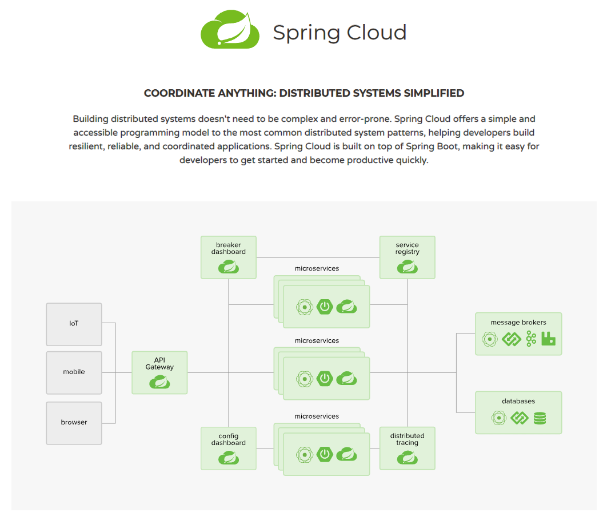

SpringCloud，基于SpringBoot提供了一套微服务解决方案，包括服务注册与发现，配置中心，全链路监控，服务网关，负载均衡，熔断器等组件，除了基于Netflix的开源组件做高度抽象封装之外，还有一些选型中立的开源组件。

SpringCloud利用SpringBoot的开发便利性巧妙的简化了分布式系统基础设施的开发，SpringCloud为开发人员提供了快速构建分布式系统的一些工具，**包括配置管理、服务发现、断路器、路由、微代理、事件总线、全局锁、决策竞选、分布式会话等**，它们都可以用SpringBoot的开发风格做到一键启动和部署。

SpringBoot并没有重复制造轮子，它只是将目前各家公司开发的比较成熟、经得起实际考验的服务框架组合起来，通过SpringBoot风格进行再封装屏蔽了复杂的配置和实现原理，最终给开发者留出了一套简单易懂、易部署和易维护的分布式系统开发包。

## 2、SpringCloud和Dobbo对比

|              | Dubbo         | SpringCloud                  |
| ------------ | ------------- | ---------------------------- |
| 服务注册中心 | Zookeeper     | SpringCloud netflix Eureka   |
| 服务调用方式 | Dubbo-monitor | REST API                     |
| 服务监控     | 不完善        | SpringBoot Admin             |
| 断路器       | 无            | SpringCloud Netflix  Hystrix |
| 服务网关     | 无            | SpringCloud Netflix Zuul     |
| 分布式配置   | 无            | SpringCloud Config           |
| 服务跟踪     | 无            | SpringCloud Sleuth           |
| 消息总线     | 无            | SpringCloud Bus              |
| 数据流       | 无            | SpringCloud Stream           |
| 批量任务     | 无            | SpringCloud Task             |
| ...          | ...           | ...                          |

## 3、SpringCloud 参考资料

1）https://springcloud.cc/spring-cloud-netflix.html

API：

英文：https://cloud.spring.io/spring-cloud-static/Finchley.SR2/

中文：https://springcloud.cc/spring-cloud-dalston.html

SpringCloud中国社区：http://springcloud.cn/

SpringCloud中文网：https://springcloud.cc/

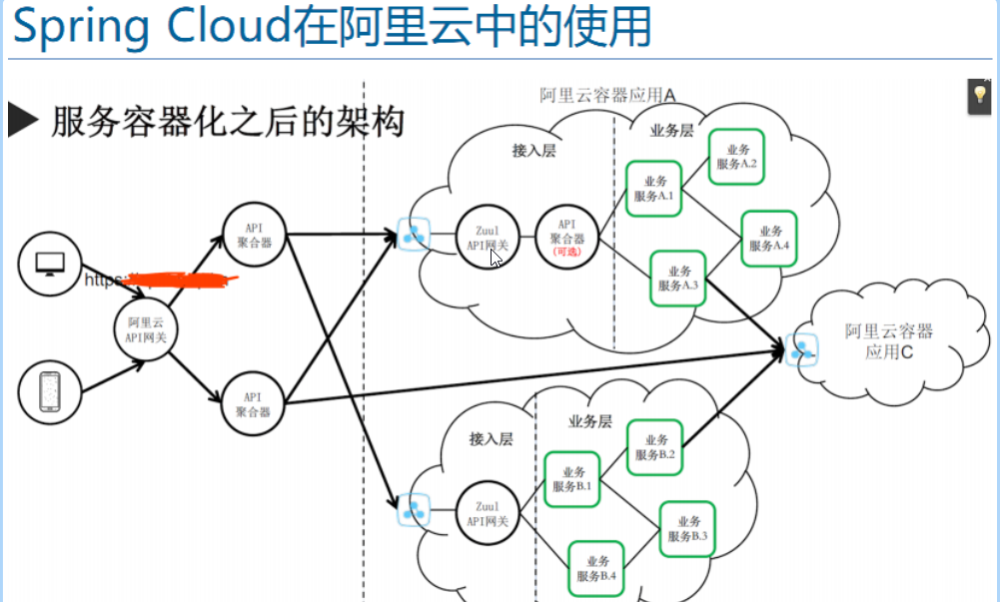

# 三、Eureka服务注册与发现

## 1、Eureka是什么

Netflix在设计Eureka时遵守的是AP原则

Eureka是Netflix的一个子模块，也是核心模块之一。Eureka是一个基于REST的服务，用于定位服务，以实现云端中间层服务发现和故障转移。服务注册与发现对于微服务架构来说是非常重要的，有了服务发现与注册，**只需要使用服务的标识符，就可以访问到服务**，而不需要修改服务调用的配置文件了。功能类似于dubbo的注册中心，比如Zookeeper。

Eureka采用了C-S的设计架构。EurekaSever作为服务注册功能的服务器，它是服务注册中心，而系统中的其他微服务，使用Eureka的客户端连接到EurekaServer并维持心跳连接。这样系统的维护人员就可以通过EurekaServer来监控系统中各个微服务是否正常运行。SpringCloud的一些其他模块就可以通过EurekaServer来发现系统中的其他微服务，并执行相关的逻辑。

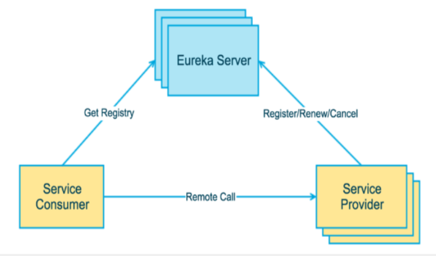

## 2、Eureka注册中心

~~~xml
<dependency>
    <groupId>org.springframework.cloud</groupId>
    <artifactId>spring-cloud-starter-netflix-eureka-server</artifactId>
</dependency>
~~~

~~~prop
server.port=8761
# eureka实例的主机名
eureka.instance.hostname=eureka-server
# 不把自己注册到eureka上
eureka.client.register-with-eureka=false
# 不从eureka上获取服务的注册信息
eureka.client.fetch-registry=false
#eureka.client.service-url.deaultZone=http://localhost:8761/eureka/
# 设置与EurekaServer通讯的地址
eureka.client.service-url.deaultZone=http://${eureka.instance.hostname}:${server.port}/eureka/
~~~

~~~java
@EnableEurekaServer // 开启Eureka服务
@SpringBootApplication
public class EurekaServerApplication {
    public static void main(String[] args) {
        SpringApplication.run(EurekaServerApplication.class, args);
    }
}
~~~

## 3、Eureka服务提供者

~~~xml
<dependency>
    <groupId>org.springframework.boot</groupId>
    <artifactId>spring-boot-starter-web</artifactId>
</dependency>
<dependency>
    <groupId>org.springframework.cloud</groupId>
    <artifactId>spring-cloud-starter-netflix-eureka-client</artifactId>
</dependency>
<!-- 监控应用 -->
<dependency>
    <groupId>org.springframework.boot</groupId>
    <artifactId>spring-boot-starter-actuator</artifactId>
</dependency>
~~~

~~~properties
server.port=9000
spring.application.name=provider-ticket
# Eureka服务地址
eureka.client.service-url.defaultZone=http://localhost:8761/eureka/
# 注册服务的时候使用服务的ip地址
eureka.instance.prefer-ip-address=true
# 修改在Eureka里的主机映射名称
eureka.instance.instance-id=${spring.application.name}:${server.port}
~~~

~~~java
@Service // 编写一个服务
public class TicketService {
    public String getTicket(String index) {
        return "《碟中谍" + index + "》";
    }
}
~~~

~~~java
@RestController // 提供一个访问地址
public class TicketController {
    @Resource
    TicketService ticketService;
    @GetMapping("/ticket/{index}")
    @ResponseBody
    public String getTicket(@PathVariable("index") String index) {
        return ticketService.getTicket(index);
    }
}
~~~

服务地址：http://127.0.0.1:9000/ticket/1

## 4、Eureka服务消费者

~~~xml
<dependency>
    <groupId>org.springframework.boot</groupId>
    <artifactId>spring-boot-starter-web</artifactId>
</dependency>
<dependency>
    <groupId>org.springframework.cloud</groupId>
    <artifactId>spring-cloud-starter-netflix-eureka-client</artifactId>
</dependency>
<!-- 监控应用 -->
<dependency>
    <groupId>org.springframework.boot</groupId>
    <artifactId>spring-boot-starter-actuator</artifactId>
</dependency>
~~~

~~~properties
server.port=9001
spring.application.name=consumer-user
eureka.client.service-url.defaultZone=http://localhost:8761/eureka/
# 注册服务的时候使用服务的ip地址
eureka.instance.prefer-ip-address=true
# 修改在Eureka里的主机映射名称
eureka.instance.instance-id=${spring.application.name}:${server.port}
~~~

~~~java
@EnableDiscoveryClient // 开启发现服务功能
@SpringBootApplication
public class ConsumerUserApplication {

    public static void main(String[] args) {
        SpringApplication.run(ConsumerUserApplication.class, args);
    }

    @LoadBalanced // 使用客户端负载均衡
    @Bean
    public RestTemplate restTemplate() {
        return new RestTemplate();
    }

}
~~~

~~~java
@Controller
public class UserController {
    @Resource
    RestTemplate restTemplate;
    @RequestMapping("/buyTicket/{index}")
    @ResponseBody
    public String buyTicket(@PathVariable("index") String index, String name) {
        // PROVIDER-TICKET 是Eureka的服务名称
        String ticket = restTemplate.getForObject("http://PROVIDER-TICKET/ticket/" + index, String.class);
        return name + "，卖到票：" + ticket;
    }
}
~~~

访问客户端地址：http://127.0.0.1:9001/butTicket/1?name=张三，将调研服务端的ticket服务

## 5、actuator显示信息

```properties
# 新增info信息，在actuator使用时可以访问info信息
info.app.name=provider-ticket
info.company.name=fcc
```

访问地址：http://127.0.0.1:9000/actuator/info

## 6、Eureka自我保护

某时刻某一个微服务不可用了，Eureka不会立刻清理，依旧会对该微服务的信息进行保存

## 7、Eureka集群

1）**Eureka服务端，将自己注册到其他Eureka服务端上**

~~~yml
# 可以修改本机的host文件将 peer1,pee2,pee3都映射到127.0.0.1
---
spring:
  profiles: peer1
server:
  port: 8761
eureka:
  instance:
    hostname: peer1
  client:
    serviceUrl:
      defaultZone: http://peer2:8762/eureka/,http://peer3:8763/eureka/
---
spring:
  profiles: peer2
server:
  port: 8762  
eureka:
  instance:
    hostname: peer2
  client:
    serviceUrl:
      defaultZone: http://peer1:8761/eureka/,http://peer3:8763/eureka/
---
spring:
  profiles: peer3
server:
  port: 8763   
eureka:
  instance:
    hostname: peer3
  client:
    serviceUrl:
      defaultZone: http://peer1:8761/eureka/,http://peer2:8762/eureka/
~~~

2）**客户端将所有Eureka的服务地址都写上**

~~~yml
eureka:
  client:
    service-url:
      defaultZone: http://peer1:8761/eureka/,http://peer2:8762/eureka/,http://peer3:8763/eureka/
~~~

## 8、分布式数据库中CAP原理

### 1、传统的ACID是什么

- A（Atomicity）原子性
- C（Consistency）一致性
- I（Isolation）独立性
- D（Durability）持久性

关系型数据库（RDBMS）遵循ACID规则

事务（transaction）它有如下四个特性：

#### 1、A（Atomicity）原子性

事务里的所有操作要么全部做完，要么都不做，事务成功的条件是事务里的所有操作都成功，只要有一个操作失败，整个事务就失败，需要回滚。

比如银行转账，从A账户转100元至B账户，分为两个步骤：

- 从A从账户取100元
- 存入100元至B账户

这两步要么一起完成，要么一起不完成，如果只完成第一步，第二步失败，钱会少了100元。

#### 2、C（Consistency）一致性

数据库要一直处于一致的状态，事务的运行不会改变数据库原本的一致性约束。

#### 3、I（Isolation）独立性

在并发的事务之间不会互相影响。如果一个事务要访问的数据正在被另外一个事务修改，只要另外一个事务未提交，它所访问的数据就不受未提交事务的影响。比如有个交易是从A账户转100元至B账户，在这个交易还未完成的情况向，如果此时B查询自己的账户，是卡不到新增加的100元的。

#### 4、D（Durability）持久性

指一旦事务提交后，它所做的修改将会永久的保存在数据库上，即使宕机也不会丢失。

### 2、CAP是什么

经典CAP图如下：

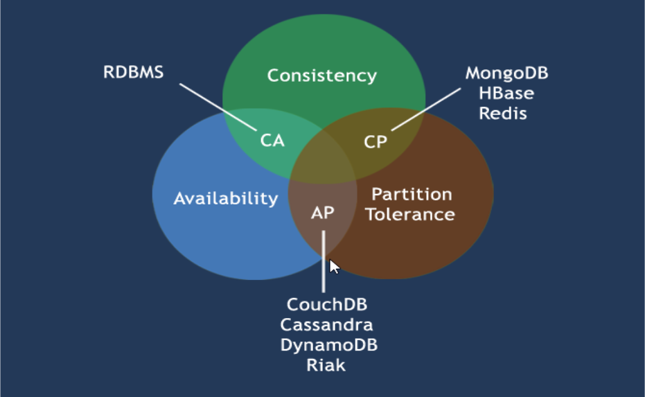

CAP理论的核心是：一个分布式系统不可能同时很好的满足一致性，可用性和分区容错性这三个需求，因此，根据CAP原理将NoSQL数据库分成了满足CA原则、满足CP原则和满足AP原则三大类

- CA：单点集群，满足一致性，可用性的系统，同在在可扩展性上不太强。
- CP：满足一致性，分区容错性的系统，通常性能不是特别高
- AP：满足可用性，分区容错性的系统，通常看呢归队一致性要求低一些。

#### 1、C（Consistency）强一致性

#### 2、A（Availability）可用性

#### 3、P（Partition tolerance）分区容错性

## 9、Eureka比Zookeeper好在哪里

CAP理论指出，一个分布式系统不可能同时满足C（一致性）、A（可用性）和P（分区容错性）。由于分区容错性P在分布式系统中必须要保证，因此我们只能在A和C之间进行权衡。

### 1、Zookeeper保证的是CP

当向注册中兴查询服务列表时，我们可以容忍注册中兴返回的是几分钟以前的注册信息，但不能接受服务直接宕机。**服务注册功能对可用性的要求高于一致性。**但是zk会出现这样一种情况，当master节点因为网络故障与其他节点失去联系时，剩余节点会重新进行leader选举。问题在于，**选角leader的时间太长，30~120s，且选举期间整个zk集群都是不可用的**，这就导致在选举区间注册服务瘫痪。在云部署的环境下，因网络罔替是的zk集群失去master节点是较大概率会发生的事，虽然服务能够最终恢复，但是漫长的选举书剑导致注册长崎不可用是不能容忍的。

### 2、Eureka保证的是AP

**Eureka各个节点都是平等的。**几个节点挂掉不会影响正常节点的工作，剩余的节点依然可以提供注册和查询服务。而Eureka的客户端在向某个Eureka注册时如果发现连接失败，则会自动切换至其他节点，只要有一台Eureka还在，就能保证注册服务可用（保证可用性），只不过查到的信息可能不是最新的（不保证强一致性）。

Eureka还有一种自我保护机制，如果在15分钟内超过85%的节点都没有正常的心跳，那么Eureka就认为客户端与注册中心出现了网络故障，此时会出现以下几种情况：

1）Eureka不再从注册列表中移除因为长时间没有收到心跳而应该过期的服务

2）Eureka仍然能够接受新服务的注册和查询请求，但是不会被同步到其他节点上（即保证当前节点依然可用）

3）当网络稳定时，当前实例新的注册信息会被同步到其他节点中

因此，Eureka可用很好的应对因为网络故障导致部分节点失去联系的情况，而不会想zookeeper那样使整个注册服务瘫痪。

# 四、Ribbon负载均衡

## 1、Ribbon是客户端负载均衡工具（LB）

SpringCloud Ribbon是基于Netflix Ribbon实现的一套**客户端 负载均衡**的工具。

Ribbon是Netflix发布的开源项目，主要功能是提供客户端的软件负载均衡算法，将Netflix的中间层服务连接在一起。Ribbon客户端组件提供一系列完善的配置项如连接超时，重试等。就是在配置文件中列出Load Balancer（简称LB）后面所有的机器，Ribbon会自动的帮助你基于某种规则（如简单轮询，随机连接等）去连接这些机器。我们也很容易使用Ribbon实现自定义的负载均衡算法。

## 2、负载均衡分类

LB，即负载均衡（Load Balance），在微服务或分布式集群中经常使用的一种应用。

负载均衡是将用户的请求平摊到分配到多个服务删个，从而达到系统的HA。

常见的负载均衡有软件Nginx，LVS，硬件F5等。

相应的中间件，例如dubbo和SpringCloud中都有给我们提供了负载均衡，SpringCloud的负载均衡算法可以自定义。

### 1、集中式LB（偏硬件）

在服务的消费方和提供方之间使用独立的LB设施（可以是硬件，如F5，也可以是软件，如Nginx），由该设施负责吧访问请求通过某种策略转发至服务的提供方。

### 2、进程内LB（偏软件）

将LB逻辑集成到消费方，消费方从服务注册中心获取有哪些地址可用，然后自己再从这些地中选择出一个合适的服务器。

**Ribbon就属于进程内LB**，它只是一个类库，集成于消费方进程，消费方通过它来获取到服务提供方的地址

### 3、服务消费者

参考Eureka服务消费者实现。

~~~xml
<!-- 使用Eureka客户端 -->
<dependency>
    <groupId>org.springframework.cloud</groupId>
    <artifactId>spring-cloud-starter-netflix-eureka-client</artifactId>
</dependency>
<dependency>
    <groupId>org.springframework.cloud</groupId>
    <artifactId>spring-cloud-starter-ribbon</artifactId>
</dependency>
~~~

~~~properties
eureka.client.service-url.defaultZone=http://localhost:8761/eureka/
~~~

~~~java
@EnableDiscoveryClient // 开启发现服务功能
@SpringBootApplication
public class ConsumerUserApplication {

    public static void main(String[] args) {
        SpringApplication.run(ConsumerUserApplication.class, args);
    }

    @LoadBalanced // 使用客户端负载均衡
    @Bean
    public RestTemplate restTemplate() {
        return new RestTemplate();
    }

}
~~~

~~~java
@Controller
public class UserController {
    @Resource
    RestTemplate restTemplate;
    @RequestMapping("/buyTicket")
    @ResponseBody
    public String buyTicket(String name) {
        // PROVIDER-TICKET 是Eureka的服务名称
        String ticket = restTemplate.getForObject("http://PROVIDER-TICKET/ticket", String.class);
        return name + "，卖到票：" + ticket;
    }
}
~~~

## 3、Ribbon核心组件

IRule：根据特定算法从服务列表中选取一个要访问的服务

- RoundRobinRule：轮询
- RandomRule：随机
- AvailabilityFilteringRule：会先过滤掉由于多次访问故障而处于断路器跳闸状态的服务，还有并发的连接数量超过阀值的服务，然后对剩余的服务列表按照如下策略进行访问
- WeightedResponseTimeRule：根据平均响应时间计算所有服务的权重，响应时间越快服务权重越大选中的概率越高 。刚启动时如果统计信息不足，则使用RoundRobinRule策略，等统计信息足够，会切换到WeightedResponseTimeRule
- RetryRule：先按照RoundRobinRule的策略获取服务，如果获取服务失败则在指定时间内会进行重试，获取可
- BestAvailableRule：会先过滤掉由于多次访问故障而处于断路器跳闸状态的服务，然后选择一个并发量最小的服务
- ZoneAvoidanceRule：默认规则，复合判断server所在区域的性能和server的可用性选择服务器

使用指定算法

~~~java
@Bean
public IRule getRule() {
    return new RandomRule(); // 随机算法
}
~~~

## 4、Ribbon自定义客户端

指定的服务使用这自定义的算法。

~~~java
@EnableDiscoveryClient // 开启发现服务功能
@SpringBootApplication
@RibbonClient(name = "PROVIDER-TICKET", configuration = MyRuleConfig.class) // Ribbon在调用服务名：PROVIDER-TICKET，使用指定的配置信息MyRuleConfig
public class ConsumerUserApplication {

    public static void main(String[] args) {
        SpringApplication.run(ConsumerUserApplication.class, args);
    }

    @LoadBalanced // 使用客户端负载均衡
    @Bean
    public RestTemplate restTemplate() {
        return new RestTemplate();
    }
}
~~~

**MyRuleConfig里指定的Ribbon的算法，定义新的包名**。

~~~java
package com.fcc.ribbon.rule;

import com.netflix.loadbalancer.IRule;
import com.netflix.loadbalancer.RandomRule;
import org.springframework.context.annotation.Bean;
import org.springframework.context.annotation.Configuration;

/**
 * Ribbon自定义配置类
 *  必须是@Configuration，但请注意，它不在主应用程序上下文的@ComponentScan中，否则将由所有@RibbonClients共享。
 *  如果您使用@ComponentScan（或@SpringBootApplication），
 *  则需要采取措施避免包含（例如将其放在一个单独的，不重叠的包中，或者指定要在@ComponentScan）。
 *  即：不能在ConsumerUserApplication所在的包下（ConsumerUserApplication里的@@SpringBootApplication包含了@ComponentScan），如新的包名：com.fcc.ribbon.rule
 */
@Configuration
public class MyRuleConfig {

    @Bean
    public IRule getRule() {
        return new RandomRule();
    }

}
~~~

# 五、Feign负载均衡-声明性REST客户端

[Feign](https://github.com/Netflix/feign)**是一个声明式的Web服务客户端。这使得Web服务客户端的写入更加方便**。要使用Feign创建一个界面并对其进行注释。（**只需要创建一个接口，然后在上面添加注解即可**）它具有可插入注释支持，包括Feign注释和JAX-RS注释。Feign还支持可插拔编码器和解码器。Spring Cloud增加了对Spring MVC注释的支持，并使用Spring Web中默认使用的`HttpMessageConverters`。Spring Cloud集成Ribbon和Eureka以在使用Feign时提供负载均衡的http客户端。

Feign旨在是编写java Http客户端变得容易。

签名使用Ribbon+RestTemplate时，利用RestTemplate对http请求的封装处理，形成了一套模板化的调用方法。但是在实际开发中，由于对服务依赖的调用可能不止一处，**往往一个接口会被多次调用，所以通常都会针对每个微服务自行封装一些客户端类来包装这些依赖服务的调用。**y因此Feign在此基础上做了进一步封装，由他来帮助我们定义和实现依赖服务接口的定义。在Feign的实现下，**我们只需要创建一个接口并使用注解的方式来配置它（以前是Dao接口上面标注Mapper注解，现在是一个额为服务接口上面标注一个Feign注解即可）**，即可完成对服务提供的接口绑定，简化了使用SpringCloud Ribbon时，自动封装服务调用客户端的开发量。

**服务消费者**

~~~xml
<!-- 添加依赖 -->
<dependency>
    <groupId>org.springframework.cloud</groupId>
    <artifactId>spring-cloud-starter-feign</artifactId>   
</dependency>
~~~

~~~java
// 添加接口访问服务提供者，参见服务提供者开放的Controller
@FeignClient(value = "PROVIDER-TICKET")
public interface TickService {
    @RequestMapping(method = RequestMethod.GET, value = "/ticket/{index}")
    String getTicket(@PathVariable("index") String index);
}
~~~

~~~java
// 在消费者的Controller调用Service
@Resource
TicketService ticketService;
@RequestMapping("/buyTicket2/{index}")
@ResponseBody
public String buyTicket2(@PathVariable("index") String index, String name) {
    String ticket = ticketService.getTicket(index);
    return name + "，卖到票：" + ticket;
}
~~~

~~~java
@EnableDiscoveryClient // 开启发现服务功能
@SpringBootApplication
@EnableFeignClients // 开启Feign功能
public class ConsumerUserApplication {
    public static void main(String[] args) {
        SpringApplication.run(ConsumerUserApplication.class, args);
    }
}
~~~

# 六、Hystrix断路器

Hystrix是一个用于处理分布式系统的延迟和容错的开源库，在分布式系统里，能保证在一个依赖出问题的情况下，不会导致整体服务失败，避免级联故障，已提高分布式系统的弹性。

“熔断器”本身是一种开关装置，当某个服务单元发生故障后，通过熔断器的故障监控，向调用方返回一个符合预期的、可处理的备选响应（Fallback），而不是长时间的等待或者抛出调用方法无法处理的异常，这样就保证服务调用方的线程不会被长时间、不必要的占用，从而避免了故障在分布式系统中的蔓延，乃至雪崩。

缺省5秒内20次调用失败就会启动熔断机制。熔断机制的注解是@HystrixCommand

## 1、服务熔断-服务端

一般不在服务端做熔断

~~~xml
<!-- 添加依赖 -->
<dependency>
    <groupId>org.springframework.cloud</groupId>
    <artifactId>spring-cloud-starter-hystrix</artifactId>
</dependency>
~~~

~~~java
@Service
public class TicketService {
	// 添加@HystrixCommand，并标记该方法的回调方法为getTicketDefault
    @HystrixCommand(fallbackMethod = "getTicketDefault")
    public String getTicket(String index) {
        int i = 1 / 0;
        return "《碟中谍" + index + "》";
    }

    public String getTicketDefault(String index) {
        return "ticket servier is error!";
    }
}
~~~

~~~java
@SpringBootApplication
@EnableCircuitBreaker //开启服务熔断
public class ProviderTicketApplication {

    public static void main(String[] args) {
        SpringApplication.run(ProviderTicketApplication.class, args);
    }

}
~~~

## 2、服务降级-客户端（Fegin Hystrix）

因为熔断只是作用在服务调用这一端，因此我们根据上一篇的示例代码只需要改动项目相关代码就可以。因为，Feign中已经依赖了Hystrix所以在maven配置上不用做任何改动。

~~~properties
feign.hystrix.enabled=true # Feign开启Hystrix支持
~~~

~~~java
// 新增熔断后回调的类
@Component // 可以获取到错误信息并返回指定信息。
public class TicketServiceFallbackFactory implements FallbackFactory<TicketService> {
    @Override
    public TicketService create(Throwable throwable) {
        return new TicketService() {
            @Override
            public String getTicket(String index) {
                return "ticket server is down,please wait a moment" ;
            }
        };
    }
}
~~~

~~~java
// 添加指定fallbackFactory类，在服务熔断的时候返回fallback类中的内容。
@FeignClient(value = "PROVIDER-TICKET", fallbackFactory = TicketServiceFallbackFactory.class)
public interface TicketService {
    @RequestMapping(method = RequestMethod.GET, value = "/ticket/{index}")
    String getTicket(@PathVariable("index") String index);
}
~~~

当Tickct服务端宕机后，将会执行TicketServiceFallbackFactory里的方法

## 3、熔断监控Hystrix Dashboard和Turbine

### 1、Hystrix Dashboard

Hystrix-dashboard是一款针对Hystrix进行实时监控的工具，通过Hystrix Dashboard我们可以在直观地看到各Hystrix Command的请求响应时间, 请求成功率等数据。但是只使用Hystrix Dashboard的话, 你只能看到单个应用内的服务信息, 这明显不够. 我们需要一个工具能让我们汇总系统内多个服务的数据并显示到Hystrix Dashboard上, 这个工具就是Turbine.

~~~xml
<!-- 添加依赖 -->
<dependency>
    <groupId>org.springframework.boot</groupId>
    <artifactId>spring-boot-starter-actuator</artifactId>
</dependency>
<dependency>
    <groupId>org.springframework.boot</groupId>
    <artifactId>spring-boot-starter-web</artifactId>
</dependency>
<dependency>
    <groupId>org.springframework.cloud</groupId>
    <artifactId>spring-cloud-starter-netflix-hystrix-dashboard</artifactId>
</dependency>
~~~

~~~properties
server.port=9100
~~~

~~~java
@EnableHystrixDashboard // 开启HystrixDashboard监控服务
@SpringBootApplication
public class HystrixDashboardApplication {
    public static void main(String[] args) {
        SpringApplication.run(HystrixDashboardApplication.class, args);
    }
}
~~~

访问http://127.0.0.1:9100/hystrix/出现下图，表示监控应用启动成功：

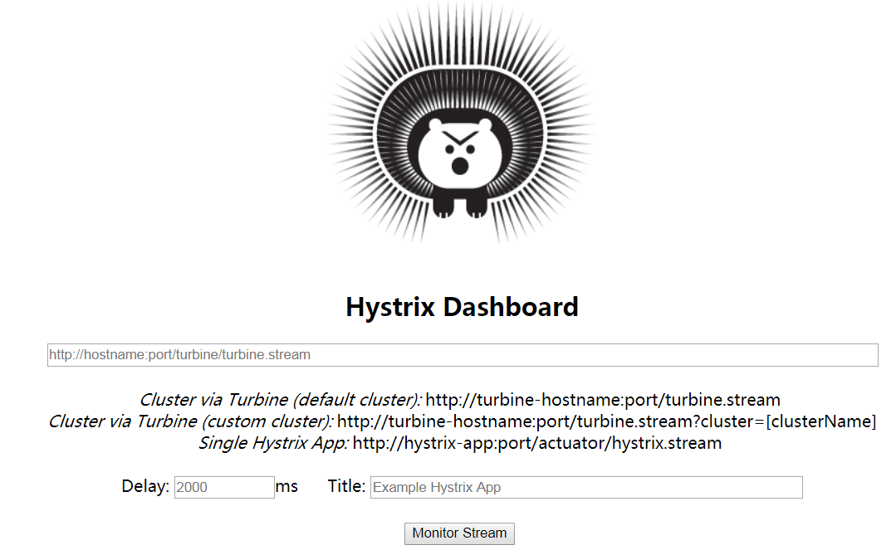

监控服务端，在地址内输入http://127.0.0.1:9000/actuator/hystrix.stream

Delay：2000，Title：ticket-service-9000

点击“Monitor Stream”，出现监控信息如下：

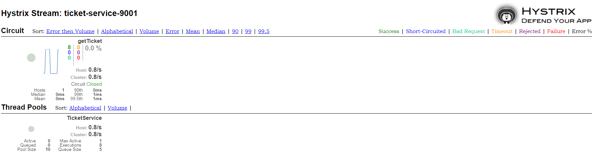

实心圆：共有两种含义。它通过颜色的变化代表了示例的健康程度，它的健康度从绿色<黄色<橙色<红色递减。

该实心圆除了颜色的变化之外，它的大小也会根据实例的请求流量发送变化，流量越大实心圆也就越大。所以通过该实心圆的展示，就可以在大量的实例中发现**故障实例和高压力实例**。

图片说明图：

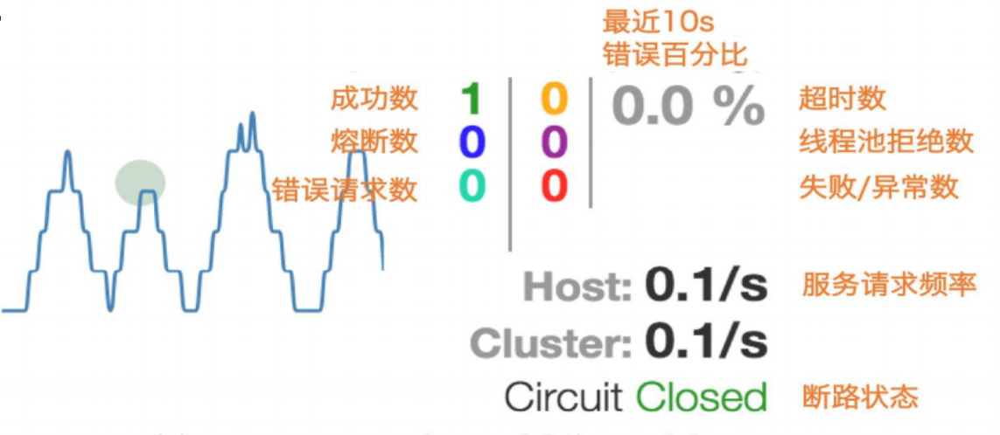

单个应用的熔断监控已经完成。

### 2、Turbine

在复杂的分布式系统中，相同服务的节点经常需要部署上百甚至上千个，很多时候，运维人员希望能够把相同服务的节点状态以一个整体集群的形式展现出来，这样可以更好的把握整个系统的状态。 为此，Netflix提供了一个开源项目（Turbine）来提供把多个hystrix.stream的内容聚合为一个数据源供Dashboard展示。

~~~xml
<!-- 添加依赖 -->
<dependency>
    <groupId>org.springframework.cloud</groupId>
    <artifactId>spring-cloud-starter-netflix-eureka-client</artifactId>
</dependency>
<dependency>
    <groupId>org.springframework.cloud</groupId>
    <artifactId>spring-cloud-starter-netflix-hystrix-dashboard</artifactId>
</dependency>
<dependency>
    <groupId>org.springframework.cloud</groupId>
    <artifactId>spring-cloud-starter-netflix-turbine</artifactId>
</dependency>
~~~

```properties
spring.application.name=hystrix-dashboard-turbine
server.port=9200
turbine.appConfig=CONSUMER-USER,PROVIDER-TICKET
turbine.aggregator.clusterConfig= default
turbine.clusterNameExpression= new String("default")
eureka.client.serviceUrl.defaultZone=http://localhost:8761/eureka/
```

- `turbine.appConfig` ：配置Eureka中的serviceId列表，表明监控哪些服务
- `turbine.aggregator.clusterConfig` ：指定聚合哪些集群，多个使用”,”分割，默认为default。可使用`http://.../turbine.stream?cluster={clusterConfig之一}`访问
- `turbine.clusterNameExpression` ： 1. clusterNameExpression指定集群名称，默认表达式appName；此时：`turbine.aggregator.clusterConfig`需要配置想要监控的应用名称；2. 当clusterNameExpression: default时，`turbine.aggregator.clusterConfig`可以不写，因为默认就是default；3. 当clusterNameExpression: metadata[‘cluster’]时，假设想要监控的应用配置了`eureka.instance.metadata-map.cluster: ABC`，则需要配置，同时`turbine.aggregator.clusterConfig: ABC`

~~~java
@SpringBootApplication
@EnableHystrixDashboard     // 开启HystrixDashboard监控熔断服务
@EnableTurbine              // 开启Turbine监控熔断集群服务
public class TurbineApplication {

    public static void main(String[] args) {
        SpringApplication.run(TurbineApplication.class, args);
    }

}
~~~

访问http://127.0.0.1:9200/hystrix/

监控服务端，在地址内输入http://127.0.0.1:9200/turbine.stream

Delay：2000，Title：all-service

点击“Monitor Stream”，出现监控信息如下（服务端和消费端都显示在仪表盘上）：

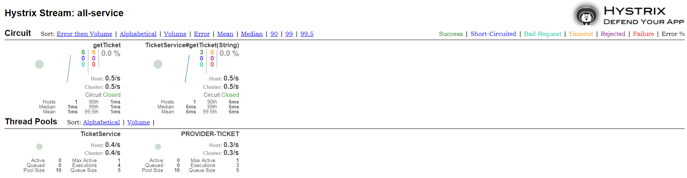

# 七、网关

1、简化客户端调用复杂度

在微服务架构模式下后端服务的实例数一般是动态的，对于客户端而言很难发现动态改变的服务实例的访问地址信息。因此在基于微服务的项目中为了简化前端的调用逻辑，通常会引入API  Gateway作为轻量级网关，同时API Gateway中也会实现相关的认证逻辑从而简化内部服务之间相互调用的复杂度。

2、数据裁剪以及聚合

通常而言不同的客户端对于显示时对于数据的需求是不一致的，比如手机端或者Web端又或者在低延迟的网络环境或者高延迟的网络环境。

因此为了优化客户端的使用体验，API Gateway可以对通用性的响应数据进行裁剪以适应不同客户端的使用需求。同时还可以将多个API调用逻辑进行聚合，从而减少客户端的请求数，优化客户端用户体验

3、多渠道支持

当然我们还可以针对不同的渠道和客户端提供不同的API Gateway,对于该模式的使用由另外一个大家熟知的方式叫Backend for front-end, 在Backend for front-end模式当中，我们可以针对不同的客户端分别创建其BFF。

4、遗留系统的微服务化改造

对于系统而言进行微服务改造通常是由于原有的系统存在或多或少的问题，比如技术债务，代码质量，可维护性，可扩展性等等。API  Gateway的模式同样适用于这一类遗留系统的改造，通过微服务化的改造逐步实现对原有系统中的问题的修复，从而提升对于原有业务响应力的提升。通过引入抽象层，逐步使用新的实现替换旧的实现。

## 1、Spring Cloud Zuul

在Spring Cloud体系中， Spring Cloud Zuul就是提供负载均衡、反向代理、权限认证的一个API gateway。

Spring Cloud Zuul路由是微服务架构的不可或缺的一部分，提供动态路由，监控，弹性，安全等的边缘服务。Zuul是Netflix出品的一个基于JVM路由和服务端的负载均衡器。

### 1、Zuul服务端&路由

~~~xml
<dependency>
    <groupId>org.springframework.boot</groupId>
    <artifactId>spring-boot-starter-actuator</artifactId>
</dependency>
<dependency>
    <groupId>org.springframework.boot</groupId>
    <artifactId>spring-boot-starter-web</artifactId>
</dependency>
<!-- 发现Eureka里的服务 -->
<dependency>
    <groupId>org.springframework.cloud</groupId>
    <artifactId>spring-cloud-starter-netflix-eureka-client</artifactId>
</dependency>
<!-- zuul网关 -->
<dependency>
    <groupId>org.springframework.cloud</groupId>
    <artifactId>spring-cloud-starter-netflix-zuul</artifactId>
</dependency>
~~~

~~~yml
server:
  port: 9020
spring:
  application:
    name: spring-cloud-zuul

eureka:
  instance:
    prefer-ip-address: true # 注册服务的时候使用服务的ip地址
    instance-id: ${spring.application.name}:${server.port}  # 修改在Eureka里的主机映射名称
  client:
    serviceUrl:
      defaultZone: "http://localhost:8761/eureka/"

management:
  endpoints:
    web:
      exposure:
        include: "*"
  endpoint:
    health:
      show-details: ALWAYS

zuul:
  routes:
    api-ticket:
      stripPrefix: true # 默认true，重定向时，/api/不在请求路径里，即访问http://127.0.0.1:60001/api/product/1,则重定向到http://127.0.0.1:60000/product/1
      path: /api/ticket/**
      url: http://localhost:9000/ticket/      
  host:
    max-per-route-connections: 1000
    max-total-connections: 1000
    socket-timeout-millis: 60000
    connect-timeout-millis: 60000
~~~

~~~java
@EnableZuulProxy       // 开启Zuul网关路由
@SpringBootApplication
public class ZuulApplication {

    public static void main(String[] args) {
        SpringApplication.run(ZuulApplication.class, args);
    }

}
~~~

1）访问：http://127.0.0.1:9020/api/ticket/3，则调用ticket服务。调用指定的path路径进行映射。

2）访问：http://127.0.0.1:9020/provider-ticket/ticket/3，通过服务名调用ticket服务。

默认情况下，Zuul会代理所有注册到Eureka Server的微服务，并且Zuul的路由规则如下：`http://ZUUL_HOST:ZUUL_PORT/微服务在Eureka上的serviceId/**`会被转发到serviceId对应的微服务。

3）将服务名替换为指定路径进行访问。

~~~yml
zuul:
  routes:
    api-ticket:      
      path: /provider/**      
      serviceId: provider-ticket	#指定
~~~

访问：http://127.0.0.1:9020/provider/ticket/3，通过指定路径访问ticket服务。

4）将微服务ID的路径禁用&统一前缀

~~~yml
zuul:
  routes:
    api-ticket:
#      stripPrefix: true # 默认true，重定向时，/api/不在请求路径里，即访问http://127.0.0.1:60001/api/product/1,则重定向到http://127.0.0.1:60000/product/1
#      path: /api/ticket/**
#      url: http://localhost:9000/ticket/
#      serviceId: ticket
      path: /provider/**
      serviceId : provider-ticket
  ignored-services: provider-ticket # provider-ticket微服务ID路径 provider-ticket 将不能直接访问。或者用"*",则禁用所有微服务ID路径
~~~

访问：http://127.0.0.1:9020/provider-ticket/ticket/3 出现404错误，已不能用微服务ID作为路径访问

5）统一访问前缀

~~~yml
zuul:
  prefix: /api #访问路径多了一个/api
~~~

访问：http://127.0.0.1:9020/api/provider/ticket/3 

### 2、Zuul的核心

Filter是Zuul的核心，用来实现对外服务的控制。

Filter的生命周期有4个，分别是“PRE”、“ROUTING”、“POST”、“ERROR”，整个生命周期可以用下图来表示。

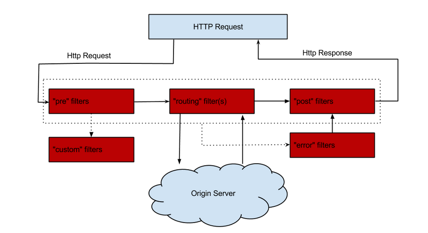

Zuul大部分功能都是通过过滤器来实现的，这些过滤器类型对应于请求的典型生命周期。

- **PRE：** 这种过滤器在请求被路由之前调用。我们可利用这种过滤器实现身份验证、在集群中选择请求的微服务、记录调试信息等。
- **ROUTING：**这种过滤器将请求路由到微服务。这种过滤器用于构建发送给微服务的请求，并使用Apache HttpClient或Netfilx Ribbon请求微服务。
- **POST：**这种过滤器在路由到微服务以后执行。这种过滤器可用来为响应添加标准的HTTP Header、收集统计信息和指标、将响应从微服务发送给客户端等。
- **ERROR：**在其他阶段发生错误时执行该过滤器。 除了默认的过滤器类型，Zuul还允许我们创建自定义的过滤器类型。例如，我们可以定制一种STATIC类型的过滤器，直接在Zuul中生成响应，而不将请求转发到后端的微服务。

### 3、Zuul自定义Filter

默认实现的Filter

| 类型  | 顺序 | 过滤器                  | 功能                       |
| ----- | ---- | ----------------------- | -------------------------- |
| pre   | -3   | ServletDetectionFilter  | 标记处理Servlet的类型      |
| pre   | -2   | Servlet30WrapperFilter  | 包装HttpServletRequest请求 |
| pre   | -1   | FormBodyWrapperFilter   | 包装请求体                 |
| route | 1    | DebugFilter             | 标记调试标志               |
| route | 5    | PreDecorationFilter     | 处理请求上下文供后续使用   |
| route | 10   | RibbonRoutingFilter     | serviceId请求转发          |
| route | 100  | SimpleHostRoutingFilter | url请求转发                |
| route | 500  | SendForwardFilter       | forward请求转发            |
| post  | 0    | SendErrorFilter         | 处理有错误的请求响应       |
| post  | 1000 | SendResponseFilter      | 处理正常的请求响应         |

自定义拦截器Oauth2认证成功后添加自定义头文件信息

~~~java
public class OAuth2HeaderFilter extends ZuulFilter {

    private Logger logger = LoggerFactory.getLogger(getClass());
    /**
     * @see com.netflix.zuul.IZuulFilter#run()
     **/
    @Override
    public Object run() throws ZuulException {
        RequestContext ctx = RequestContext.getCurrentContext();
        // 在header参数中添加 username  
        try {
            Authentication authentication = SecurityContextHolder.getContext().getAuthentication();
            String username = authentication.getName();
            ctx.addZuulRequestHeader("oauth2-username", URLEncoder.encode(username, "UTF-8"));
            // api 获取方式是
//            ((ServletRequestAttributes) RequestContextHolder.getRequestAttributes()).getRequest().getHeader("oauth2-username");            
        } catch (Exception e) {
            e.printStackTrace();
        }
        return null;
    }

    /**
     * 指定需要执行该Filter的规则
     * 返回true则执行run()
     * 返回false则不执行run()
     */
    @Override
    public boolean shouldFilter() {
        return true;
    }

    /**
     * 指定该Filter执行的顺序（Filter从小到大执行）
     * DEBUG_FILTER_ORDER = 1;
     * FORM_BODY_WRAPPER_FILTER_ORDER = -1;
     * PRE_DECORATION_FILTER_ORDER = 5;
     * RIBBON_ROUTING_FILTER_ORDER = 10;
     * SEND_ERROR_FILTER_ORDER = 0;
     * SEND_FORWARD_FILTER_ORDER = 500;
     * SEND_RESPONSE_FILTER_ORDER = 1000;
     * SIMPLE_HOST_ROUTING_FILTER_ORDER = 100;
     * SERVLET_30_WRAPPER_FILTER_ORDER = -2;
     * SERVLET_DETECTION_FILTER_ORDER = -3;
     */
    @Override
    public int filterOrder() {
        return 100;
    }

    /**
     * 指定该Filter的类型
     * ERROR_TYPE = "error";
     * POST_TYPE = "post";
     * PRE_TYPE = "pre";
     * ROUTE_TYPE = "route";
     */
    @Override
    public String filterType() {
        return PRE_TYPE;
    }
}
~~~

将OAuth2HeaderFilter加入到请求拦截队列，在启动类中添加以下代码：

```java
@Bean
public OAuth2HeaderFilter oAuth2HeaderFilter() {
    return new OAuth2HeaderFilter();
}
```

### 4、路由熔断

当我们的后端服务出现异常的时候，我们不希望将异常抛出给最外层，期望服务可以自动进行一降级。Zuul给我们提供了这样的支持。当某个服务出现异常时，直接返回我们预设的信息。

我们通过自定义的fallback方法，并且将其指定给某个route来实现该route访问出问题的熔断处理。主要继承ZuulFallbackProvider接口来实现，ZuulFallbackProvider默认有两个方法，一个用来指明熔断拦截哪个服务，一个定制返回内容。

~~~java
@Component
public class TicketFallback implements FallbackProvider {

    private Logger logger = LoggerFactory.getLogger(getClass());

    // 指定要处理的 serviceID。
    @Override
    public String getRoute() {
        return "provider-ticket";
    }
    @Override
    public ClientHttpResponse fallbackResponse(String route, Throwable cause) {
        if (cause != null && cause.getCause() != null) {
            String reason = cause.getCause().getMessage();
            logger.info("Excption {}",reason);
        }
        return new ClientHttpResponse() {
            @Override
            public HttpStatus getStatusCode() throws IOException {
                return HttpStatus.OK;
            }

            @Override
            public int getRawStatusCode() throws IOException {
                return 200;
            }

            @Override
            public String getStatusText() throws IOException {
                return "OK";
            }

            @Override
            public void close() {

            }

            @Override
            public InputStream getBody() throws IOException {
                return new ByteArrayInputStream("The ticket service is unavailable.".getBytes());
            }

            @Override
            public HttpHeaders getHeaders() {
                HttpHeaders headers = new HttpHeaders();
                headers.setContentType(MediaType.APPLICATION_JSON);
                return headers;
            }
        };
    }
}
~~~

当服务出现异常时，打印相关异常信息，并返回”The ticket service is unavailable.”。

### 5、限流

使用spring-cloud-zuul-ratelimit实现限流。

**原理分析**

对API限流是基于zuul过滤器完成的，如果不使用redis，限流数据是记录在内存中的，一般在开发环境中可以直接记录在内存中，生产环境中还是要使用Redis。

限流过滤器是在请求被转发之前调用的。

~~~xml
<!-- zool 限流 -->
<dependency>
    <groupId>com.marcosbarbero.cloud</groupId>
    <artifactId>spring-cloud-zuul-ratelimit</artifactId>
    <version>2.2.1.RELEASE</version>
</dependency>
~~~

~~~yml
spring:
  redis:
    host: localhost
    database: 0
    port: 6379
zuul:
  # 限流
  ratelimit:
    enabled: true
    behind-proxy: true          #代理之后
    repository: REDIS        #redis缓存数据 REDIS
    default-policy-list:        #通用配置
      - limit: 10               #每个刷新时间窗口对应的请求数量限制
        quota: 1000             #每个刷新时间窗口对应的请求时间限制（秒）
        refresh-interval: 60    #统计窗口刷新时间（秒），10次请求/60秒
        type:
          - user              #授权用户，匿名用户区分
          - origin            #客户端IP
          - url               #请求路径
#    policy-list:
#      api-ticket:               # 指定服务拦截
#          - limit: 10 #optional - request number limit per refresh interval window
#            quota: 1000 #optional - request time limit per refresh interval window (in seconds)
#            refresh-interval: 60 #default value (in seconds)
#            type: #optional
#                - user
#                - origin
#                - url
    #- type: #optional value for each type
    #    - user=anonymous
    #    - origin=somemachine.com
    #    - url=/api #url prefix
~~~


### 6、API文档汇总-swagger


## 2、SpringCloud Gateway

Spring Cloud Gateway 是 Spring Cloud 的一个全新项目，该项目是基于 Spring 5.0，Spring  Boot 2.0 和 Project Reactor 等技术开发的网关，它旨在为微服务架构提供一种简单有效的统一的 API 路由管理方式。

Spring Cloud Gateway 作为 Spring Cloud 生态系统中的网关，目标是替代 Netflix Zuul，其不仅提供统一的路由方式，并且基于 Filter 链的方式提供了网关基本的功能，例如：安全，监控/指标，和限流。

**相关概念:**

- Route（路由）：这是网关的基本构建块。它由一个 ID，一个目标 URI，一组断言和一组过滤器定义。如果断言为真，则路由匹配。
- Predicate（断言）：这是一个 Java 8 的 Predicate。输入类型是一个 ServerWebExchange。我们可以使用它来匹配来自 HTTP 请求的任何内容，例如 headers 或参数。
- Filter（过滤器）：这是`org.springframework.cloud.gateway.filter.GatewayFilter`的实例，我们可以使用它修改请求和响应。

**工作原理：**

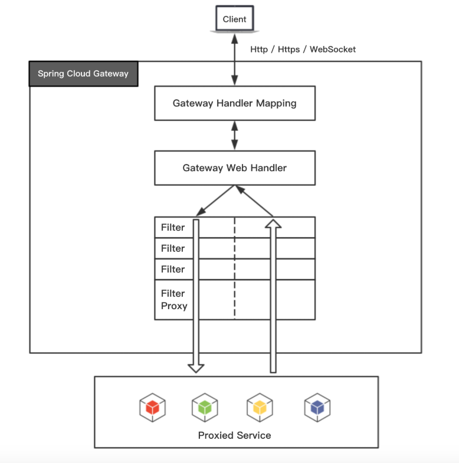

客户端向 Spring Cloud Gateway 发出请求。如果 Gateway Handler Mapping  中找到与请求相匹配的路由，将其发送到 Gateway Web Handler。Handler  再通过指定的过滤器链来将请求发送到我们实际的服务执行业务逻辑，然后返回。 过滤器之间用虚线分开是因为过滤器可能会在发送代理请求之前（“pre”）或之后（“post”）执行业务逻辑。

Spring Cloud Gateway 的特征：

- 基于 Spring Framework 5，Project Reactor 和 Spring Boot 2.0
- 动态路由
- Predicates 和 Filters 作用于特定路由
- 集成 Hystrix 断路器
- 集成 Spring Cloud DiscoveryClient
- 易于编写的 Predicates 和 Filters
- 限流
- 路径重写

~~~xml
<dependency>
    <groupId>org.springframework.boot</groupId>
    <artifactId>spring-boot-starter-actuator</artifactId>
</dependency>
<!-- 引入gateway -->
<dependency>
    <groupId>org.springframework.cloud</groupId>
    <artifactId>spring-cloud-starter-gateway</artifactId>
</dependency>
<dependency>
    <groupId>org.springframework.cloud</groupId>
    <artifactId>spring-cloud-starter-netflix-eureka-client</artifactId>
</dependency>
~~~

~~~yml
server:
  port: 9030
spring:
  application:
    name: spring-cloud-gateway
  cloud:
    gateway:
      discovery:
        locator:
          enabled: true # 开启注册中心访问发现
      routes:
        - id: 163
          uri: https://www.163.com
          predicates:
            - Path=/163
        - id: provider-ticket
          uri: http://localhost:9000/
#          uri: lb://provider-ticket # lb代表从注册中心获取服务
          filters:
            - StripPrefix=1  # 访问路径不带Path里的路径，如Path：/api/**，则转发/**
          predicates:
            - Path=/api/**

eureka:
  instance:
    prefer-ip-address: true # 注册服务的时候使用服务的ip地址
    instance-id: ${spring.application.name}:${server.port}  # 修改在Eureka里的主机映射名称
  client:
    serviceUrl:
      defaultZone: "http://localhost:8761/eureka/"

management:
  endpoints:
    web:
      exposure:
        include: "*"
  endpoint:
    health:
      show-details: ALWAYS
~~~

访问：http://127.0.0.1:9030/163，将跳转到https://www.163.com

各字段含义如下：

- id：我们自定义的路由 ID，保持唯一
- uri：目标服务地址
- predicates：路由条件，Predicate 接受一个输入参数，返回一个布尔值结果。该接口包含多种默认方法来将 Predicate 组合成其他复杂的逻辑（比如：与，或，非）。
- filters：过滤规则。


# 八、配置中心Config

SpringCloud Config范围服务端和客户端两部分。

服务端也称为分布式配置中心，它是一个独立的微服务应用，用来连接配置服务器并为客户端提供获取配置信息，加密/解密信息等访问接口。

## 1、服务端


## 2、客户端


# 九、分布式日志采集

## 1、分布式服务跟踪sleuth

随着业务的发展，我们的系统规模也会变得越来越大，各微服务间的调用关系也变得越来越错综复杂。通常一个由客户端发起的请求在后端系统中会经过多个不同的微服务调用来协同产生最后的请求结果，在复杂的微服务架构系统中，几乎每一个前端请求都会形成一条复杂的分布式服务调用链路，在每条链路中任何一个依赖服务出现延迟过高或错误的时候都有可能引起请求最后的失败。这时候对于每个请求全链路调用的跟踪就变得越来越重要，通过实现对请求调用的跟踪可以帮助我们快速的发现错误根源以及监控分析每条请求链路上的性能瓶颈等好处。

~~~xml
<!-- 微服务添加依赖链路跟踪 -->
<dependency>
    <groupId>org.springframework.cloud</groupId>
    <artifactId>spring-cloud-starter-sleuth</artifactId>
</dependency>
~~~

~~~java
@RestController // ticket服务提供者
public class TicketController {

    Logger logger = LoggerFactory.getLogger(getClass());

    @Resource
    TicketService ticketService;
    @GetMapping("/ticket/{index}")
    @ResponseBody
    public String getTicket(@PathVariable("index") String index) {
        logger.info("call getTicket");// 打印日志
        return ticketService.getTicket(index);
    }
}
~~~

~~~java
@Controller // ticket服务消费者
public class UserController {

    Logger logger = LoggerFactory.getLogger(getClass());

    @Resource
    RestTemplate restTemplate;
    @RequestMapping("/buyTicket/{index}")
    @ResponseBody
    public String buyTicket(@PathVariable("index") String index, String name) {
        // PROVIDER-TICKET 是Eureka的服务名称
        logger.info("call ticketService"); // 打印日志
        String ticket = restTemplate.getForObject("http://PROVIDER-TICKET/ticket/" + index, String.class);
        return name + "，卖到票：" + ticket;
    }

    @Resource
    TicketService ticketService;
    @RequestMapping("/buyTicket2/{index}")
    @ResponseBody
    public String buyTicket2(@PathVariable("index") String index, String name) {
        logger.info("call ticketService2"); // 打印日志
        String ticket = ticketService.getTicket(index);
        return name + "，卖到票：" + ticket;
    }
}
~~~

访问：http://127.0.0.1:9001/buyTicket2/2?name=张三

日志输出：

2018-12-29 09:38:20.000  INFO [consumer-user,5826fa1351f5a40d,5826fa1351f5a40d,false] 6964 --- [nio-9001-exec-9] c.f.s.user.controller.UserController     : call ticketService2

2018-12-29 09:38:20.007  INFO [provider-ticket,5826fa1351f5a40d,8504bf6a797a3875,false] 12600 --- [nio-9000-exec-8] c.f.s.t.controller.TicketController      : call getTicket

从上面的控制台输出内容中，我们可以看到多了一些形如`[consumer-user,5826fa1351f5a40d,5826fa1351f5a40d,false]`的日志信息，而这些元素正是实现分布式服务跟踪的重要组成部分，它们每个值的含义如下：

- 第一个值：`consumer-user`，它记录了应用的名称，也就是`application.properties`中`spring.application.name`参数配置的属性。
- 第二个值：`5826fa1351f5a40d`，Spring Cloud Sleuth生成的一个ID，称为Trace ID，它用来标识一条请求链路。一条请求链路中包含一个Trace ID，多个Span ID。
- 第三个值：`8504bf6a797a3875`，Spring Cloud Sleuth生成的另外一个ID，称为Span ID，它表示一个基本的工作单元，比如：发送一个HTTP请求。
- 第四个值：`false`，表示是否要将该信息输出到Zipkin等服务中来收集和展示。

上面四个值中的`Trace ID`和`Span ID`是Spring Cloud Sleuth实现分布式服务跟踪的核心。在一次服务请求链路的调用过程中，会保持并传递同一个`Trace ID`，从而将整个分布于不同微服务进程中的请求跟踪信息串联起来，以上面输出内容为例，`consumer-user`和`provider-ticket`同属于一个前端服务请求来源，所以他们的`Trace ID`是相同的，处于同一条请求链路中。

## 2、延迟监控Zipkin

Zipkin是Twitter的一个开源项目，它基于Google 
Dapper实现。我们可以使用它来收集各个服务器上请求链路的跟踪数据，并通过它提供的REST 
API接口来辅助我们查询跟踪数据以实现对分布式系统的监控程序，从而及时地发现系统中出现的延迟升高问题并找出系统性能瓶颈的根源。除了面向开发的API接口之外，它也提供了方便的UI组件来帮助我们直观的搜索跟踪信息和分析请求链路明细，比如：可以查询某段时间内各用户请求的处理时间等。

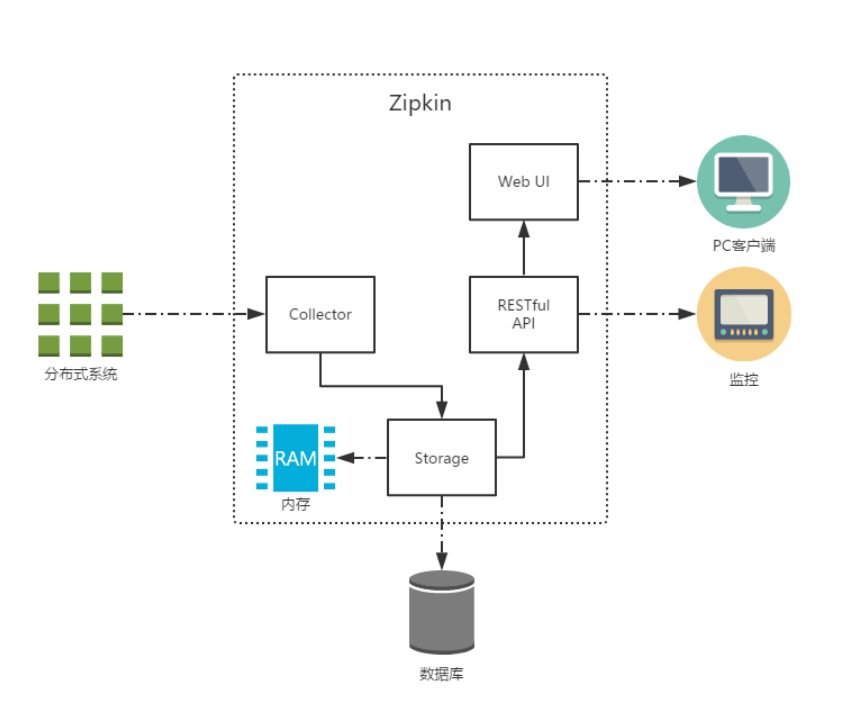

上图展示了Zipkin的基础架构，它主要有4个核心组件构成：

- Collector：收集器组件，它主要用于处理从外部系统发送过来的跟踪信息，将这些信息转换为Zipkin内部处理的Span格式，以支持后续的存储、分析、展示等功能。
- Storage：存储组件，它主要对处理收集器接收到的跟踪信息，默认会将这些信息存储在内存中，我们也可以修改此存储策略，通过使用其他存储组件将跟踪信息存储到数据库中。
- RESTful API：API组件，它主要用来提供外部访问接口。比如给客户端展示跟踪信息，或是外接系统访问以实现监控等。
- Web UI：UI组件，基于API组件实现的上层应用。通过UI组件用户可以方便而有直观地查询和分析跟踪信息。

### 1、HTTP通讯

#### 1、服务端

~~~xml
<!-- Zipkin -->
<dependency>
    <groupId>io.zipkin.java</groupId>
    <artifactId>zipkin-server</artifactId>
    <version>2.11.12</version>
</dependency>
<dependency>
    <groupId>io.zipkin.java</groupId>
    <artifactId>zipkin-autoconfigure-ui</artifactId>
    <version>2.11.12</version>
</dependency>
~~~

~~~yml
server:
  port: 9050
spring:
  application:
    name: spring-cloud-zipkin


eureka:
  instance:
    prefer-ip-address: true # 注册服务的时候使用服务的ip地址
    instance-id: ${spring.application.name}:${server.port}  # 修改在Eureka里的主机映射名称
  client:
    serviceUrl:
      defaultZone: "http://localhost:8761/eureka/"

management:
  metrics:
    web:
      server:
        auto-time-requests: false # 如果为true会出现访问错误 Prometheus requires that all meters with the same name have the same set of tag keys. There is already an existing meter named
  endpoints:
    web:
      exposure:
        include: "*"
  endpoint:
    health:
      show-details: ALWAYS
~~~

management.metrics.web.server.auto-time-requests=true ，则访问时出现如下错误：

~~~java
java.lang.IllegalArgumentException: Prometheus requires that all meters with the same name have the same set of tag keys. There is already an existing meter named 'http_server_requests_seconds' containing tag keys [method, status, uri]. The meter you are attempting to register has keys [exception, method, outcome, status, uri].2    at io.micrometer.prometheus.PrometheusMeterRegistry.lambda$collectorByName$9(PrometheusMeterRegistry.java:372) ~[micrometer-registry-prometheus-1.1.1.jar:1.1.1]3    at java.util.concurrent.ConcurrentHashMap.compute(ConcurrentHashMap.java:1877) ~[na:1.8.0_162]4    at io.micrometer.prometheus.PrometheusMeterRegistry.collectorByName(PrometheusMeterRegistry.java:359) ~[micrometer-registry-prometheus-1.1.1.jar:1.1.1]
~~~

~~~java
@EnableEurekaClient
@EnableZipkinServer   // 开启Zipkin服务，使用http通讯
@SpringBootApplication
public class SpringcloudZipkinApplication {

    public static void main(String[] args) {
        SpringApplication.run(SpringcloudZipkinApplication.class, args);
    }

}
~~~

访问Zipkin：http://127.0.0.1:9050/

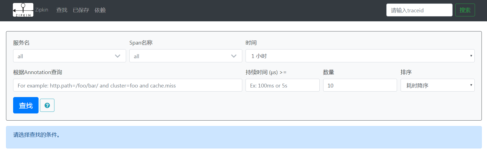

#### 2、客户端

~~~xml
<!-- 链路反馈到Zipkin -->
<dependency>
    <groupId>org.springframework.cloud</groupId>
    <artifactId>spring-cloud-sleuth-zipkin</artifactId>
</dependency>
~~~

~~~yml
spring:
  zipkin:
    base-url: http://127.0.0.1:9050 # zipkin服务地址，用http通讯
  sleuth:
    sampler:
      probability: 1 # 采集所有链路信息，测试使用，默认0.1，生产环境用0.1
~~~

1）访问zuul：http://127.0.0.1:9020/user/buyTicket2/1?name=张三

2）日志输出：

2018-12-29 11:44:56.434  INFO [consumer-user,e55cd2197912b001,cb00a37cac872ab9,true] 14736 --- [nio-9001-exec-7] c.f.s.user.controller.UserController     : call ticketService2

2018-12-29 11:44:56.440  INFO [provider-ticket,e55cd2197912b001,2cff8eaf58a384da,true] 10608 --- [nio-9000-exec-5] c.f.s.t.controller.TicketController      : call getTicket

[consumer-user,e55cd2197912b001,cb00a37cac872ab9,true] 中，最后一个参数为true，表示通知给Zipkin了。

3）访问zipki：点击查找-

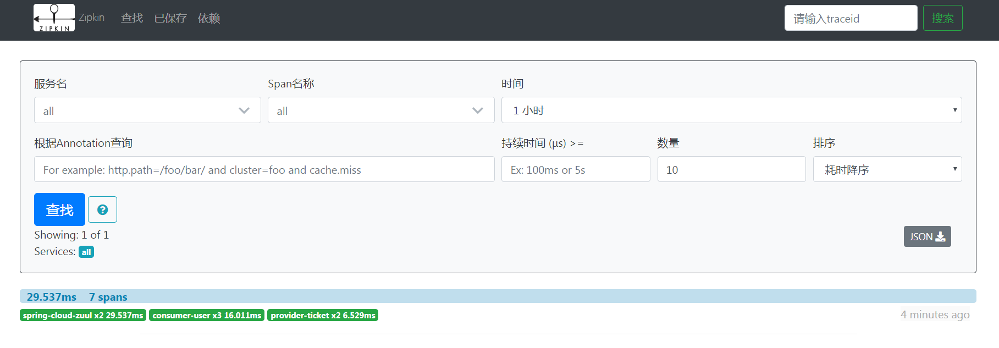

> 点击查找到的链路信息

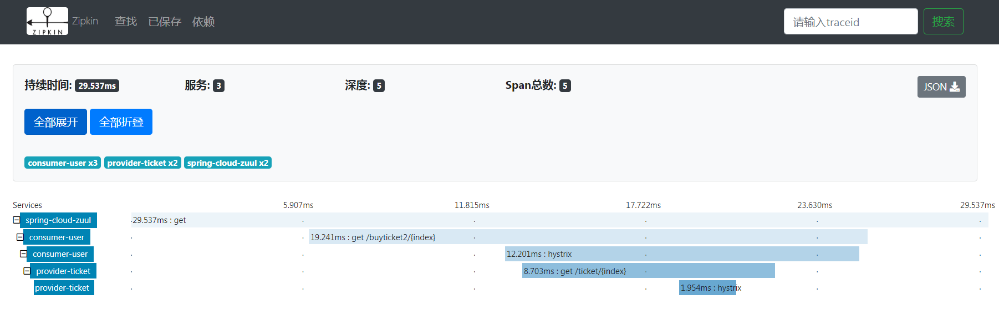

### 2、消息中间件通讯

Spring Cloud Sleuth在整合Zipkin时，不仅实现了以HTTP的方式收集跟踪信息，还实现了通过消息中间件来对跟踪信息进行异步收集的封装。通过结合Spring Cloud Stream，我们可以非常轻松的让应用客户端将跟踪信息输出到消息中间件上，同时Zipkin服务端从消息中间件上异步地消费这些跟踪信息。

#### 1、服务端


#### 2、客户端


### 3、ELK


